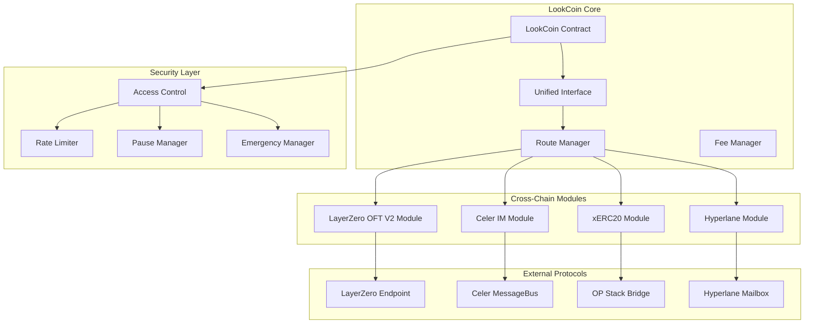

# Design Document

## Overview

The native cross-chain token enhancement transforms LookCoin into a multi-protocol cross-chain token with a highly modular architecture. Each cross-chain protocol is implemented as a completely separate, interchangeable module with clear boundaries and responsibilities.

**Protocol-Chain Mapping Strategy:**

- **LayerZero OFT V2**: Primary protocol for EVM chains (BSC, Base, Optimism)
- **Celer IM**: Alternative bridging for EVM chains with different security assumptions
- **SuperChain xERC20**: Native Optimism ecosystem support (OP Stack chains)
- **Hyperlane**: Custom infrastructure for Akashic-BSC bridge (replacing IBC)

**Key Design Principles:**

- **Separation of Concerns**: Each protocol module is completely independent
- **Modular Architecture**: Protocols can be enabled/disabled per chain without affecting others
- **Unified Interface**: Single entry point for all cross-chain operations
- **Chain-Specific Optimization**: Each chain uses optimal protocol combinations

## Architecture

### High-Level Architecture



### Contract Architecture

The system uses a highly modular architecture with clear separation:

**Core Layer:**

1. **LookCoin**: Base ERC20 token contract (unchanged)
2. **CrossChainRouter**: Protocol selection and routing logic
3. **FeeManager**: Cross-protocol fee estimation and optimization

**Protocol Modules (Completely Independent):** 4. **LayerZeroModule**: OFT V2 implementation for EVM chains 5. **CelerModule**: Celer IM implementation for alternative bridging 6. **XErc20Module**: SuperChain xERC20 for Optimism ecosystem 7. **HyperlaneModule**: Custom Hyperlane infrastructure for Akashic

**Security & Governance:** 8. **SecurityManager**: Access control and emergency functions 9. **ProtocolRegistry**: Dynamic protocol registration and management

**Supported Chain Matrix:**

```
Chain        | LayerZero | Celer | xERC20 | Hyperlane
-------------|-----------|-------|--------|----------
BSC          |     ✓     |   ✓   |   -    |    ✓
Base         |     ✓     |   -   |   ✓    |    -
Optimism     |     ✓     |   ✓   |   ✓    |    -
Sapphire     |     -     |   ✓   |   -    |    -
Akashic      |     -     |   -   |   -    |    ✓
```

## Components and Interfaces

### Core Contracts

#### LookCoinCrossChain Contract

```solidity
contract LookCoinCrossChain is
    ERC20Upgradeable,
    OFTUpgradeable,
    IMessageReceiverApp,
    XERC20,
    IMessageRecipient,
    AccessControlUpgradeable,
    PausableUpgradeable,
    UUPSUpgradeable
{
    // Core token functionality with cross-chain capabilities
}
```

**Key Responsibilities:**

- Inherit from all required cross-chain interfaces
- Manage token supply across chains
- Coordinate between different bridge protocols
- Handle upgrades and governance

#### CrossChainRouter Contract

```solidity
interface ICrossChainRouter {
    struct BridgeOption {
        uint8 protocol; // 0: LayerZero, 1: Celer, 2: xERC20, 3: Hyperlane
        uint256 fee;
        uint256 estimatedTime;
        uint8 securityLevel;
        bool available;
    }

    function getBridgeOptions(
        uint256 chainId,
        uint256 amount
    ) external view returns (BridgeOption[] memory);

    function getOptimalRoute(
        uint256 chainId,
        uint256 amount,
        uint8 preference // 0: cheapest, 1: fastest, 2: most secure
    ) external view returns (uint8 protocol);

    function bridgeToken(
        uint256 chainId,
        address to,
        uint256 amount,
        uint8 protocol,
        bytes calldata data
    ) external payable;
}
```

#### FeeManager Contract

```solidity
interface IFeeManager {
    function estimateFee(
        uint8 protocol,
        uint256 chainId,
        uint256 amount,
        bytes calldata data
    ) external view returns (uint256 fee);

    function getProtocolFees(
        uint256 chainId,
        uint256 amount
    ) external view returns (
        uint256 layerZeroFee,
        uint256 celerFee,
        uint256 xERC20Fee,
        uint256 hyperlaneFee
    );
}
```

### Protocol-Specific Implementations

#### LayerZero OFT V2 Integration

```solidity
abstract contract LayerZeroModule is OFTUpgradeable {
    mapping(uint32 => bytes32) public trustedRemotes;
    mapping(uint32 => uint256) public chainIdToEid;

    function _lzSend(
        uint32 _dstEid,
        bytes memory _message,
        bytes memory _options,
        MessagingFee memory _fee,
        address _refundAddress
    ) internal override {
        // Custom implementation for LookCoin
    }

    function _lzReceive(
        Origin calldata _origin,
        bytes32 _guid,
        bytes calldata _message,
        address _executor,
        bytes calldata _extraData
    ) internal override {
        // Handle incoming LayerZero messages
    }
}
```

#### Celer IM Integration

```solidity
abstract contract CelerModule is IMessageReceiverApp {
    IMessageBus public messageBus;
    mapping(uint64 => address) public siblingContracts;

    function executeMessage(
        address _sender,
        uint64 _srcChainId,
        bytes calldata _message,
        address _executor
    ) external payable override returns (ExecutionStatus) {
        // Handle Celer cross-chain messages
    }

    function sendViaCeler(
        uint64 _dstChainId,
        address _receiver,
        uint256 _amount
    ) external payable {
        // Send tokens via Celer
    }
}
```

#### xERC20 Integration

```solidity
abstract contract XERC20Module is XERC20 {
    mapping(address => BridgeParameters) public bridges;

    struct BridgeParameters {
        uint256 mintingLimit;
        uint256 burningLimit;
        uint256 mintingCurrentLimit;
        uint256 burningCurrentLimit;
        uint256 rateLimitPerSecond;
        uint256 lastUpdated;
    }

    function mint(address _user, uint256 _amount) public override {
        // Implement xERC20 minting with rate limits
    }

    function burn(address _user, uint256 _amount) public override {
        // Implement xERC20 burning with rate limits
    }
}
```

#### Hyperlane Integration

```solidity
abstract contract HyperlaneModule is IMessageRecipient {
    IMailbox public mailbox;
    mapping(uint32 => bytes32) public trustedSenders;

    function handle(
        uint32 _origin,
        bytes32 _sender,
        bytes calldata _message
    ) external override {
        // Handle Hyperlane messages
    }

    function sendViaHyperlane(
        uint32 _destination,
        address _recipient,
        uint256 _amount
    ) external payable {
        // Send via Hyperlane
    }
}
```

## Data Models

### Cross-Chain Transfer Structure

```solidity
struct CrossChainTransfer {
    uint256 id;
    address sender;
    address recipient;
    uint256 amount;
    uint256 sourceChain;
    uint256 destinationChain;
    uint8 protocol;
    uint8 status; // 0: pending, 1: completed, 2: failed, 3: refunded
    uint256 timestamp;
    bytes32 messageHash;
    uint256 nonce;
}
```

### Bridge Configuration

```solidity
struct BridgeConfig {
    bool enabled;
    uint256 minAmount;
    uint256 maxAmount;
    uint256 dailyLimit;
    uint256 dailyUsed;
    uint256 lastResetTime;
    address endpoint;
    uint256 baseFee;
    uint256 feeRate; // basis points
}
```

### Protocol Status

```solidity
struct ProtocolStatus {
    bool operational;
    uint256 totalVolume;
    uint256 totalTransactions;
    uint256 failureCount;
    uint256 lastFailureTime;
    uint256 averageProcessingTime;
}
```

## Error Handling

### Custom Errors

```solidity
error InvalidChainId(uint256 chainId);
error InsufficientBalance(uint256 available, uint256 required);
error ExceedsTransferLimit(uint256 amount, uint256 limit);
error ProtocolNotSupported(uint8 protocol);
error BridgeNotConfigured(uint256 chainId, uint8 protocol);
error InvalidMessageSender(address sender);
error ReplayAttackDetected(bytes32 messageHash);
error InsufficientFee(uint256 provided, uint256 required);
error TransferAlreadyProcessed(uint256 transferId);
error EmergencyPauseActive();
error UnauthorizedBridge(address bridge);
```

### Error Recovery Mechanisms

1. **Failed Transfer Recovery**: Implement refund mechanisms for failed cross-chain transfers
2. **Message Replay Protection**: Use nonces and message hashes to prevent replay attacks
3. **Emergency Pause**: Allow pausing of specific protocols during security incidents
4. **Fallback Routing**: Automatically retry failed transfers using alternative protocols
5. **Supply Reconciliation**: Regular checks to ensure total supply consistency

## Testing Strategy

### Unit Testing

1. **Protocol Integration Tests**
   - Test each cross-chain protocol independently
   - Verify message handling and validation
   - Test fee calculation accuracy
   - Validate access control mechanisms

2. **Core Functionality Tests**
   - Token minting and burning logic
   - Supply management across chains
   - Route optimization algorithms
   - Emergency pause mechanisms

### Integration Testing

1. **Cross-Protocol Tests**
   - Test switching between different protocols
   - Verify unified interface consistency
   - Test concurrent operations across protocols
   - Validate fee comparison accuracy

2. **End-to-End Tests**
   - Complete cross-chain transfer flows
   - Multi-hop transfers through different protocols
   - Error handling and recovery scenarios
   - Upgrade compatibility testing

### Security Testing

1. **Attack Vector Testing**
   - Replay attack prevention
   - Supply inflation attacks
   - Unauthorized minting/burning
   - Message spoofing attempts

2. **Stress Testing**
   - High-volume transfer scenarios
   - Rate limiting effectiveness
   - Gas optimization under load
   - Protocol failover scenarios

### Mock Testing Environment

```solidity
contract MockCrossChainEnvironment {
    // Mock implementations of all external protocols
    MockLayerZeroEndpoint public lzEndpoint;
    MockCelerMessageBus public celerBus;
    MockHyperlaneMailbox public hyperlaneMailbox;
    MockOPStackBridge public opBridge;

    function simulateChainEnvironment(uint256 chainId) external {
        // Set up mock environment for specific chain
    }

    function simulateNetworkConditions(
        uint256 latency,
        uint256 gasPrice,
        bool congested
    ) external {
        // Simulate various network conditions
    }
}
```

### Test Scenarios

1. **Happy Path Scenarios**
   - Successful transfers via each protocol
   - Optimal route selection
   - Fee estimation accuracy
   - Status tracking

2. **Edge Cases**
   - Minimum and maximum transfer amounts
   - Network congestion handling
   - Protocol unavailability
   - Partial failures

3. **Security Scenarios**
   - Unauthorized access attempts
   - Invalid message handling
   - Supply manipulation attempts
   - Emergency response procedures

4. **Upgrade Scenarios**
   - Contract upgrade compatibility
   - State migration testing
   - Protocol version updates
   - Configuration changes

The testing strategy ensures comprehensive coverage of all cross-chain functionality while maintaining security and reliability standards across all supported protocols.
