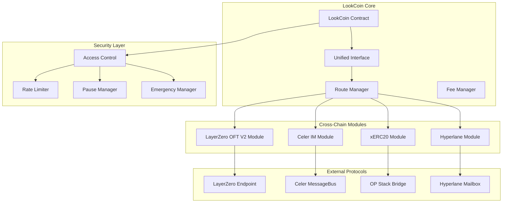

# Design Document

## Overview

The native cross-chain token enhancement transforms LookCoin into a multi-protocol cross-chain token with a highly modular architecture. Each cross-chain protocol is implemented as a completely separate, interchangeable module with clear boundaries and responsibilities.

**Protocol-Chain Mapping Strategy:**

- **LayerZero OFT V2**: Primary protocol for EVM chains (BSC, Base, Optimism)
- **Celer IM**: Alternative bridging for EVM chains with different security assumptions
- **SuperChain xERC20**: Native Optimism ecosystem support (OP Stack chains)
- **Hyperlane**: Custom infrastructure for Akashic-BSC bridge (replacing IBC)

**Key Design Principles:**

- **Separation of Concerns**: Each protocol module is completely independent
- **Modular Architecture**: Protocols can be enabled/disabled per chain without affecting others
- **Unified Interface**: Single entry point for all cross-chain operations
- **Chain-Specific Optimization**: Each chain uses optimal protocol combinations

## Architecture

### High-Level Architecture



### Contract Architecture

The system uses a highly modular architecture with clear separation:

**Core Layer:**

1. **LookCoin**: Base ERC20 token contract (unchanged)
2. **CrossChainRouter**: Protocol selection and routing logic
3. **FeeManager**: Cross-protocol fee estimation and optimization

**Protocol Modules (Completely Independent):** 4. **LayerZeroModule**: OFT V2 implementation for EVM chains 5. **CelerModule**: Celer IM implementation for alternative bridging 6. **XErc20Module**: SuperChain xERC20 for Optimism ecosystem 7. **HyperlaneModule**: Custom Hyperlane infrastructure for Akashic

**Security & Governance:** 8. **SecurityManager**: Access control and emergency functions 9. **ProtocolRegistry**: Dynamic protocol registration and management

**Supported Chain Matrix:**

```
Chain        | LayerZero | Celer | xERC20 | Hyperlane
-------------|-----------|-------|--------|----------
BSC          |     ✓     |   ✓   |   -    |    ✓
Base         |     ✓     |   -   |   ✓    |    -
Optimism     |     ✓     |   ✓   |   ✓    |    -
Sapphire     |     -     |   ✓   |   -    |    -
Akashic      |     -     |   -   |   -    |    ✓
```

## Components and Interfaces

### Core Contracts

#### LookCoin Contract (Delegation Pattern Architecture)

**Important Note:** The implementation uses a **delegation pattern** instead of direct inheritance from all protocol interfaces. This architectural decision was made to:

1. **Maintain upgrade safety** - Adding new parent contracts post-deployment would break storage layout compatibility
2. **Provide flexibility** - Protocol modules can be updated independently without affecting the core token
3. **Ensure security** - Each protocol is isolated in its own module with specific access controls

```solidity
contract LookCoin is
    ERC20Upgradeable,
    AccessControlUpgradeable,
    PausableUpgradeable,
    ReentrancyGuardUpgradeable,
    UUPSUpgradeable,
    ILayerZeroReceiver,  // Direct integration for LayerZero OFT
    IXERC20,            // Direct integration for xERC20 compatibility
    IMessageRecipient    // Direct integration for Hyperlane
{
    // Core token with delegation to CrossChainRouter for unified operations
    ICrossChainRouter public crossChainRouter;
    
    // Protocol-specific modules are accessed through the router
    // rather than direct inheritance
}
```

**Delegation Architecture:**

- **Direct Integrations**: LayerZero, xERC20, and Hyperlane are integrated directly for backward compatibility
- **Modular Protocols**: Celer IM and future protocols are implemented as separate modules
- **Unified Interface**: CrossChainRouter provides a single entry point for all cross-chain operations
- **Protocol Registry**: Manages available protocols and their configurations

**Key Responsibilities:**

- Maintain core ERC20 functionality with cross-chain awareness
- Delegate complex cross-chain operations to CrossChainRouter
- Provide direct protocol support where required for compatibility
- Manage token supply tracking across all protocols
- Handle upgrades safely without storage layout changes

#### CrossChainRouter Contract

```solidity
interface ICrossChainRouter {
    struct BridgeOption {
        uint8 protocol; // 0: LayerZero, 1: Celer, 2: xERC20, 3: Hyperlane
        uint256 fee;
        uint256 estimatedTime;
        uint8 securityLevel;
        bool available;
    }

    function getBridgeOptions(
        uint256 chainId,
        uint256 amount
    ) external view returns (BridgeOption[] memory);

    function getOptimalRoute(
        uint256 chainId,
        uint256 amount,
        uint8 preference // 0: cheapest, 1: fastest, 2: most secure
    ) external view returns (uint8 protocol);

    function bridgeToken(
        uint256 chainId,
        address to,
        uint256 amount,
        uint8 protocol,
        bytes calldata data
    ) external payable;
}
```

#### FeeManager Contract

```solidity
interface IFeeManager {
    function estimateFee(
        uint8 protocol,
        uint256 chainId,
        uint256 amount,
        bytes calldata data
    ) external view returns (uint256 fee);

    function getProtocolFees(
        uint256 chainId,
        uint256 amount
    ) external view returns (
        uint256 layerZeroFee,
        uint256 celerFee,
        uint256 xERC20Fee,
        uint256 hyperlaneFee
    );
}
```

### Protocol Module Architecture

**Note:** Due to upgrade safety requirements, protocol modules are implemented as **separate contracts** rather than abstract base contracts. This allows for:
- Independent deployment and upgrade of each protocol
- Storage layout safety in the main LookCoin contract
- Better security isolation between protocols
- Flexible addition of new protocols without affecting existing ones

#### LayerZero Integration (Direct in LookCoin)

```solidity
// LayerZero is integrated directly in the LookCoin contract for backward compatibility
// The contract implements ILayerZeroReceiver interface
contract LookCoin is ILayerZeroReceiver {
    ILayerZeroEndpoint public lzEndpoint;
    mapping(uint16 => bytes32) public trustedRemoteLookup;
    
    function lzReceive(
        uint16 _srcChainId,
        bytes calldata _srcAddress,
        uint64 _nonce,
        bytes calldata _payload
    ) external override {
        // Handle incoming LayerZero messages
    }
    
    // LayerZero operations are also available through CrossChainRouter
}
```

#### Celer IM Module (Separate Contract)

```solidity
contract CelerIMModule is IMessageReceiverApp, AccessControlUpgradeable {
    IMessageBus public messageBus;
    IERC20 public lookCoin;
    mapping(uint64 => address) public remoteModules;
    
    // Only callable by authorized bridges or router
    function bridgeOut(
        uint64 _dstChainId,
        address _receiver,
        uint256 _amount
    ) external payable {
        // Burns tokens from sender via LookCoin
        lookCoin.burn(msg.sender, _amount);
        // Send message via Celer
    }
    
    function executeMessage(
        address _sender,
        uint64 _srcChainId,
        bytes calldata _message,
        address _executor
    ) external payable override returns (ExecutionStatus) {
        // Verify and mint tokens via LookCoin
        lookCoin.mint(recipient, amount);
    }
}
```

#### xERC20 Module (Separate Contract + Direct Integration)

```solidity
// xERC20 interface is implemented directly in LookCoin for compatibility
contract LookCoin is IXERC20 {
    mapping(address => bool) public authorizedBridges;
    bool public xERC20Enabled; // Can be toggled for safety
    
    // Standard xERC20 functions with delegation to authorized bridges
    function mint(address to, uint256 amount) external {
        require(xERC20Enabled && authorizedBridges[msg.sender], "Unauthorized");
        _mint(to, amount);
    }
}

// Separate XERC20Module for OP Stack specific functionality
contract XERC20Module is AccessControlUpgradeable {
    ILookCoin public lookCoin;
    mapping(uint256 => bool) public supportedChains; // OP Stack chains
    RateLimiter public rateLimiter;
    
    function bridgeOut(
        uint256 destinationChain,
        address recipient,
        uint256 amount
    ) external {
        require(supportedChains[destinationChain], "Unsupported chain");
        rateLimiter.checkLimit(msg.sender, amount);
        lookCoin.burn(msg.sender, amount);
        // Emit event for OP Stack indexer
    }
}
```

#### Hyperlane Module (Separate Contract)

```solidity
// Hyperlane is integrated directly in LookCoin for message receipt
contract LookCoin is IMessageRecipient {
    address public hyperlaneMailbox;
    
    function handle(
        uint32 _origin,
        bytes32 _sender,
        bytes calldata _message
    ) external override {
        require(msg.sender == hyperlaneMailbox, "Unauthorized");
        // Mint tokens based on message
    }
}

// Separate HyperlaneModule for enhanced functionality
contract HyperlaneModule is AccessControlUpgradeable {
    IMailbox public mailbox;
    IInterchainGasPaymaster public gasPaymaster;
    ILookCoin public lookCoin;
    mapping(uint32 => bool) public supportedDomains;
    
    function bridgeOut(
        uint32 destinationDomain,
        address recipient,
        uint256 amount
    ) external payable {
        require(supportedDomains[destinationDomain], "Unsupported domain");
        lookCoin.burn(msg.sender, amount);
        
        bytes32 messageId = mailbox.dispatch(
            destinationDomain,
            bytes32(uint256(uint160(recipient))),
            abi.encode(recipient, amount)
        );
        
        if (msg.value > 0) {
            gasPaymaster.payForGas{value: msg.value}(messageId, destinationDomain, gasAmount, msg.sender);
        }
    }
}
```
        address _recipient,
        uint256 _amount
    ) external payable {
        // Send via Hyperlane
    }
}
```

## Data Models

### Cross-Chain Transfer Structure

```solidity
struct CrossChainTransfer {
    uint256 id;
    address sender;
    address recipient;
    uint256 amount;
    uint256 sourceChain;
    uint256 destinationChain;
    uint8 protocol;
    uint8 status; // 0: pending, 1: completed, 2: failed, 3: refunded
    uint256 timestamp;
    bytes32 messageHash;
    uint256 nonce;
}
```

### Bridge Configuration

```solidity
struct BridgeConfig {
    bool enabled;
    uint256 minAmount;
    uint256 maxAmount;
    uint256 dailyLimit;
    uint256 dailyUsed;
    uint256 lastResetTime;
    address endpoint;
    uint256 baseFee;
    uint256 feeRate; // basis points
}
```

### Protocol Status

```solidity
struct ProtocolStatus {
    bool operational;
    uint256 totalVolume;
    uint256 totalTransactions;
    uint256 failureCount;
    uint256 lastFailureTime;
    uint256 averageProcessingTime;
}
```

## Error Handling

### Custom Errors

```solidity
error InvalidChainId(uint256 chainId);
error InsufficientBalance(uint256 available, uint256 required);
error ExceedsTransferLimit(uint256 amount, uint256 limit);
error ProtocolNotSupported(uint8 protocol);
error BridgeNotConfigured(uint256 chainId, uint8 protocol);
error InvalidMessageSender(address sender);
error ReplayAttackDetected(bytes32 messageHash);
error InsufficientFee(uint256 provided, uint256 required);
error TransferAlreadyProcessed(uint256 transferId);
error EmergencyPauseActive();
error UnauthorizedBridge(address bridge);
```

### Error Recovery Mechanisms

1. **Failed Transfer Recovery**: Implement refund mechanisms for failed cross-chain transfers
2. **Message Replay Protection**: Use nonces and message hashes to prevent replay attacks
3. **Emergency Pause**: Allow pausing of specific protocols during security incidents
4. **Fallback Routing**: Automatically retry failed transfers using alternative protocols
5. **Supply Reconciliation**: Regular checks to ensure total supply consistency

## Testing Strategy

### Unit Testing

1. **Protocol Integration Tests**
   - Test each cross-chain protocol independently
   - Verify message handling and validation
   - Test fee calculation accuracy
   - Validate access control mechanisms

2. **Core Functionality Tests**
   - Token minting and burning logic
   - Supply management across chains
   - Route optimization algorithms
   - Emergency pause mechanisms

### Integration Testing

1. **Cross-Protocol Tests**
   - Test switching between different protocols
   - Verify unified interface consistency
   - Test concurrent operations across protocols
   - Validate fee comparison accuracy

2. **End-to-End Tests**
   - Complete cross-chain transfer flows
   - Multi-hop transfers through different protocols
   - Error handling and recovery scenarios
   - Upgrade compatibility testing

### Security Testing

1. **Attack Vector Testing**
   - Replay attack prevention
   - Supply inflation attacks
   - Unauthorized minting/burning
   - Message spoofing attempts

2. **Stress Testing**
   - High-volume transfer scenarios
   - Rate limiting effectiveness
   - Gas optimization under load
   - Protocol failover scenarios

### Mock Testing Environment

```solidity
contract MockCrossChainEnvironment {
    // Mock implementations of all external protocols
    MockLayerZeroEndpoint public lzEndpoint;
    MockCelerMessageBus public celerBus;
    MockHyperlaneMailbox public hyperlaneMailbox;
    MockOPStackBridge public opBridge;

    function simulateChainEnvironment(uint256 chainId) external {
        // Set up mock environment for specific chain
    }

    function simulateNetworkConditions(
        uint256 latency,
        uint256 gasPrice,
        bool congested
    ) external {
        // Simulate various network conditions
    }
}
```

### Test Scenarios

1. **Happy Path Scenarios**
   - Successful transfers via each protocol
   - Optimal route selection
   - Fee estimation accuracy
   - Status tracking

2. **Edge Cases**
   - Minimum and maximum transfer amounts
   - Network congestion handling
   - Protocol unavailability
   - Partial failures

3. **Security Scenarios**
   - Unauthorized access attempts
   - Invalid message handling
   - Supply manipulation attempts
   - Emergency response procedures

4. **Upgrade Scenarios**
   - Contract upgrade compatibility
   - State migration testing
   - Protocol version updates
   - Configuration changes

The testing strategy ensures comprehensive coverage of all cross-chain functionality while maintaining security and reliability standards across all supported protocols.
