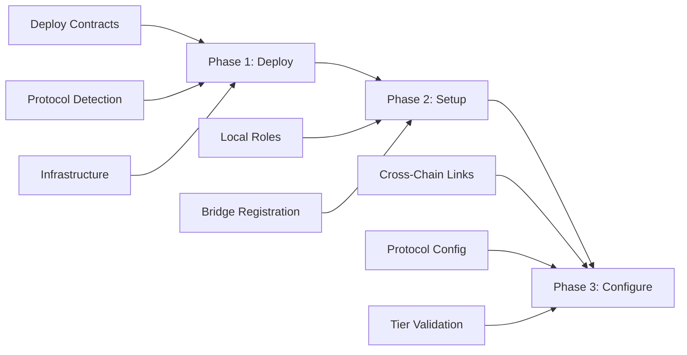

# LookCoin Deployment Guide

## Table of Contents
- [Introduction](#introduction)
- [Global Supply Management](#global-supply-management)
- [Three-Phase Deployment Architecture](#three-phase-deployment-architecture)
- [Phase 1: Deploy](#phase-1-deploy)
- [Phase 2: Setup](#phase-2-setup)
- [Phase 3: Configure](#phase-3-configure)
- [Network-Specific Examples](#network-specific-examples)
- [Migration Guide](#migration-guide)
- [Troubleshooting](#troubleshooting)
- [Cross-Tier Configuration](#cross-tier-configuration)
- [Command Reference](#command-reference)

## Introduction

LookCoin uses a unified three-phase deployment process that automatically detects and handles different protocol configurations. The system supports both standard (single-protocol) and multi-protocol deployments without requiring separate scripts.

### Key Architecture Features

- **Global Supply Cap**: 5 billion LOOK tokens managed through burn-and-mint mechanism
- **Home Chain (BSC)**: Primary chain where the full supply is initially minted
- **Dual-Path Support**: LayerZero offers both direct OFT calls (`sendFrom`) and router-based calls (`bridgeToken`)
- **Unified Token Mechanics**: All protocols (LayerZero, Celer, Hyperlane) use burn-and-mint for consistency
- **Multi-Protocol Router**: CrossChainRouter provides a unified interface for all bridge protocols
- **Automatic Protocol Selection**: The system can automatically choose the optimal protocol based on destination and cost

### Benefits of the Unified Approach
- **Automatic Protocol Detection**: The system automatically detects which protocols are supported on your network
- **Intelligent Deployment Mode**: Automatically chooses between standard and multi-protocol deployment
- **Simplified Workflow**: One set of commands for all deployment scenarios
- **Enhanced Safety**: Built-in tier validation and cross-chain safety checks
- **Better Maintainability**: Consolidated codebase reduces duplication and errors

## Global Supply Management

LookCoin has a **global supply cap of 5 billion LOOK tokens** managed through a burn-and-mint mechanism across all chains.

### Key Principles

1. **Home Chain (BSC)**: The BSC deployment is the home chain where tokens can be minted up to the global cap
2. **Secondary Chains**: All other chains (Base, Optimism, Akashic) start with 0 supply and receive tokens only through bridges
3. **Supply Monitoring**: The SupplyOracle monitors total supply across all chains and automatically pauses bridges if supply exceeds the configured limit
4. **Flexible Minting**: Tokens can be minted gradually as needed, not necessarily all at once

### Token Minting (BSC Only)

**Note**: The deployment process does NOT automatically mint any tokens. All minting is done manually after deployment.

```javascript
// Manual minting example (done separately from deployment)
const mpcVault = "0x..."; // Your MPC vault address
const amount = ethers.parseEther("20000"); // Example: 20,000 LOOK
await lookCoin.mint(mpcVault, amount);

// You can mint additional tokens later as needed, up to the 5 billion cap
```

**Important**: 
- No tokens are minted during deploy, setup, or configure phases
- All minting must be done manually by accounts with MINTER_ROLE
- Only mint on the home chain (BSC)
- The MPC vault must have MINTER_ROLE (granted during setup phase)
- Total minted across all minting operations cannot exceed 5 billion LOOK
- SupplyOracle tracks cumulative minted amounts

### Supply Verification

#### Automatic Supply Configuration

The setup script automatically ensures the SupplyOracle has the correct 5 billion LOOK expected supply:
- If the current expected supply doesn't match 5 billion, it will be updated automatically
- This requires the deployer to have DEFAULT_ADMIN_ROLE on the SupplyOracle
- If the deployer lacks permissions, the script will provide manual update instructions
- The expected supply represents the maximum that can ever be minted, not the current circulating supply

#### Check Individual Chain Supply

Run the reconciliation script on any deployed chain:

```bash
npm run reconcile:bsc-testnet
```

This will show:
- Current chain's minted, burned, and circulating supply
- SupplyOracle's expected global supply (should be 5 billion LOOK)
- Recommendations for any required actions

#### Monitor Cross-Chain Supply

The SupplyOracle provides global supply monitoring:

```javascript
// Check global supply health
const oracle = await ethers.getContractAt("SupplyOracle", supplyOracleAddress);
const { expectedSupply, actualSupply, isHealthy } = await oracle.getGlobalSupply();

console.log(`Expected: ${ethers.formatEther(expectedSupply)} LOOK`);
console.log(`Actual: ${ethers.formatEther(actualSupply)} LOOK`);
console.log(`Healthy: ${isHealthy}`);
```

## Three-Phase Deployment Architecture

The deployment process is divided into three distinct phases:



### Phase Overview

1. **Deploy**: Creates contracts on a single network
2. **Setup**: Configures local-only settings (roles, registrations) and validates supply configuration
3. **Configure**: Establishes cross-chain connections between networks

## Phase 1: Deploy

The deploy phase automatically detects supported protocols and deploys appropriate contracts.

### How It Works

1. **Protocol Detection**: Analyzes chain configuration to determine supported protocols
2. **Mode Selection**: Chooses standard or multi-protocol mode based on protocol count
3. **Contract Deployment**: Deploys core contracts and protocol-specific modules
4. **Infrastructure**: Deploys additional contracts for multi-protocol setups

### Running Deployment

```bash
# Deploy to any supported network
npm run deploy:bsc-testnet
npm run deploy:base-sepolia
npm run deploy:optimism-sepolia
npm run deploy:sapphire-mainnet
```

### Protocol Detection Logic

The system detects protocols by checking:
1. Explicit protocol flags in `hardhat.config.ts`
2. Non-zero endpoint addresses (fallback for legacy configs)

Example detection output:
```
🔍 Detecting supported protocols...
Supported protocols: layerZero, celer
Deployment mode: multi-protocol
```

### Deployment Modes

#### Standard Mode (Single Protocol)
- Deploys LookCoin with one cross-chain protocol
- Minimal contract footprint
- Used when only one protocol is detected

#### Multi-Protocol Mode
- Deploys additional infrastructure contracts:
  - CrossChainRouter: Routes messages between protocols
  - FeeManager: Manages protocol-specific fees
  - ProtocolRegistry: Tracks available protocols
  - SecurityManager: Handles protocol-specific security
- Automatically selected when 2+ protocols are detected

#### Simple Mode (Development Optimization)
- Available for any chain with multiple protocols
- Skips infrastructure contracts even when multiple protocols are detected
- Deploys only core contracts: LookCoin, SupplyOracle, and protocol modules
- Perfect for single-chain development and testing
- Enable with `--simple-mode` flag or `SIMPLE_MODE=true` environment variable
- You can still use direct protocol calls (e.g., LayerZero's `sendFrom`)

### Deployment Output

```
✅ Deployment completed successfully!

Deployment Mode: multi-protocol
Protocols Deployed: layerZero, celer

Core Contracts:
  - LookCoin: 0x1234...
  - SupplyOracle: 0x5678...

Protocol Modules:
  - celerIMModule: 0x9ABC...

Infrastructure Contracts:
  - crossChainRouter: 0xDEF0...
  - feeManager: 0x1357...
  - protocolRegistry: 0x2468...
```


## Phase 2: Setup

The setup phase configures local-only settings on the deployed network.

### What Gets Configured

1. **Role Assignments**
   - MINTER_ROLE for protocol modules
   - BURNER_ROLE for LayerZero operations
   - OPERATOR_ROLE for governance actions

2. **Bridge Registrations**
   - Register protocol modules with SupplyOracle
   - Set up chain-specific identifiers

3. **Supply Validation** (BSC Only)
   - Verifies SupplyOracle has 5 billion LOOK expected supply (maximum cap)
   - Reports current minted amount (will be 0 after initial deployment)
   - Shows available minting capacity (5 billion initially)

### Running Setup

```bash
# Setup on the network where you just deployed
npm run setup:bsc-testnet
npm run setup:base-sepolia
npm run setup:optimism-sepolia
```

### Setup Validation

The setup script includes safety checks:
- Verifies deployment exists on current network
- Validates chain ID matches
- Checks deployment format consistency
- Prevents cross-network operations

Example output:
```
Starting LookCoin post-deployment setup (local configuration only)...
Found multi-protocol deployment from 2024-01-15
Deployment Mode: multi-protocol

1. Configuring roles...
✅ MINTER_ROLE granted to CelerIMModule
✅ BURNER_ROLE granted to LookCoin

2. Registering bridges with SupplyOracle...
✅ LookCoin (LayerZero) registered
✅ CelerIMModule registered
```

## Phase 3: Configure

The configure phase establishes cross-chain connections between deployed networks.

### Prerequisites

- At least 2 networks must be deployed
- Setup must be completed on all networks
- Cross-tier safety checks must pass

### What Gets Configured

1. **Protocol-Specific Settings**
   - LayerZero: Trusted remotes, DVN configuration
   - Celer: Remote modules, fee parameters
   - Hyperlane: Trusted senders, ISM configuration

2. **Infrastructure (Multi-Protocol Only)**
   - CrossChainRouter: Protocol registration, chain support
   - FeeManager: Protocol fees, recipient addresses
   - ProtocolRegistry: Protocol metadata, types

### Running Configuration

```bash
# Configure cross-chain connections
npm run configure:bsc-testnet
npm run configure:base-sepolia
npm run configure:optimism-sepolia
```

### Automatic Protocol Detection

The configure script automatically detects and configures all deployed protocols:

```
Detected protocols: layerZero, celer

✅ Configuring protocols...

Configuring layerZero...
✅ LayerZero: Configured: Chain 40102: 0x1234..., Send DVN: 0x5678...

Configuring celer...
✅ Celer: Configured: Chain 97: 0x9ABC..., Transfer fee: 0.001 LOOK

⚙️  Configuring multi-protocol infrastructure...
✅ CrossChainRouter: Configured: LayerZero: 0x1234..., Celer: 0x5678...
✅ FeeManager: Configured: LayerZero: 0.01 LOOK, Celer: 0.001 LOOK
```


## Network-Specific Examples

### BSC Testnet → Base Sepolia → Optimism Sepolia

Complete deployment flow for a three-network setup:

```bash
# 1. Deploy to all networks (BSC first as home chain)
npm run deploy:bsc-testnet          # Home chain
npm run deploy:base-sepolia         # Secondary chain
npm run deploy:optimism-sepolia     # Secondary chain

# 2. Setup each network locally
npm run setup:bsc-testnet           # Configures roles, no minting
npm run setup:base-sepolia          # Secondary chain setup
npm run setup:optimism-sepolia      # Secondary chain setup

# 3. Mint tokens manually on BSC (separate from deployment process)
# Use your own scripts or console to mint tokens as needed
# Example: npx hardhat console --network bsc-mainnet
# > const lookCoin = await ethers.getContractAt("LookCoin", "0x...")
# > await lookCoin.mint("0xMpcVault...", ethers.parseEther("20000"))

# 4. Configure cross-chain connections
npm run configure:bsc-testnet      # Connects to Base & Optimism
npm run configure:base-sepolia      # Connects to BSC & Optimism
npm run configure:optimism-sepolia  # Connects to BSC & Base
```

### Sapphire Mainnet (Single Network)

For networks with unique protocols:

```bash
# 1. Deploy
npm run deploy:sapphire-mainnet

# 2. Setup
npm run setup:sapphire-mainnet

# 3. Configure (when other networks are ready)
npm run configure:sapphire-mainnet
```

## Migration Guide

### For Existing Deployments

The new system automatically handles legacy deployment artifacts:

1. **Automatic Format Migration**: Old deployments are upgraded on load
2. **Protocol Detection**: Missing metadata is inferred from contracts
3. **Backward Compatibility**: Existing deployments continue to work

### What Changes for Users

| Old Command | New Command | Notes |
|------------|-------------|--------|
| `deploy-multi-protocol.ts` | `deploy.ts` | Automatic mode detection |
| `configure-multi-protocol.ts` | `configure.ts` | Automatic protocol detection |
| Manual protocol selection | Automatic | Based on chain config |

### Migration Steps

1. Update to latest code
2. Run deployment commands as normal
3. System automatically handles the rest

No manual migration required!

## Troubleshooting

### Common Issues

#### "No deployment found"
- **Cause**: Deploy phase not completed
- **Solution**: Run `npm run deploy:<network>` first

#### "Cross-tier configuration detected"
- **Cause**: Mixing testnet/mainnet deployments
- **Solution**: Use `--force-cross-tier` flag or set `CROSS_TIER_OK=1`

#### "Protocol not enabled on this chain"
- **Cause**: Chain doesn't support the protocol
- **Solution**: Check `hardhat.config.ts` for supported protocols

#### "Deployment format validation warnings"
- **Cause**: Legacy deployment being migrated
- **Solution**: Usually safe to ignore, system handles it

#### "Unnecessary Proxy Upgrades"
- **Cause**: Bytecode hash comparison detecting changes when none exist
- **Solution**: 
  - Enable debug mode: `DEBUG_DEPLOYMENT=true npm run deploy:<network>`
  - Skip upgrades temporarily: `SKIP_UPGRADE_CHECK=true npm run deploy:<network>`
  - Clear LevelDB if corrupted: `rm -rf leveldb/`

#### "Network Connectivity Issues"
- **Cause**: RPC endpoint not responding or rate limited
- **Solution**:
  - Check RPC URL in `.env` or `hardhat.config.ts`
  - Use alternative RPC providers
  - Deployment script retries 3 times automatically

#### "Multi-Protocol Overhead"
- **Cause**: Infrastructure contracts deployed when not needed for single-chain operation
- **Solution**:
  - Use simple mode: `npm run deploy:<network> -- --simple-mode`
  - Set environment: `SIMPLE_MODE=true npm run deploy:<network>`
  - Force standard mode: `FORCE_STANDARD_MODE=true npm run deploy:<network>`
  - BSC legacy support: `BSC_SIMPLE_MODE=true` still works for backward compatibility

#### "No tokens have been minted on the home chain"
- **Solution**: This is not an error if you plan to mint gradually. You can mint tokens as needed using the MINTER_ROLE up to the 5 billion cap

#### "SupplyOracle expected supply doesn't match the 5 billion cap"
- **Solution**: The setup script will automatically update it if the deployer has admin rights. If not:
```javascript
// Admin can manually update:
await supplyOracle.updateExpectedSupply("5000000000000000000000000000");  // 5 billion LOOK
```

#### "Destination chain not configured" error when bridging
- **Solution**: Ensure you've run the configure script for both source and destination chains

#### Supply mismatch causes bridge pause
- **Solution**: This is a safety feature. If total supply across chains exceeds 5 billion by more than the tolerance threshold (default 1000 LOOK), bridges are automatically paused. Admin intervention required

### Error Recovery

The deployment system includes recovery mechanisms:

1. **State Persistence**: Deployment progress saved at each step
2. **Resume Capability**: Failed deployments can be resumed
3. **Rollback Protection**: Failed steps don't affect completed ones

Resume a failed deployment:
```bash
npm run deploy:resume -- --network bscTestnet
```

### Debug Options

Enable verbose debugging to diagnose deployment issues:

```bash
# Debug deployment with detailed logging
DEBUG_DEPLOYMENT=true npm run deploy:<network>

# Debug with dry run (no actual deployment)
npm run deploy:<network> -- --debug --dry-run

# Debug specific contract upgrades
DEBUG_DEPLOYMENT=true npm run deploy:<network> 2>&1 | grep -A5 -B5 "Hash comparison"
```

### Command Line Options

The deployment script supports several command line options:

```bash
# Enable debug logging
npm run deploy:<network> -- --debug

# Dry run mode (simulate deployment)
npm run deploy:<network> -- --dry-run

# Skip proxy upgrades
npm run deploy:<network> -- --skip-upgrade

# Force simple mode (skip infrastructure contracts)
npm run deploy:<network> -- --simple-mode

# Combine multiple options
npm run deploy:<network> -- --debug --skip-upgrade --simple-mode
```

## Cross-Tier Configuration

### Understanding Network Tiers

- **testnet**: Test networks (BSC Testnet, Base Sepolia)
- **mainnet**: Production networks (BSC, Base, Optimism)
- **dev**: Local development (Hardhat)

### Safety Rules

1. Same-tier connections are always allowed
2. Cross-tier requires explicit permission
3. Dev tier can connect to testnet for testing

### Allowing Cross-Tier

Two methods to enable cross-tier configuration:

```bash
# Method 1: Command flag
npm run configure:bsc-testnet -- --force-cross-tier

# Method 2: Environment variable
CROSS_TIER_OK=1 npm run configure:bsc-testnet
```

### Cross-Tier Warnings

```
⚠️  WARNING: Cross-tier configuration detected! ⚠️

You are configuring a testnet network to trust contracts from:
  - BSC Mainnet (mainnet tier)

This could create security vulnerabilities if done incorrectly.
Do you want to continue? (yes/no):
```

## Command Reference

### Deployment Commands

| Command | Description |
|---------|-------------|
| `npm run deploy:bsc-testnet` | Deploy to BSC Testnet |
| `npm run deploy:base-sepolia` | Deploy to Base Sepolia |
| `npm run deploy:optimism-sepolia` | Deploy to Optimism Sepolia |
| `npm run deploy:sapphire-mainnet` | Deploy to Oasis Sapphire |
| `npm run deploy:akashic-mainnet` | Deploy to Akashic Mainnet |
| `npm run deploy:akashic-testnet` | Deploy to Akashic Testnet |

### Setup Commands

| Command | Description |
|---------|-------------|
| `npm run setup:<network>` | Configure local roles and registrations |
| All networks supported | Same pattern as deploy commands |

### Configuration Commands

| Command | Description |
|---------|-------------|
| `npm run configure:<network>` | Set up cross-chain connections |
| `--force-cross-tier` | Allow cross-tier configuration |
| Available after deployment | Other networks must be deployed first |

### Utility Commands

| Command | Description |
|---------|-------------|
| `npm run verify` | Verify contracts on block explorer |
| `npm run test:integration` | Run integration tests |
| `npm run security:scan` | Run security analysis |

### Environment Variables

| Variable | Description | Default |
|----------|-------------|------|
| `CROSS_TIER_OK` | Allow cross-tier config | `0` |
| `CI` | Skip interactive prompts | `false` |
| `GOVERNANCE_VAULT` | Override governance address | Chain config |
| `SIMPLE_MODE` | Skip infrastructure contracts | `false` |
| `BSC_SIMPLE_MODE` | Legacy: Skip infrastructure (BSC) | `false` |
| `FORCE_STANDARD_MODE` | Force full deployment | `false` |

## Best Practices

1. **Always Follow the Three-Phase Order**: Deploy → Setup → Configure
2. **Deploy to BSC (Home Chain) First**: This is where tokens can be minted
3. **Mint Tokens Gradually**: You can mint as needed up to the 5 billion cap
4. **Deploy Secondary Chains with Zero Supply**: They receive tokens only through bridges
5. **Deploy to All Networks First**: Before running configure
6. **Test on Testnets**: Before mainnet deployment (BSC Testnet deployment completed ✅)
7. **Monitor Deployment Artifacts**: Check `deployments/` directory
8. **Use Tier Protection**: Don't mix testnet/mainnet unless necessary
9. **Verify After Deploy**: Run contract verification
10. **Test Bridge Operations**: After configuration completes
11. **Monitor SupplyOracle Regularly**: It tracks total minted vs. the 5 billion cap
12. **Regular Reconciliation**: SupplyOracle reconciles every 15 minutes by default

### BSC Deployment Notes

Both BSC Testnet and BSC Mainnet have been successfully deployed as the **home chain** with:
- **LookCoin**: Core ERC20 token with native LayerZero OFT V2 integration and EIP-2612 permit support
- **CelerIMModule**: Celer Inter-chain Messaging support
- **SupplyOracle**: Cross-chain supply monitoring with 5 billion LOOK maximum supply cap
- **Multi-protocol support**: Both LayerZero and Celer IM are active
- **Zero Initial Supply**: No tokens minted during deployment (all minting is manual)

For BSC deployments, the contracts support:
- Direct LayerZero transfers via `sendFrom()`
- Router-based transfers via `bridgeToken()` (when CrossChainRouter is deployed)
- Celer IM transfers through the CelerIMModule
- EIP-2612 permit for gasless approvals

### Security Considerations

1. **Never mint tokens on secondary chains** - They should only receive tokens through bridges
2. **Monitor SupplyOracle regularly** - It's the guardian of supply consistency
3. **Keep bridge modules updated** - They enforce the burn-and-mint mechanism
4. **Regular reconciliation** - SupplyOracle reconciles every 15 minutes by default

## Advanced Topics

### Custom Protocol Support

To add a new protocol:

1. Update `hardhat.config.ts` with protocol config
2. Create protocol module contract
3. Add configurator in `protocolConfigurators.ts`
4. System automatically detects and uses it

### Deployment State Management

Deployment state is tracked in:
- `deployments/<network>.json`: Deployment artifacts
- `deployments/.state/`: Deployment progress
- Level database: Contract tracking

### Gas Optimization

The deployment system includes:
- Batch operations where possible
- Optimized contract initialization
- Efficient upgrade patterns

For large deployments, ensure sufficient gas:
```bash
# Check balance before deploy
DEPLOYER_KEY=<key> npm run deploy:bsc-mainnet
```

## Prerequisites

Before deploying, ensure you have:

- **Node.js v18+** and npm installed
- **Hardhat** (installed via npm)
- **Network RPC access** for target chains
- **Sufficient native tokens** for deployment gas fees
- **Block explorer API keys** for contract verification

### Environment Setup

1. Clone the repository and install dependencies:
```bash
git clone https://github.com/lookcard/lookcoin-contract.git
cd lookcoin-contract
npm install
```

2. Copy the environment template:
```bash
cp .env.example .env
```

3. Configure your `.env` file with:
- Deployer private key
- Network RPC URLs
- Block explorer API keys
- Governance vault address

## Supported Networks

| Network                    | Chain ID | Network Name     | LayerZero       | Celer IM | Hyperlane | RPC Endpoint                                    |
| -------------------------- | -------- | ---------------- | --------------- | -------- | --------- | ----------------------------------------------- |
| **BSC Mainnet**            | 56       | bsc-mainnet      | ✓ (dual)        | ✓        | Planned   | https://bsc-dataseed.binance.org/               |
| **BSC Testnet**            | 97       | bsc-testnet      | ✓ (dual)        | ✓        | Planned   | https://data-seed-prebsc-1-s1.binance.org:8545/ |
| **Base Mainnet**           | 8453     | base-mainnet     | ✓ (dual)        | ✗        | Planned   | https://mainnet.base.org                        |
| **Base Sepolia**           | 84532    | base-sepolia     | ✓ (dual)        | ✗        | Planned   | https://sepolia.base.org                        |
| **Optimism Mainnet**       | 10       | op-mainnet       | ✓ (dual)        | ✓        | Planned   | https://mainnet.optimism.io                     |
| **Optimism Sepolia**       | 11155420 | op-sepolia       | ✓ (dual)        | ✓        | Planned   | https://sepolia.optimism.io                     |
| **Oasis Sapphire**         | 23295    | sapphire         | ✗               | ✓        | ✗         | https://sapphire.oasis.io                       |
| **Oasis Sapphire Testnet** | 23295    | sapphire-testnet | ✗               | ✓        | ✗         | https://testnet.sapphire.oasis.io               |
| **Akashic Mainnet**        | 9070     | akashic-mainnet  | ✗               | ✗        | Planned   | https://rpc-mainnet.akashicrecords.io           |
| **Akashic Testnet**        | 9071     | akashic-testnet  | ✗               | ✗        | Planned   | https://rpc-testnet.akashicrecords.io           |

**Note**: Hyperlane infrastructure is planned but not yet deployed. LookCard will deploy and operate a complete self-hosted Hyperlane stack when ready.
### LayerZero Endpoints

- BSC Mainnet: `0x1a44076050125825900e736c501f859c50fE728c`
- BSC Testnet: `0x6EDCE65403992e310A62460808c4b910D972f10f`
- Base Mainnet: `0x1a44076050125825900e736c501f859c50fE728c`
- Base Sepolia: `0x6EDCE65403992e310A62460808c4b910D972f10f`
- Optimism Mainnet: `0x1a44076050125825900e736c501f859c50fE728c`
- Optimism Sepolia: `0x6EDCE65403992e310A62460808c4b910D972f10f`
- Sapphire: Not supported by LayerZero (use Celer IM)

### Celer MessageBus

- BSC Mainnet: `0x95714818fdd7a5454f73da9c777b3ee6ebaeea6b`
- BSC Testnet: `0xAd204986D6cB67A5Bc76a3CB8974823F43Cb9AAA`
- Base: Not supported by Celer (use LayerZero)
- Optimism Mainnet: `0x0D71D18126E03646eb09FEc929e2ae87b7CAE69d`
- Optimism Sepolia: Not supported on testnet
- Oasis Sapphire: `0x9Bb46D5100d2Db4608112026951c9C965b233f4D`
- Oasis Sapphire Testnet: `0x9Bb46D5100d2Db4608112026951c9C965b233f4D`

### Hyperlane Infrastructure (Planned - Not Yet Deployed)

**⚠️ Note**: Hyperlane infrastructure is planned but not yet deployed. All addresses below are placeholders for future self-hosted deployment.

**Planned Self-Hosted Mailboxes**:
- BSC Mainnet: To be deployed
- BSC Testnet: To be deployed  
- Base Mainnet: To be deployed
- Base Sepolia: To be deployed
- Optimism Mainnet: To be deployed
- Optimism Sepolia: To be deployed
- Akashic Mainnet: To be deployed
- Akashic Testnet: To be deployed

**Planned Self-Hosted Gas Paymasters**:
- All networks: To be deployed as part of complete self-hosted infrastructure

**Deployment Timeline**: Infrastructure setup is pending. Updates will be provided when deployment begins.

## Deployment File Naming Convention

LookCoin deployment files follow a standardized naming convention to ensure consistency between network lookup logic and deployment file storage:

### Naming Format

- **Pattern**: `{chainConfigKey}.json`
- **Examples**:
  - `basesepolia.json` (Base Sepolia)
  - `bsctestnet.json` (BSC Testnet)
  - `optimismsepolia.json` (Optimism Sepolia)
  - `sapphiremainnet.json` (Sapphire Mainnet)

### Key Characteristics

- **Lowercase**: All filenames are in lowercase
- **No spaces or dashes**: Spaces are removed, not converted to dashes
- **CHAIN_CONFIG alignment**: Names match the keys in `hardhat.config.ts` CHAIN_CONFIG
- **Human-readable network name**: Each deployment JSON file contains a `network` field with the human-readable network name

### Technical Implementation

The naming convention is implemented in `scripts/utils/deployment.ts`:

```typescript
// Canonical naming format: lowercase, no spaces or dashes
const fileName = networkName.toLowerCase().replace(/\s+/g, "") + ".json";
```

This ensures that when `getNetworkName(chainId)` returns a CHAIN_CONFIG key like `"basesepolia"`, the deployment utility functions can correctly locate the corresponding `basesepolia.json` file.

### Backward Compatibility

The deployment system includes backward compatibility for legacy hyphenated filenames (e.g., `base-sepolia.json`). If a canonical filename is not found, the system will automatically check for the legacy format and display a deprecation warning.

## Deployment Process

The deployment process (implemented in `scripts/deploy.ts`) follows this sequence:

### 1. Contract Deployment Order

1. **LookCoin (UUPS Proxy)**
   - Deploys implementation contract
   - Deploys UUPS proxy pointing to implementation
   - Initializes with name, symbol, and initial supply
   - Configures LayerZero endpoint (if supported)

2. **CelerIMModule** (if Celer is supported on the network)
   - Deploys with LookCoin address and MessageBus address
   - Registers Celer chain IDs for cross-chain messaging

3. **HyperlaneModule** (if Hyperlane is supported on the network)
   - Deploys with LookCoin address and mailbox address
   - Configures domain mappings and ISM settings

4. **SupplyOracle**
   - Deploys with LookCoin address
   - Monitors cross-chain supply for reconciliation

5. **MPCMultisig**
   - Deploys with configured signers (3-of-5 threshold)
   - Sets up timelock delays (48 hours standard, 24 hours emergency)

### 2. Role Assignment

After deployment, roles are automatically assigned:

- **MINTER_ROLE**: Granted to bridge modules (CelerIMModule, HyperlaneModule)
- **BURNER_ROLE**: Granted to LookCoin itself (for self-burning in cross-chain transfers)
- **DEFAULT_ADMIN_ROLE**: Transferred to MPCMultisig contract
- **PAUSER_ROLE**: Granted to security monitoring addresses
- **ORACLE_ROLE**: Granted to SupplyOracle contract

### 3. Bridge Registration

All deployed bridges are registered with the SupplyOracle:

- LayerZero (native to LookCoin contract)
- Celer IM Module (if deployed)
- Hyperlane Module (if deployed)

### 4. Deployment Artifacts

Deployment information is saved to:

- `deployments/{network}/deployment.json` - Contract addresses and configuration
- `deployments/{network}/artifacts/` - Contract ABIs and bytecode

## Network-Specific Commands

### Testnet Deployments

```bash
# BSC Testnet (Chain ID: 97)
npm run deploy:bsc-testnet

# Base Sepolia (Chain ID: 84532)
npm run deploy:base-sepolia

# Optimism Sepolia (Chain ID: 11155420)
npm run deploy:op-sepolia

# Oasis Sapphire Testnet (Chain ID: 23295)
npm run deploy:sapphire-testnet

# Akashic Testnet (Chain ID: 9071)
npm run deploy:akashic-testnet

```

### Mainnet Deployments

```bash
# BSC Mainnet (Chain ID: 56)
npm run deploy:bsc-mainnet

# Base Mainnet (Chain ID: 8453)
npm run deploy:base-mainnet

# Optimism Mainnet (Chain ID: 10)
npm run deploy:op-mainnet

# Oasis Sapphire (Chain ID: 23295)
npm run deploy:sapphire

# Akashic Mainnet (Chain ID: 9070)
npm run deploy:akashic

```

## Post-Deployment Configuration

### Three-Stage Deployment Process

LookCoin deployment follows a three-stage process to ensure proper contract setup and cross-chain connectivity:

#### Stage 1: Deploy

**Purpose**: Creates contracts and deployment artifacts on a single network
**Script**: `scripts/deploy.ts`
**What it does**:

- Deploys all smart contracts (LookCoin, bridge modules, SupplyOracle)
- Creates deployment artifacts in `deployments/{network}/deployment.json`
- Initializes contracts with basic parameters
- Does not configure cross-chain connections

#### Stage 2: Setup

**Purpose**: Configures local roles and settings post-deployment on a single network
**Script**: `scripts/setup.ts`
**What it does**:

- Assigns MINTER_ROLE to bridge modules (CelerIMModule, HyperlaneModule)
- Grants BURNER_ROLE to LookCoin contract for LayerZero burns
- Registers local bridges with SupplyOracle for the current network only
- Configures rate limiting parameters
- Operates on a single network using only local deployment artifacts

#### Stage 3: Configure

**Purpose**: Establishes cross-chain connections between multiple networks
**Script**: `scripts/configure.ts`
**What it does**:

- Sets up LayerZero trusted remotes using contract addresses from other networks
- Configures Celer IM remote modules for cross-chain messaging
- Registers bridges from ALL networks in the local SupplyOracle
- Implements cross-tier validation to prevent mainnet/testnet mixing
- Requires deployment artifacts from multiple networks via `loadOtherChainDeployments()`

### Available Configuration Scripts

```bash
# Configure cross-chain connections (only available for networks with deployment artifacts)
npm run configure:bsc-testnet          # BSC Testnet
npm run configure:base-sepolia         # Base Sepolia
npm run configure:optimism-sepolia     # Optimism Sepolia
npm run configure:sapphire-mainnet     # Oasis Sapphire Mainnet
```

**Technical Dependency**: Configure scripts are only available for networks that have deployment artifacts from other networks. The `configure.ts` script uses `loadOtherChainDeployments()` to scan the `/deployments` directory for JSON files from other networks. This function loads contract addresses required for setting up LayerZero trusted remotes and Celer IM remote modules.

**Execution Order**: Always follow this sequence: **Deploy → Setup → Configure**

The configuration script (`scripts/configure.ts`) performs:

### 1. LayerZero Configuration

- Sets trusted remote addresses for each LayerZero-enabled chain
- Configures DVN (Decentralized Verifier Network) settings:
  - BSC: LayerZero Labs (0xfD6865c841c2d64565562fCc7e05e619A30615f0), Google Cloud (0xd56e4eab23cb81f43168f9f45211eb027b9ac7cc), Nethermind (0x31f748a368a893bdb5abb67ec95f232507601a73)
  - Base: LayerZero Labs (0x9e059a54699a285714207b43b055483e78faac25), Google Cloud (0xd56e4eab23cb81f43168f9f45211eb027b9ac7cc), Nethermind (0xcd37ca043f8479064e10635020c65ffc005d36f6)
  - Optimism: LayerZero Labs (0x6a02d83e8d433304bba74ef1c427913958187142), Google Cloud (0xd56e4eab23cb81f43168f9f45211eb027b9ac7cc), Nethermind (0xa7b5189bca84cd304d8553977c7c614329750d99)
- Sets up send/receive libraries
- Configures execution and verification settings
- Required DVNs: 1 (typically LayerZero Labs)
- Optional DVNs: 2 (Google Cloud, Nethermind) with threshold of 1

### 2. Celer IM Configuration

- Registers remote module addresses on each Celer-enabled chain
- Sets message fees (typically 0.001 ETH equivalent)
- Configures chain ID mappings (BSC: 56, Optimism: 10, Sapphire: 23295)
- Bridge fee structure: 0.5% (50 basis points), minimum 10 LOOK, maximum 1000 LOOK

### 3. Hyperlane Configuration (Planned - Not Yet Implemented)

**Status**: Hyperlane infrastructure is planned but not yet deployed.

**When Available**, the configuration will include:
- Self-hosted mailbox addresses for message passing
- Trusted senders from other LookCard-deployed Hyperlane chains
- Domain mappings (BSC: 56, Base: 8453, Optimism: 10, Akashic: 9070)
- Custom ISM (Interchain Security Module) parameters
- Self-hosted gas payment settings for cross-chain messages

#### Planned Self-Hosted Hyperlane Infrastructure

LookCard plans to deploy a complete self-hosted Hyperlane infrastructure across all supported chains:

**Planned Architecture**:
- **Self-Hosted Mailboxes**: LookCard-deployed mailbox contracts on all chains
- **Custom Relayers**: Dedicated relayer infrastructure for optimal performance
- **Custom Warp Routes**: Tailored warp route configuration for LOOK token
- **Controlled Security**: LookCard-managed validator set and ISM configuration
- **Optimized Gas**: Self-hosted gas paymasters with predictable fee structure

**Expected Benefits**:
- Enhanced performance and reliability (faster settlement times)
- Full control over security parameters and validator selection
- Optimized gas costs and fee structure
- No dependency on third-party relayer availability
- Custom features specific to LookCard ecosystem requirements

**Timeline**: Infrastructure deployment is pending. Updates will be provided when setup begins.

### 4. Supply Oracle Setup

- Registers all bridge endpoints across chains
- Sets initial supply baselines
- Configures monitoring intervals (15 minutes)
- Sets deviation thresholds (1% for automatic pause)

### 5. Rate Limiting Configuration

- Per-account limits: 500K tokens per transaction
- Hourly limits: 3 transactions per hour per account
- Global daily limit: 20% of total supply
- Tier-based limits for different user categories

## Contract Verification

To verify contracts on block explorers:

1. **Ensure API keys are configured** in `.env`

2. **Run verification command**:

```bash
npm run verify
```

3. **Manual verification** (if needed):

```bash
# Verify specific contract
npx hardhat verify --network <network-name> <contract-address> <constructor-args>

# Example for BSC mainnet
npx hardhat verify --network bsc-mainnet 0x123... "LookCoin" "LOOK" "1000000000000000000000000000"
```

### Verification Tips

- For upgradeable contracts, verify both proxy and implementation
- Constructor arguments must match deployment parameters exactly
- Some explorers may take time to index new contracts
- Use `--constructor-args` flag for complex arguments

## Admin Role Assignment

During deployment, all admin roles are automatically assigned to the MPC vault wallet:

1. **Verify vault address is correct**:
   - Confirm GOVERNANCE_VAULT environment variable
   - Double-check the address before deployment

2. **Automatic role assignment**:
   - DEFAULT_ADMIN_ROLE → MPC Vault Wallet
   - UPGRADER_ROLE → MPC Vault Wallet
   - PAUSER_ROLE → MPC Vault Wallet
   - All roles assigned during contract initialization

3. **Post-deployment verification**:
   - Check role assignments on block explorer
   - Verify vault has all necessary permissions
   - Test basic operations through vault

## Monitoring and Maintenance

### Event Monitoring

Set up monitoring for critical events:

- `Transfer` events for token movements
- `CrossChainTransfer` for bridge operations
- `SupplyMismatch` for reconciliation alerts
- `EmergencyPause` for security incidents

### Supply Reconciliation

- Monitor SupplyOracle contract for deviations
- Set up alerts for >0.5% supply discrepancies
- Review reconciliation reports every 15 minutes
- Investigate any automatic pauses
- Run manual reconciliation with: `npm run reconcile:<network>`


### Emergency Procedures

1. **To pause all operations**:
   - Call `pause()` with EMERGENCY_ROLE account
   - All transfers and bridge operations will halt

2. **To disable specific bridge**:
   - Call `disableBridge(bridgeId)` through MPC multisig
   - Only affects the specified bridge

3. **To force supply reconciliation**:
   - Call `forceReconcile()` through MPC multisig
   - Manually adjusts supply tracking

## Troubleshooting

### Deployment Errors

#### Network Connectivity

- **Error**: "Network connection timeout"
- **Solution**: Check RPC URL is correct and accessible
- **Alternative**: Use backup RPC endpoints

#### Gas Estimation Failures

- **Error**: "Cannot estimate gas"
- **Solution**: Ensure account has sufficient native tokens
- **Check**: Contract size limits (24KB max)

#### Role Assignment Issues

- **Error**: "AccessControl: account is missing role"
- **Solution**: Verify deployment account has admin rights
- **Fix**: Re-run role assignment with correct account

#### Cross-Chain Configuration

- **Error**: "Invalid remote address"
- **Solution**: Ensure all chains are deployed before configuration
- **Check**: Deployment artifacts contain correct addresses

#### Verification Failures

- **Error**: "Contract source code not verified"
- **Solution**: Check API key is valid and network is supported
- **Fix**: Try manual verification with exact constructor arguments

### Debug Commands

```bash
# Check deployment status
npx hardhat run scripts/status.ts --network <network>

# Verify role assignments
npx hardhat run scripts/check-roles.ts --network <network>

# Test bridge connectivity
npx hardhat run scripts/test-bridge.ts --network <network>
```

### Support Resources

- GitHub Issues: [LookCoin Contract Issues](https://github.com/lookcard/lookcoin-contract/issues)
- Technical Documentation: See CLAUDE.md for detailed architecture
- Security Audits: Available in `/audits` directory
