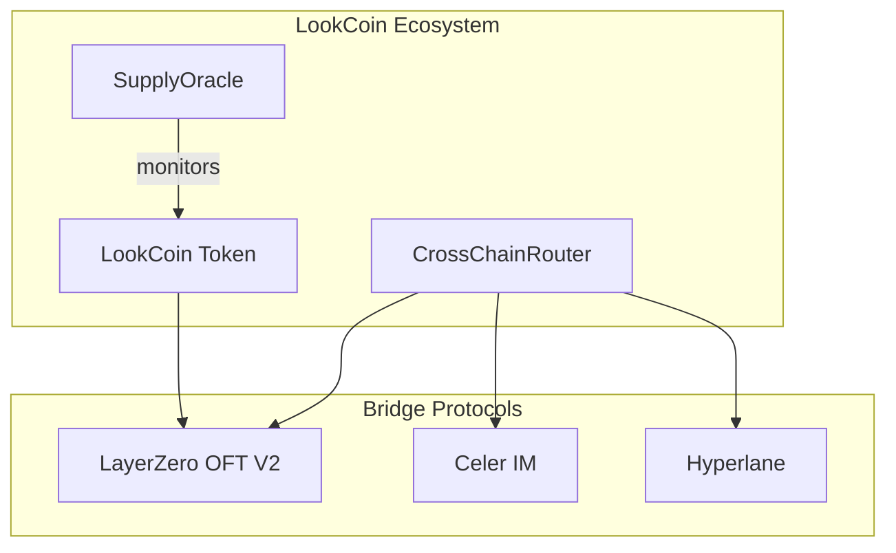

# Quick Start Guide

Get up and running with LookCoin development in 5 minutes.

## Prerequisites Checklist

- [ ] Node.js v18+ installed
- [ ] Git installed  
- [ ] Code editor (VS Code recommended)
- [ ] MetaMask or similar wallet

## 5-Minute Setup

### 1. Clone and Install (2 minutes)

```bash
# Clone repository
git clone https://github.com/lookcard-dev/lookcoin-contract.git
cd lookcoin-contract

# Install dependencies
npm install

# Copy environment file
cp .env.example .env
```

### 2. Compile and Test (2 minutes)

```bash
# Compile contracts
npm run compile

# Run tests to verify setup
npm test

# Check contract sizes
npm run size
```

### 3. Deploy to Testnet (1 minute)

```bash
# Configure your .env with testnet RPC and test wallet private key
# Then deploy to BSC testnet
npm run deploy:bsc-testnet

# Setup roles and configuration
npm run setup:bsc-testnet
```

## What You Just Built

- **LookCoin Token**: ERC20 token with cross-chain capabilities
- **Bridge Modules**: LayerZero and Celer IM integrations  
- **Security Infrastructure**: Supply oracle and access controls
- **Multi-Protocol Router**: Unified bridging interface

## Verify Your Setup

### Check Deployment

```bash
# View deployed contracts
cat deployments/bsctestnet.json

# Run integration tests
npm run test:integration
```

### Test Cross-Chain Transfer

```bash
# Deploy to second network
npm run deploy:base-sepolia
npm run setup:base-sepolia

# Configure cross-chain connections
npm run configure:bsc-testnet
npm run configure:base-sepolia

# Test bridging (via test script)
npx hardhat run scripts/test-bridge.ts --network bsc-testnet
```

## Next Steps

Choose your path:

### For New Developers
- Read [Developer Onboarding Guide](DEVELOPER_ONBOARDING.md)
- Study [Technical Architecture](TECHNICAL.md)
- Explore the test suite in `/test`

### For Integration Partners
- Review [User Flow Guide](USER_FLOW.md) 
- Check [Contract Addresses](ADDRESSES.md)
- Test bridging functionality

### For Security Auditors
- Read [Security Overview](SECURITY.md)
- Run security tests: `npm run test:security`
- Review audit reports in project root

### For Operations Teams
- Study [Deployment Guide](DEPLOYMENT.md)
- Practice [User Flow](USER_FLOW.md) procedures
- Learn about [Oracle Architecture](ORACLE_ARCHITECTURE.md)

## Common Commands

| Task | Command |
|------|---------|
| Compile contracts | `npm run compile` |
| Run all tests | `npm test` |
| Deploy to network | `npm run deploy:<network>` |
| Setup post-deployment | `npm run setup:<network>` |
| Configure cross-chain | `npm run configure:<network>` |
| Security audit | `npm run security-audit` |
| Gas analysis | `npm run test:gas` |
| Coverage report | `npm run coverage` |

## Supported Networks

| Network | Deploy Command | Status |
|---------|----------------|---------|
| BSC Testnet | `npm run deploy:bsc-testnet` | ✅ Active |
| Base Sepolia | `npm run deploy:base-sepolia` | ✅ Active |
| Optimism Sepolia | `npm run deploy:optimism-sepolia` | ✅ Active |
| Sapphire Mainnet | `npm run deploy:sapphire-mainnet` | ✅ Active |
| BSC Mainnet | `npm run deploy:bsc-mainnet` | ✅ Active |

## Environment Variables

Essential variables for your `.env` file:

```bash
# Required: MPC vault address for governance
GOVERNANCE_VAULT=0x...

# Optional: Dev team address for technical roles  
DEV_TEAM_ADDRESS=0x...

# Required: Network RPC endpoints
BSC_TESTNET_RPC=https://data-seed-prebsc-1-s1.binance.org:8545/
BASE_SEPOLIA_RPC=https://sepolia.base.org

# Required: Deployment private keys (use test wallets!)
DEPLOYER_PRIVATE_KEY=0x...
```

## Troubleshooting

### Common Issues

**"No deployment found"**
```bash
# Solution: Run deploy script first
npm run deploy:<network>
```

**"Cross-tier configuration detected"**
```bash
# Solution: Use force flag for mixed tier deployments
npm run configure:<network> -- --force-cross-tier
```

**"Insufficient balance for deployment"**
```bash
# Solution: Fund your deployer wallet with testnet tokens
# BSC Testnet: https://testnet.binance.org/faucet-smart
# Base Sepolia: https://bridge.base.org/deposit
```

### Getting Help

- **Documentation**: Check relevant doc in `/docs` folder
- **Issues**: Create GitHub issue with error details
- **Logs**: Enable debug mode: `DEBUG_DEPLOYMENT=true npm run deploy:network`

## Architecture Overview



Ready to dive deeper? Continue with the [Developer Onboarding Guide](DEVELOPER_ONBOARDING.md)!

---

**⚡ Pro Tip**: Bookmark this page and use it as your command reference during development.