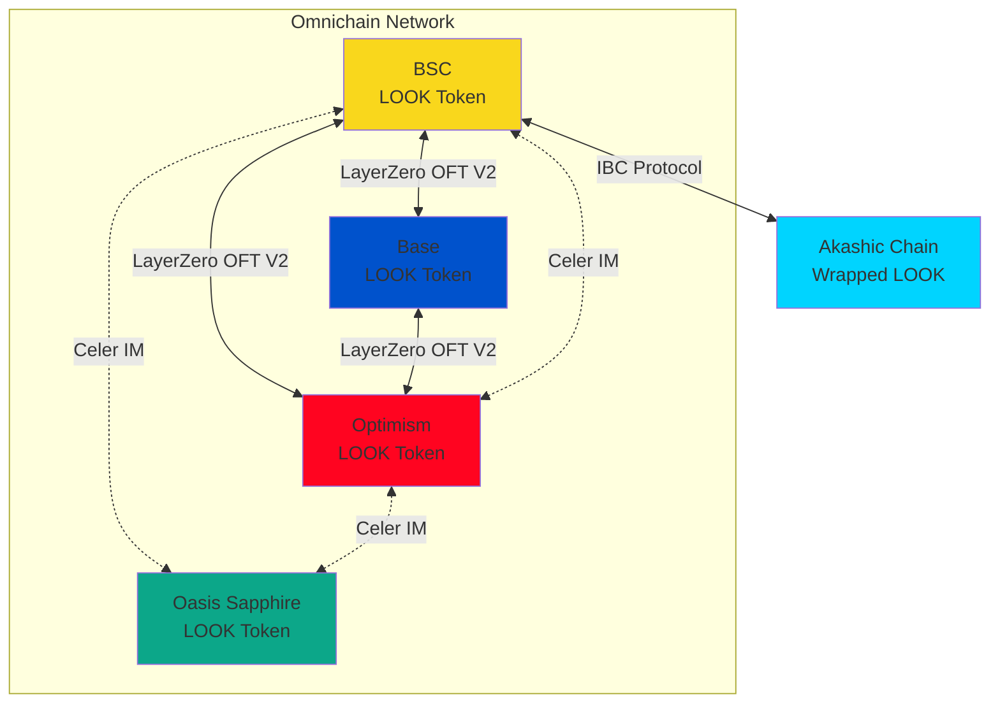
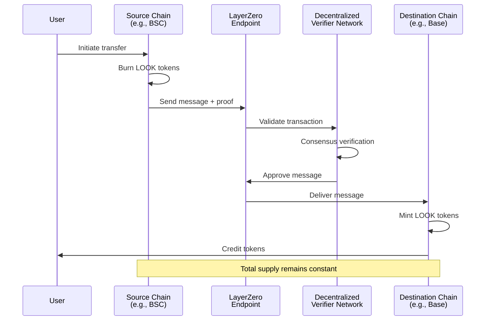
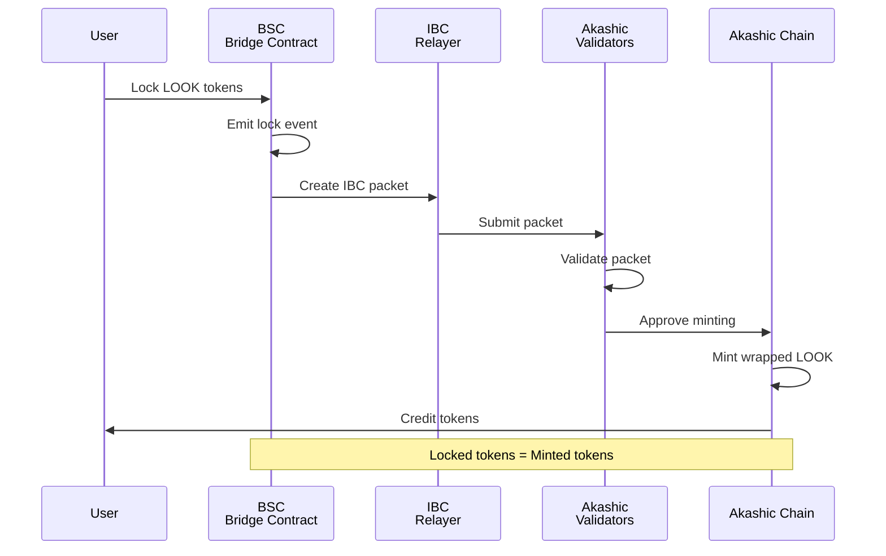
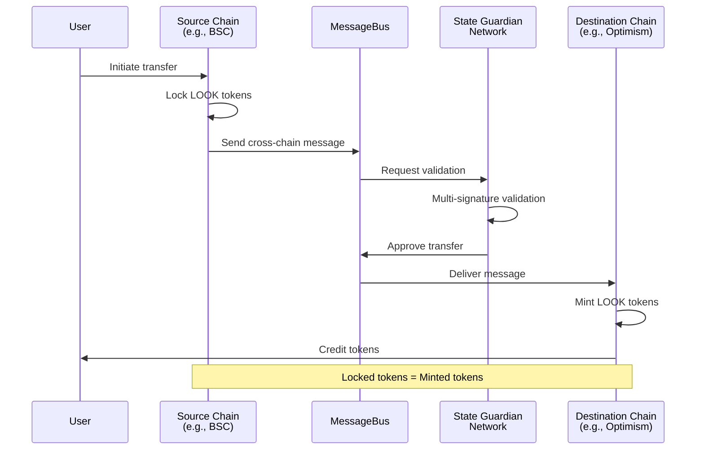
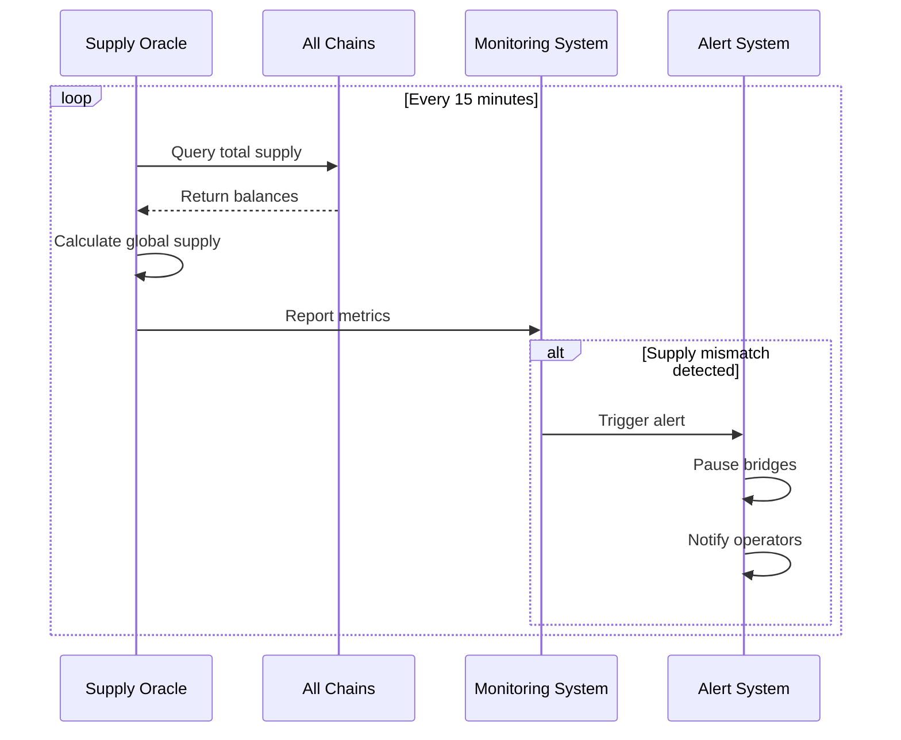
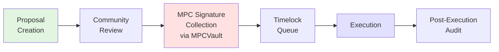

# LookCoin Technical Architecture

## Executive Summary

LookCoin (LOOK) is the native platform token of the LookCard ecosystem, designed as an omnichain fungible token utilizing a triple-bridge architecture for seamless cross-chain transfers. The token integrates LayerZero's OFT V2 standard (BSC, Base, Optimism), Celer IM's cross-chain messaging (BSC, Optimism), and the Inter-Blockchain Communication (IBC) protocol (Akashic Chain via BSC), creating a comprehensive multi-chain token ecosystem. The architecture employs a unified global supply model with burn-and-mint mechanics on LayerZero-supported chains, lock-and-mint mechanics for both Celer IM and IBC bridges, ensuring consistent token supply across all deployments while providing redundancy and enhanced cross-chain capabilities. The architecture additionally supports Oasis Sapphire through Celer IM integration.

## Token Specification

### Core Token Properties

- **Token Name**: LookCoin
- **Token Symbol**: LOOK
- **Decimals**: 18
- **Total Supply**: Fixed supply model with cross-chain reconciliation
- **Standard**: ERC-20 base with LayerZero OFTV2 extension
- **Governance**: MPC multisig wallet control via MPCVault provider

### Technical Standards

- **ERC-20 Compliance**: Full compatibility with standard token interfaces
- **OFTV2 Implementation**: LayerZero's Omnichain Fungible Token V2 standard
- **Upgradeable Contracts**: Proxy pattern for future enhancements
- **Access Control**: Role-based permissions with granular controls

## Omnichain Architecture Overview

LookCoin implements a triple-bridge architecture to achieve comprehensive cross-chain functionality:

### LayerZero Integration

- **Supported Chains**: BSC, Base, Optimism
- **Mechanism**: Burn-and-mint for supply consistency
- **Security**: Decentralized Verifier Network (DVN) validation
- **Messaging**: Ultra Light Node (ULN) for cross-chain communication

### Celer IM Integration

- **Supported Chains**: BSC, Optimism, Oasis Sapphire
- **Mechanism**: Lock-and-mint through cBridge liquidity pools
- **Security**: State Guardian Network (SGN) validation
- **Messaging**: MessageBus for arbitrary cross-chain communication

### IBC Bridge Integration

- **Target Chain**: Akashic Chain
- **Mechanism**: Lock-and-mint through BSC bridge
- **Security**: IBC validator consensus
- **Interoperability**: Native IBC packet routing



## Chain Deployment Matrix

| Chain Name     | Bridge Types               | Network ID | Contract Address | Status  |
| -------------- | -------------------------- | ---------- | ---------------- | ------- |
| BSC            | LayerZero OFT V2, Celer IM | 56         | TBD              | Planned |
| Base           | LayerZero OFT V2           | 8453       | TBD              | Planned |
| Optimism       | LayerZero OFT V2, Celer IM | 10         | TBD              | Planned |
| Oasis Sapphire | Celer IM                   | 23295      | TBD              | Planned |
| Akashic Chain  | IBC Bridge                 | TBD        | TBD              | Planned |

## Cross-Chain Flow Diagrams

### LayerZero Burn-and-Mint Flow



### IBC Lock-and-Mint Flow



### Celer IM Lock-and-Mint Flow



Note: The same Celer IM lock-and-mint flow applies to transfers involving Oasis Sapphire as source or destination chain.

### Supply Reconciliation Mechanism



## Smart Contract Design

### Contract Architecture

#### Upgradeable Proxy Pattern

```solidity
// Proxy implementation pattern
contract LookCoinOFTV2 is OFTV2Upgradeable, UUPSUpgradeable {
    // Implementation details
}
```

#### Key Components

- **Token Core**: ERC-20 implementation with minting/burning capabilities
- **OFT V2 Module**: LayerZero cross-chain functionality
- **Access Control**: Role-based permissions system
- **Emergency Controls**: Pause mechanism for security incidents

### Contract Modules

#### Core Token Module

- Standard ERC-20 functions
- Mint/burn authorization logic
- Balance tracking and transfers
- Supply management

#### Cross-Chain Module

- LayerZero endpoint integration
- Celer IM MessageBus interface integration
- SGN signature verification logic
- cBridge liquidity pool handling
- Message encoding/decoding for LayerZero and Celer IM
- Fee calculation logic
- Chain-specific configurations

#### Security Module

- Emergency pause functionality
- Rate limiting mechanisms
- Whitelist/blacklist management
- Multi-signature requirements

#### Governance Module

- Proposal submission system
- Voting mechanisms
- Execution timelock
- Parameter adjustment

## Security & Ownership Model

### MPC Multisig Governance

- **Provider**: MPCVault (off-chain MPC provider)
- **Threshold**: M-of-N signature requirement (e.g., 3-of-5)
- **Key Distribution**: Geographically distributed key shares managed off-chain by MPCVault provider
- **Rotation Policy**: Quarterly key rotation schedule managed by MPCVault provider
- **Access Levels**: Tiered permission structure managed off-chain by MPCVault provider

### LayerZero Security Configuration

```yaml
DVN Configuration:
  - Required DVNs: 2
  - Optional DVNs: 1
  - Verification Threshold: 66%
  - Timeout Period: 600 seconds
```

### IBC Security Model

- **Validator Set**: Minimum 21 active validators
- **Trust Period**: 14-day unbonding period
- **Light Client**: On-chain verification
- **Packet Timeout**: 1-hour expiry

### Celer IM Security Model

- **Validator Set**: SGN validators with staked CELR tokens
- **Trust Model**: Non-custodial liquidity pool management
- **Validation Process**: Multi-signature validation by SGN
- **Slashing Conditions**: Penalties for malicious behavior or downtime
- **Liquidity Security**: Real-time pool monitoring and automated risk management

### Security Layers

1. **Smart Contract Level**: Audited code with formal verification
2. **Bridge Level**: DVN/Validator consensus requirements
3. **Operational Level**: MPC multisig for admin functions
4. **Monitoring Level**: Real-time anomaly detection

## Governance & Upgradeability

### Governance Workflow



### Upgrade Procedures

#### Standard Upgrade Process

1. **Proposal Submission**: Technical specification and impact analysis
2. **Security Review**: External audit requirement for major changes
3. **MPC Approval**: Collect required signatures (3-of-5) via MPCVault provider
4. **Timelock Period**: 48-hour delay for community review
5. **Execution**: Atomic upgrade across all chains
6. **Verification**: Post-upgrade testing and monitoring

#### Emergency Response

- **Severity Levels**: Critical, High, Medium, Low
- **Fast Track**: 2-hour timelock for critical fixes
- **Pause First**: Immediate pause capability without timelock
- **Communication**: Real-time updates via official channels

### Cross-Chain Coordination

#### Upgrade Synchronization

- Coordinated upgrade windows
- Chain-by-chain rollout strategy
- Rollback procedures
- Version compatibility matrix

#### Parameter Adjustment

- Fee updates
- Rate limits
- Whitelist management
- Bridge configurations

## Risk Mitigation & Monitoring

### Supply Monitoring System

#### Real-Time Tracking

- **Metrics**: Total supply per chain, bridge volumes, transaction counts
- **Frequency**: 1-minute intervals for critical metrics
- **Storage**: Time-series database with 1-year retention
- **Dashboards**: Grafana visualization with alerts

#### Reconciliation Process

```javascript
// Pseudo-code for supply reconciliation across LayerZero, IBC, and Celer IM bridges
async function reconcileSupply() {
	const supplies = await Promise.all(SUPPORTED_CHAINS.map((chain) => chain.getTotalSupply()));

	const totalSupply = supplies.reduce((a, b) => a + b, 0);

	if (totalSupply !== EXPECTED_TOTAL_SUPPLY) {
		await pauseAllBridges(); // Pauses LayerZero, IBC, and Celer IM bridges
		await alertOperators();
		await initiateInvestigation();
	}
}
```

### Incident Response Framework

#### Response Levels

1. **Level 1**: Automated response (pause bridges)
2. **Level 2**: Operator intervention required
3. **Level 3**: MPCVault multisig action needed
4. **Level 4**: Community notification and action

#### Bridge Failure Scenarios

- **Communication Failure**: Retry with exponential backoff
- **Validation Failure**: Manual investigation required
- **Supply Mismatch**: Automatic bridge pause
- **Contract Compromise**: Emergency pause all operations

### Security Requirements

#### Audit Schedule

- **Pre-Launch**: Full security audit by tier-1 firm
- **Quarterly**: Incremental audits for changes
- **Annual**: Comprehensive security review
- **Ad-Hoc**: Critical updates audit

#### Monitoring Infrastructure

- **Log Aggregation**: Centralized logging system
- **Anomaly Detection**: ML-based pattern recognition
- **Alert Routing**: PagerDuty integration
- **Incident Tracking**: JIRA-based workflow

## Future Considerations

### Roadmap Priorities

#### Phase 1: Foundation (Months 1-3)

- Deploy core contracts on primary chains
- Establish bridge connections
- Implement monitoring systems
- Complete security audits

#### Phase 2: Expansion (Months 4-6)

- Additional chain integrations (Arbitrum, Polygon)
- Enhanced governance features
- Liquidity incentive programs
- Mobile wallet integration

#### Phase 3: Maturation (Months 7-12)

- Governance decentralization
- Advanced DeFi integrations
- Cross-chain DEX aggregation
- Institutional features

### Technical Enhancements

#### Planned Upgrades

- **ZK-Proof Integration**: Privacy-preserving transfers
- **Account Abstraction**: Gasless transactions
- **Batch Operations**: Multi-transfer optimization
- **Dynamic Fees**: Market-based pricing

#### Scalability Improvements

- Layer 2 optimization
- State channel integration
- Compression algorithms
- Parallel processing

### Governance Evolution

#### Decentralization Path

1. **Stage 1**: MPCVault MPC multisig (current)
2. **Stage 2**: Token holder voting rights
3. **Stage 3**: Full DAO governance
4. **Stage 4**: Autonomous protocol

#### Community Involvement

- Governance token distribution
- Proposal creation rights
- Parameter adjustment voting
- Treasury management

## References

### Technical Documentation

- [LayerZero V2 Documentation](https://docs.layerzero.network/v2)
- [LayerZero OFT V2 Standard](https://docs.layerzero.network/v2/developers/evm/oft/quickstart)
- [Celer Network Documentation](https://docs.celer.network)
- [Celer IM Integration Guide](https://docs.celer.network/developer/celer-im)
- [cBridge Technical Specification](https://docs.celer.network/developer/cbridge-sdk)
- [IBC Protocol Specification](https://github.com/cosmos/ibc)
- [OpenZeppelin Upgradeable Contracts](https://docs.openzeppelin.com/contracts/4.x/upgradeable)

### Security Resources

- [MPC Wallet Best Practices](https://www.fireblocks.com/blog/mpc-wallet-technology/)
- [Bridge Security Considerations](https://ethereum.org/en/developers/docs/bridges/)
- [Smart Contract Security Verification](https://consensys.github.io/smart-contract-best-practices/)

### Governance Frameworks

- [Compound Governance](https://compound.finance/docs/governance)
- [OpenZeppelin Governor](https://docs.openzeppelin.com/contracts/4.x/governance)
- [Snapshot Voting](https://docs.snapshot.org/)

### Monitoring Tools

- [Tenderly Monitoring](https://tenderly.co/monitoring)
- [Defender Sentinel](https://docs.openzeppelin.com/defender/sentinel)
- [Grafana Dashboards](https://grafana.com/docs/)
