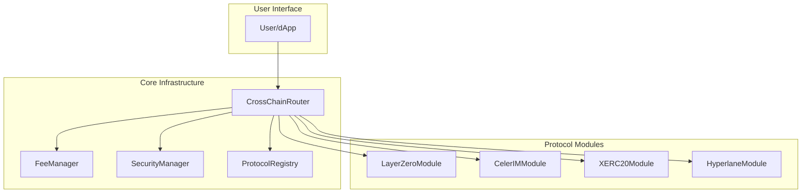
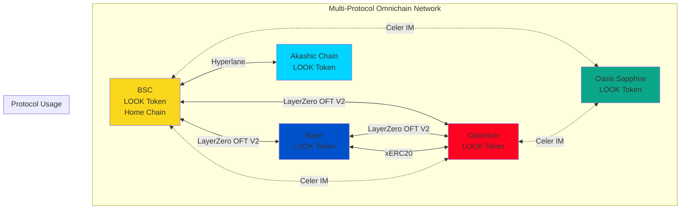
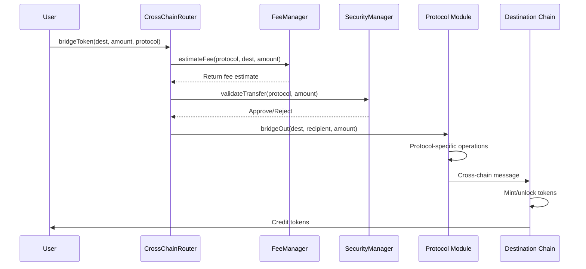
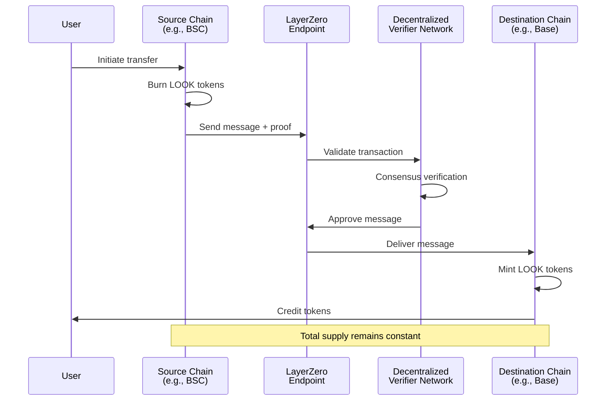
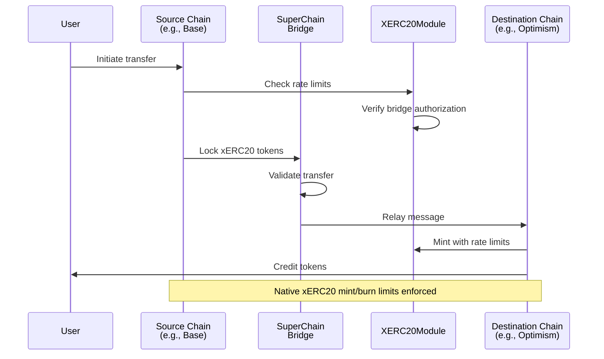
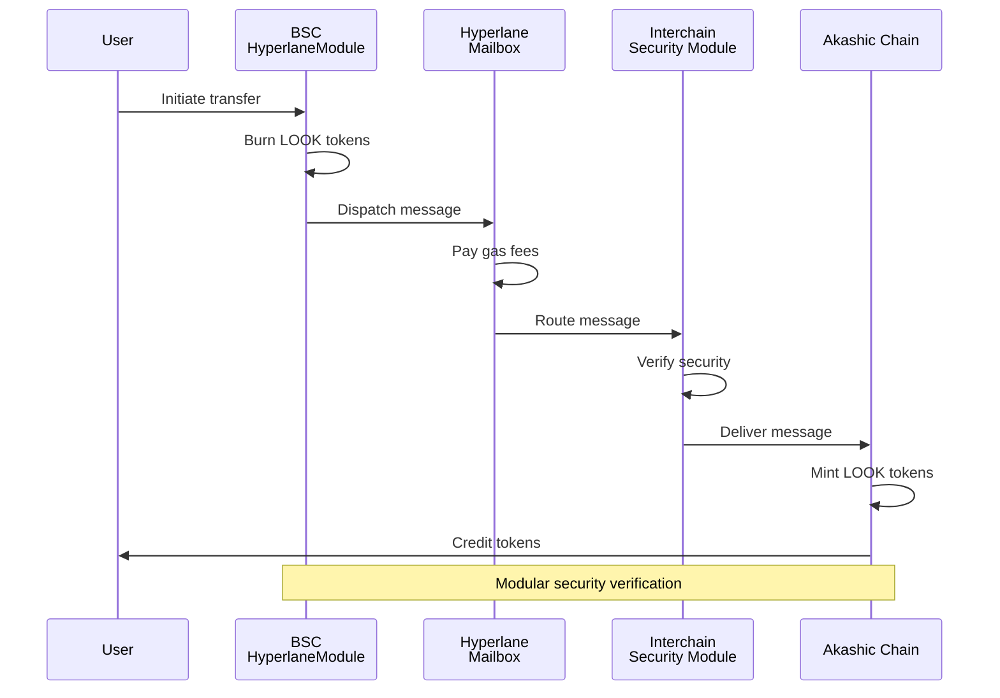
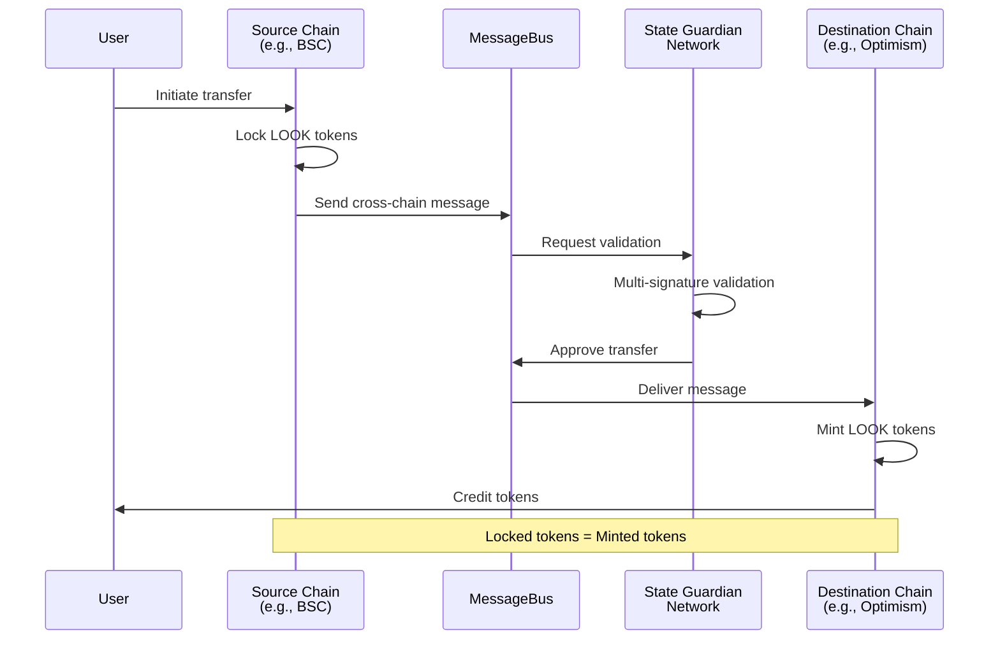
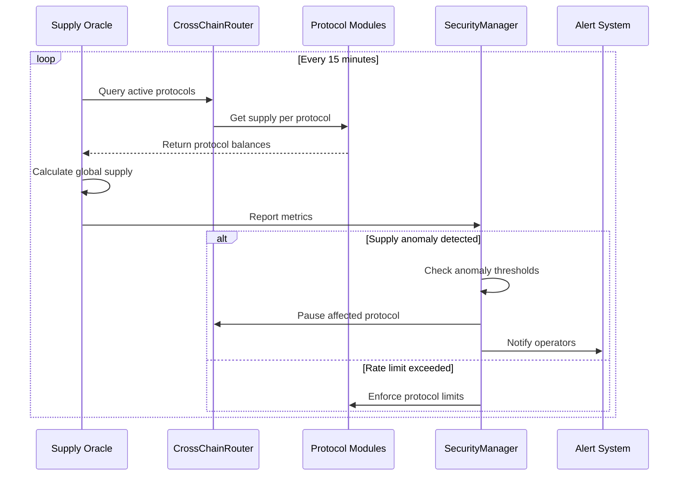
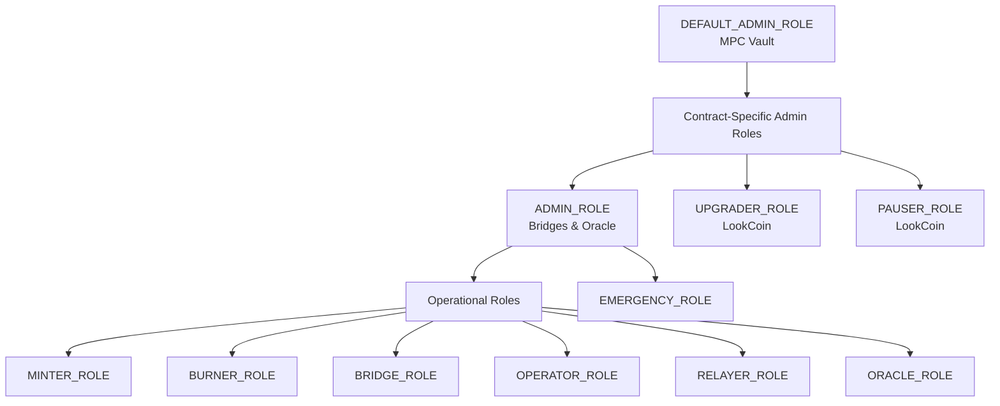
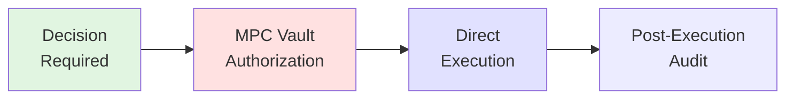

# LookCoin Technical Architecture

## Executive Summary

LookCoin (LOOK) is the native platform token of the LookCard ecosystem, designed as a native multi-protocol omnichain fungible token. The token implements a unified cross-chain architecture through the CrossChainRouter, supporting multiple bridge protocols: LayerZero's OFT V2 standard (BSC, Base, Optimism), Celer IM's cross-chain messaging (BSC, Optimism, Oasis Sapphire), SuperChain's xERC20 standard (Optimism ecosystem), and Hyperlane (replacing IBC for Akashic Chain connectivity). The architecture employs protocol abstraction through a modular design where each bridge protocol implements the ILookBridgeModule interface, enabling seamless protocol selection based on destination chain, cost optimization, speed requirements, or security preferences. The system maintains a unified global supply model with appropriate mechanics for each protocol (burn-and-mint for LayerZero, lock-and-mint for Celer IM, mint/burn authorization for xERC20, and burn-and-mint for Hyperlane), ensuring consistent token supply across all deployments while providing redundancy, optimal routing, and enhanced cross-chain capabilities.

## Token Specification

### Core Token Properties

- **Token Name**: LookCoin
- **Token Symbol**: LOOK
- **Decimals**: 18
- **Total Supply**: Fixed supply model with cross-chain reconciliation
- **Standard**: ERC-20 base with LayerZero OFTV2 extension
- **Governance**: External MPC vault wallet for secure off-chain governance

### Technical Standards

- **ERC-20 Compliance**: Full compatibility with standard token interfaces
- **Multi-Protocol Support**: Native implementation of LayerZero OFT V2, xERC20, and Hyperlane standards
- **Upgradeable Contracts**: UUPS proxy pattern for future enhancements
- **Access Control**: Role-based permissions with granular controls
- **Protocol Abstraction**: ILookBridgeModule interface for unified bridge operations

## Omnichain Architecture Overview

LookCoin implements a native multi-protocol architecture through the CrossChainRouter, enabling optimal protocol selection for each cross-chain transfer:

### Multi-Protocol Router Architecture



### LayerZero Integration (Protocol ID: 0)

- **Supported Chains**: BSC, Base, Optimism
- **Mechanism**: Burn-and-mint for supply consistency
- **Security**: Decentralized Verifier Network (DVN) validation
- **Messaging**: Ultra Light Node (ULN) for cross-chain communication
- **Module**: LayerZeroModule implementing ILookBridgeModule

### Celer IM Integration (Protocol ID: 1)

- **Supported Chains**: BSC, Optimism, Oasis Sapphire
- **Mechanism**: Lock-and-mint through cBridge liquidity pools
- **Security**: State Guardian Network (SGN) validation
- **Messaging**: MessageBus for arbitrary cross-chain communication
- **Module**: CelerIMModule implementing ILookBridgeModule

### SuperChain xERC20 Integration (Protocol ID: 2)

- **Supported Chains**: Optimism ecosystem (Base, Optimism, etc.)
- **Mechanism**: Mint/burn with bridge-specific rate limits
- **Security**: Bridge authorization and rate limiting
- **Standard**: xERC20 token standard for native cross-chain support
- **Module**: XERC20Module implementing ILookBridgeModule

### Hyperlane Integration (Protocol ID: 3)

- **Target Chain**: Akashic Chain (replacing IBC)
- **Mechanism**: Burn-and-mint with mailbox system
- **Security**: Modular security via Interchain Security Modules (ISM)
- **Messaging**: Hyperlane mailbox for message passing
- **Module**: HyperlaneModule implementing ILookBridgeModule



## Chain Deployment Matrix

| Chain Name     | Supported Protocols                        | Network ID | Protocol IDs | Status  |
| -------------- | ------------------------------------------ | ---------- | ------------ | ------- |
| BSC            | LayerZero, Celer IM, Hyperlane           | 56         | 0, 1, 3      | Planned |
| Base           | LayerZero, xERC20                         | 8453       | 0, 2         | Planned |
| Optimism       | LayerZero, Celer IM, xERC20               | 10         | 0, 1, 2      | Planned |
| Oasis Sapphire | Celer IM                                  | 23295      | 1            | Planned |
| Akashic Chain  | Hyperlane                                 | 9070       | 3            | Planned |

### Protocol Selection Matrix

| Source → Destination | Optimal Protocol | Alternative Protocols | Selection Criteria |
| -------------------- | ---------------- | --------------------- | ------------------ |
| BSC → Base          | LayerZero        | -                     | Direct support     |
| BSC → Optimism      | LayerZero        | Celer IM              | Speed vs. cost     |
| Base → Optimism     | xERC20           | LayerZero             | Native SuperChain  |
| BSC → Akashic       | Hyperlane        | -                     | Only option        |
| * → Sapphire        | Celer IM         | -                     | Only option        |

## Cross-Chain Flow Diagrams

### Multi-Protocol Router Flow



### LayerZero Burn-and-Mint Flow



### xERC20 Native Bridge Flow



### Hyperlane Burn-and-Mint Flow



### Celer IM Lock-and-Mint Flow



Note: The same Celer IM lock-and-mint flow applies to transfers involving Oasis Sapphire as source or destination chain.

### Supply Reconciliation with Multi-Protocol Support



## Smart Contract Design

### Contract Architecture

#### Multi-Protocol Architecture

```solidity
// Core router pattern
contract CrossChainRouter {
    mapping(Protocol => ILookBridgeModule) public protocolModules;
    
    function bridgeToken(
        uint256 destinationChain,
        address recipient,
        uint256 amount,
        Protocol protocol,
        bytes calldata params
    ) external payable {
        ILookBridgeModule module = protocolModules[protocol];
        module.bridgeOut(destinationChain, recipient, amount, params);
    }
}

// Unified bridge interface
interface ILookBridgeModule {
    function bridgeOut(
        uint256 destinationChain,
        address recipient,
        uint256 amount,
        bytes calldata params
    ) external payable returns (bytes32 transferId);
    
    function estimateFee(
        uint256 destinationChain,
        uint256 amount,
        bytes calldata params
    ) external view returns (uint256 fee, uint256 estimatedTime);
}
```

#### Key Components

- **Token Core**: Multi-standard ERC-20 with LayerZero OFT V2, xERC20, and Hyperlane support
- **CrossChainRouter**: Central hub for protocol selection and routing
- **Protocol Modules**: Modular bridge implementations (LayerZero, Celer, xERC20, Hyperlane)
- **Infrastructure**: FeeManager, SecurityManager, ProtocolRegistry
- **Access Control**: Unified role-based permissions across all contracts

### Contract Modules

#### Core Token Module (LookCoin.sol)

- ERC-20 with multi-protocol extensions
- LayerZero OFT V2 native implementation
- xERC20 mint/burn authorization
- Hyperlane message handling
- Unified mint/burn access control
- CrossChainRouter integration

#### CrossChainRouter Module

- Protocol selection logic
- Route optimization (cost, speed, security)
- Unified fee aggregation
- Security validation
- Emergency protocol control

#### Protocol Modules

**LayerZeroModule**:
- OFT V2 message handling
- DVN configuration
- Trusted remote management
- Gas optimization

**CelerIMModule**:
- MessageBus integration
- SGN validation
- Lock/unlock mechanics
- Fee parameter management

**XERC20Module**:
- Bridge authorization
- Rate limit enforcement
- Mint/burn limit management
- SuperChain bridge integration

**HyperlaneModule**:
- Mailbox integration
- ISM configuration
- Gas payment handling
- Domain routing

#### Infrastructure Modules

**FeeManager**:
- Multi-protocol fee estimation
- Dynamic fee adjustment
- Fee collection and distribution
- Protocol-specific parameters

**SecurityManager**:
- Global rate limiting
- Per-protocol limits
- Anomaly detection
- Emergency response

**ProtocolRegistry**:
- Protocol registration
- Version management
- Chain support tracking
- Protocol metadata

## Security & Ownership Model

### MPC Vault Governance

- **Type**: External MPC vault wallet (off-chain governance)
- **Security**: Multi-party computation ensures no single point of failure
- **Operations**: Direct execution of administrative functions
- **Key Management**: Secure key distribution managed by MPC vault provider
- **Access Control**: All contract admin roles assigned to vault address

### Multi-Protocol Security Architecture

#### Protocol-Specific Security Models

**LayerZero Security**:
```yaml
DVN Configuration:
  - Required DVNs: 2
  - Optional DVNs: 1
  - Verification Threshold: 66%
  - Timeout Period: 600 seconds
  - Executor: Decentralized execution network
```

**Celer IM Security**:
- **Validator Set**: SGN validators with staked CELR tokens
- **Trust Model**: Non-custodial liquidity pool management
- **Validation Process**: Multi-signature validation by SGN
- **Slashing Conditions**: Penalties for malicious behavior or downtime
- **Liquidity Security**: Real-time pool monitoring

**xERC20 Security**:
- **Rate Limiting**: Per-bridge mint/burn limits
- **Authorization**: Explicit bridge whitelisting
- **Time Windows**: Rolling 24-hour limit enforcement
- **Emergency Controls**: Immediate bridge suspension

**Hyperlane Security**:
- **ISM Types**: Multisig, Aggregation, Routing ISMs
- **Validator Sets**: Configurable per destination
- **Proof Verification**: Merkle tree validation
- **Gas Payment**: Required prepayment via IGP

#### Unified Security Layer

**SecurityManager Features**:
- Cross-protocol anomaly detection
- Global daily transfer limits
- Per-protocol rate limiting
- Automated circuit breakers
- Real-time monitoring integration

### Security Layers

1. **Smart Contract Level**: Audited code with formal verification
2. **Bridge Level**: DVN/Validator consensus requirements
3. **Operational Level**: MPC multisig for admin functions
4. **Monitoring Level**: Real-time anomaly detection

### Access Control & Role Assignment

#### Role Overview

The LookCoin ecosystem implements granular role-based access control using OpenZeppelin's AccessControl pattern. All contracts share a unified role hierarchy with the MPC vault serving as the governance authority.

| Contract                   | Role Constant        | Gated Functions                               | Capabilities                    | Default Assignee | Revocability |
| -------------------------- | -------------------- | --------------------------------------------- | ------------------------------- | ---------------- | ------------ |
| **LookCoin.sol**           |                      |                                               |                                 |                  |              |
|                            | `DEFAULT_ADMIN_ROLE` | `grantRole()`, `revokeRole()`                 | Grant/revoke all roles          | MPC Vault        | No           |
|                            | `MINTER_ROLE`        | `mint()`                                      | Mint new tokens                 | Protocol Modules | Yes          |
|                            | `BURNER_ROLE`        | `burn()`, `burnFrom()`                        | Burn tokens                     | Protocol Modules | Yes          |
|                            | `PAUSER_ROLE`        | `pause()`, `unpause()`                        | Pause/unpause transfers         | MPC Vault        | Yes          |
|                            | `UPGRADER_ROLE`      | `upgradeToAndCall()`                          | Upgrade contract implementation | MPC Vault        | Yes          |
|                            | `BRIDGE_ROLE`        | `setAuthorizedBridge()`, `setCrossChainRouter()` | Configure bridge access     | MPC Vault        | Yes          |
| **CrossChainRouter.sol**   |                      |                                               |                                 |                  |              |
|                            | `DEFAULT_ADMIN_ROLE` | `grantRole()`, `revokeRole()`                 | Grant/revoke all roles          | MPC Vault        | No           |
|                            | `OPERATOR_ROLE`      | `registerProtocol()`, `setChainProtocolSupport()` | Manage protocols          | MPC Vault        | Yes          |
|                            | `EMERGENCY_ROLE`     | `pauseProtocol()`, `unpauseProtocol()`        | Emergency protocol control      | MPC Vault        | Yes          |
| **LayerZeroModule.sol**    |                      |                                               |                                 |                  |              |
|                            | `DEFAULT_ADMIN_ROLE` | `grantRole()`, `revokeRole()`                 | Grant/revoke all roles          | MPC Vault        | No           |
|                            | `OPERATOR_ROLE`      | `setTrustedRemote()`, `setMinDstGas()`        | Configure LayerZero            | MPC Vault        | Yes          |
| **CelerIMModule.sol**      |                      |                                               |                                 |                  |              |
|                            | `DEFAULT_ADMIN_ROLE` | `grantRole()`, `revokeRole()`                 | Grant/revoke all roles          | MPC Vault        | No           |
|                            | `OPERATOR_ROLE`      | `setRemoteModule()`, `setFeeParameters()`     | Configure Celer IM             | MPC Vault        | Yes          |
| **XERC20Module.sol**       |                      |                                               |                                 |                  |              |
|                            | `DEFAULT_ADMIN_ROLE` | `grantRole()`, `revokeRole()`                 | Grant/revoke all roles          | MPC Vault        | No           |
|                            | `OPERATOR_ROLE`      | `registerBridge()`, `updateBridgeLimits()`    | Manage bridge limits           | MPC Vault        | Yes          |
| **HyperlaneModule.sol**    |                      |                                               |                                 |                  |              |
|                            | `DEFAULT_ADMIN_ROLE` | `grantRole()`, `revokeRole()`                 | Grant/revoke all roles          | MPC Vault        | No           |
|                            | `OPERATOR_ROLE`      | `setTrustedSender()`, `setGasConfig()`        | Configure Hyperlane            | MPC Vault        | Yes          |
| **SecurityManager.sol**    |                      |                                               |                                 |                  |              |
|                            | `DEFAULT_ADMIN_ROLE` | `grantRole()`, `revokeRole()`                 | Grant/revoke all roles          | MPC Vault        | No           |
|                            | `OPERATOR_ROLE`      | `setProtocolLimits()`, `setAnomalyThresholds()` | Configure security           | MPC Vault        | Yes          |
|                            | `EMERGENCY_ROLE`     | `emergencyPause()`, `forceReconcile()`        | Emergency response              | MPC Vault        | Yes          |

#### Role Hierarchy

The role system follows a hierarchical structure where `DEFAULT_ADMIN_ROLE` serves as the root administrator:



#### Cross-Contract Role Dependencies

The multi-protocol system implements carefully orchestrated role dependencies:

1. **Protocol Module Permissions**: All protocol modules (LayerZero, Celer, XERC20, Hyperlane) require appropriate roles on the LookCoin contract:
   - LayerZero & Hyperlane modules: `MINTER_ROLE` and `BURNER_ROLE` for burn-and-mint
   - CelerIMModule: `MINTER_ROLE` for lock-and-mint
   - XERC20Module: `BRIDGE_ROLE` for authorized minting

2. **Router Integration**: The CrossChainRouter requires registration in LookCoin via `setCrossChainRouter()` to enable protocol routing.

3. **Security Integration**: Protocol modules must be registered with SecurityManager for rate limiting and anomaly detection.

4. **Fee Management**: FeeManager requires protocol module addresses for accurate fee estimation across protocols.

#### Role Assignment Lifecycle

The role assignment follows a three-stage pattern designed for security and operational efficiency, matching the deployment process:

**Stage 1: Contract Deployment**

- During deployment, only administrative roles are assigned to the `_admin` parameter (MPC vault)
- This includes `DEFAULT_ADMIN_ROLE`, `ADMIN_ROLE`, `PAUSER_ROLE`, `UPGRADER_ROLE`, `OPERATOR_ROLE`, and `EMERGENCY_ROLE`
- No operational permissions are granted during initialization to prevent unauthorized operations
- Creates deployment artifacts with contract addresses for use in subsequent stages

**Stage 2: Setup (Local Configuration)**

- **Script**: `scripts/setup.ts`
- **Purpose**: Configures roles and settings for the current network only
- **Operations**:
  - Assigns roles to protocol modules based on their requirements:
    - LayerZero/Hyperlane: `MINTER_ROLE` and `BURNER_ROLE`
    - CelerIM: `MINTER_ROLE`
    - XERC20: `BRIDGE_ROLE` and bridge authorization
  - Registers CrossChainRouter with LookCoin
  - Configures local protocol parameters
  - Sets up infrastructure contracts (FeeManager, SecurityManager)

**Stage 3: Configure (Cross-Chain Configuration)**

- **Script**: `scripts/configure-multi-protocol.ts`
- **Purpose**: Establishes cross-chain connections across all protocols
- **Operations**:
  - Registers all protocol modules with CrossChainRouter
  - Sets chain-protocol support mappings
  - Configures cross-chain trusted endpoints:
    - LayerZero trusted remotes
    - Celer remote modules
    - XERC20 bridge registrations
    - Hyperlane trusted senders
  - Updates ProtocolRegistry with supported chains per protocol
  - Configures FeeManager with protocol modules

**Technical Dependencies**:

- **Setup Stage**: Uses only local deployment artifacts and centralized configuration
- **Configure Stage**: Requires deployment artifacts from other networks via `loadOtherChainDeployments()`
- **Security**: Implements cross-tier validation to prevent mainnet/testnet mixing

#### Security Rationale

The role separation follows the principle of least privilege:

- **Governance Isolation**: MPC vault holds administrative roles but not operational roles, preventing accidental token minting/burning
- **Bridge Autonomy**: Each bridge module operates independently with its own `MINTER_ROLE` grant, allowing selective bridge disabling
- **Emergency Response**: `EMERGENCY_ROLE` provides rapid response capability without full admin access
- **Relayer Decentralization**: Multiple addresses can hold `RELAYER_ROLE` for redundancy

#### Operational Examples

**Emergency Pause Scenario**:

```solidity
// MPC vault initiates emergency pause
1. Call LookCoin.pause() with PAUSER_ROLE
2. Call IBCModule.pause() with ADMIN_ROLE
3. Call CelerIMModule.pause() with ADMIN_ROLE
4. Oracle detects pause and halts monitoring
```

**Multi-Protocol Transfer Flow**:

```solidity
// User bridges from BSC to Optimism (protocol selection)
1. User calls CrossChainRouter.bridgeToken()
2. Router selects optimal protocol (LayerZero vs Celer)
3. Router calls selected module.bridgeOut()
4. Module executes protocol-specific operations
5. Destination receives and processes message
6. SecurityManager validates and tracks transfer
```

**Contract Upgrade Process**:

```solidity
// Upgrading LookCoin implementation
1. Deploy new implementation contract
2. MPC vault calls upgradeToAndCall() with UPGRADER_ROLE
3. Roles persist through upgrade (stored in proxy)
4. No role reassignment needed
```

#### Role Management Procedures

**Granting a New Role**:

```typescript
// Only DEFAULT_ADMIN_ROLE can execute
await lookCoin.grantRole(MINTER_ROLE, newBridgeAddress);
```

**Revoking a Role**:

```typescript
// Revoke compromised oracle
await supplyOracle.revokeRole(ORACLE_ROLE, compromisedAddress);
```

**Role Verification**:

```typescript
// Check if address has role
const hasMinterRole = await lookCoin.hasRole(MINTER_ROLE, bridgeAddress);
```

**Emergency Role Rotation**:

1. Revoke role from compromised address
2. Grant role to new secure address
3. Update off-chain services to use new address
4. Monitor for any unauthorized attempts

#### Upgrade Impact on Roles

- Roles are stored in the proxy contract, not the implementation
- Upgrading contract logic does not affect role assignments
- New roles can be added in upgraded implementations
- Existing roles remain functional across upgrades
- Role constants must maintain same bytes32 values for compatibility

## Governance & Upgradeability

### Governance Workflow



### Upgrade Procedures

#### Standard Upgrade Process

1. **Technical Review**: Specification and impact analysis
2. **Security Audit**: External audit for major changes
3. **MPC Vault Authorization**: Secure approval through vault
4. **Execution**: Direct upgrade transaction
5. **Verification**: Post-upgrade testing and monitoring

#### Emergency Response

- **Severity Levels**: Critical, High, Medium, Low
- **Immediate Action**: Direct execution through MPC vault
- **Pause First**: Immediate pause capability
- **Communication**: Real-time updates via official channels

### Cross-Chain Coordination

#### Upgrade Synchronization

- Coordinated upgrade windows
- Chain-by-chain rollout strategy
- Rollback procedures
- Version compatibility matrix

#### Parameter Adjustment

- Fee updates
- Rate limits
- Whitelist management
- Bridge configurations

## Risk Mitigation & Monitoring

### Supply Monitoring System

#### Real-Time Tracking

- **Metrics**: Total supply per chain, bridge volumes, transaction counts
- **Frequency**: 1-minute intervals for critical metrics
- **Storage**: Time-series database with 1-year retention
- **Dashboards**: Grafana visualization with alerts

#### Reconciliation Process

```javascript
// Multi-protocol supply reconciliation
async function reconcileSupply() {
  const protocolSupplies = {};
  
  // Get supply per protocol
  for (const protocol of ['LayerZero', 'Celer', 'XERC20', 'Hyperlane']) {
    protocolSupplies[protocol] = await getProtocolSupply(protocol);
  }
  
  const totalSupply = Object.values(protocolSupplies).reduce((a, b) => a + b, 0);
  
  // Check for anomalies
  if (totalSupply !== EXPECTED_TOTAL_SUPPLY) {
    const affectedProtocol = identifyAnomalousProtocol(protocolSupplies);
    await securityManager.pauseProtocol(affectedProtocol);
    await alertOperators(affectedProtocol);
  }
}
```

### Incident Response Framework

#### Response Levels

1. **Level 1**: Automated response (pause bridges)
2. **Level 2**: Operator intervention required
3. **Level 3**: MPC vault action needed
4. **Level 4**: Community notification and action

#### Protocol Failure Scenarios

- **Single Protocol Failure**: Isolate and pause affected protocol only
- **Communication Failure**: Automatic failover to alternative protocol
- **Validation Failure**: Protocol-specific investigation
- **Supply Mismatch**: Per-protocol supply tracking enables targeted response
- **Contract Compromise**: Emergency pause via SecurityManager

### Security Requirements

#### Audit Schedule

- **Pre-Launch**: Full security audit by tier-1 firm
- **Quarterly**: Incremental audits for changes
- **Annual**: Comprehensive security review
- **Ad-Hoc**: Critical updates audit

#### Monitoring Infrastructure

- **Log Aggregation**: Centralized logging system
- **Anomaly Detection**: ML-based pattern recognition
- **Alert Routing**: PagerDuty integration
- **Incident Tracking**: JIRA-based workflow

## Future Considerations

### Roadmap Priorities

#### Phase 1: Foundation (Months 1-3)

- Deploy core contracts on primary chains
- Establish bridge connections
- Implement monitoring systems
- Complete security audits

#### Phase 2: Expansion (Months 4-6)

- Additional chain integrations (Arbitrum, Polygon)
- Enhanced governance features
- Liquidity incentive programs
- Mobile wallet integration

#### Phase 3: Maturation (Months 7-12)

- Governance decentralization
- Advanced DeFi integrations
- Cross-chain DEX aggregation
- Institutional features

### Technical Enhancements

#### Planned Upgrades

- **ZK-Proof Integration**: Privacy-preserving transfers
- **Account Abstraction**: Gasless transactions
- **Batch Operations**: Multi-transfer optimization
- **Dynamic Fees**: Market-based pricing

#### Scalability Improvements

- Layer 2 optimization
- State channel integration
- Compression algorithms
- Parallel processing

### Governance Evolution

#### Decentralization Path

1. **Stage 1**: MPCVault MPC multisig (current)
2. **Stage 2**: Token holder voting rights
3. **Stage 3**: Full DAO governance
4. **Stage 4**: Autonomous protocol

#### Community Involvement

- Governance token distribution
- Proposal creation rights
- Parameter adjustment voting
- Treasury management

## References

### Technical Documentation

- [LayerZero V2 Documentation](https://docs.layerzero.network/v2)
- [LayerZero OFT V2 Standard](https://docs.layerzero.network/v2/developers/evm/oft/quickstart)
- [Celer Network Documentation](https://docs.celer.network)
- [Celer IM Integration Guide](https://docs.celer.network/developer/celer-im)
- [xERC20 Token Standard](https://github.com/defi-wonderland/xERC20)
- [Hyperlane Documentation](https://docs.hyperlane.xyz)
- [Hyperlane Message Format](https://docs.hyperlane.xyz/docs/reference/messaging/message-format)
- [OpenZeppelin Upgradeable Contracts](https://docs.openzeppelin.com/contracts/4.x/upgradeable)

### Security Resources

- [MPC Wallet Best Practices](https://www.fireblocks.com/blog/mpc-wallet-technology/)
- [Bridge Security Considerations](https://ethereum.org/en/developers/docs/bridges/)
- [Smart Contract Security Verification](https://consensys.github.io/smart-contract-best-practices/)

### Governance Frameworks

- [Compound Governance](https://compound.finance/docs/governance)
- [OpenZeppelin Governor](https://docs.openzeppelin.com/contracts/4.x/governance)
- [Snapshot Voting](https://docs.snapshot.org/)

### Monitoring Tools

- [Tenderly Monitoring](https://tenderly.co/monitoring)
- [Defender Sentinel](https://docs.openzeppelin.com/defender/sentinel)
- [Grafana Dashboards](https://grafana.com/docs/)
