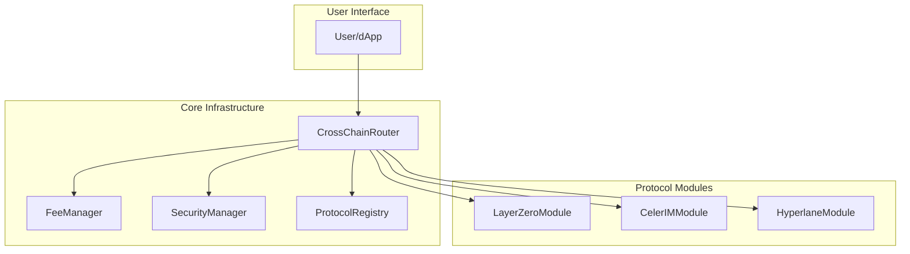
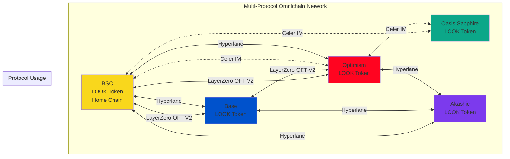
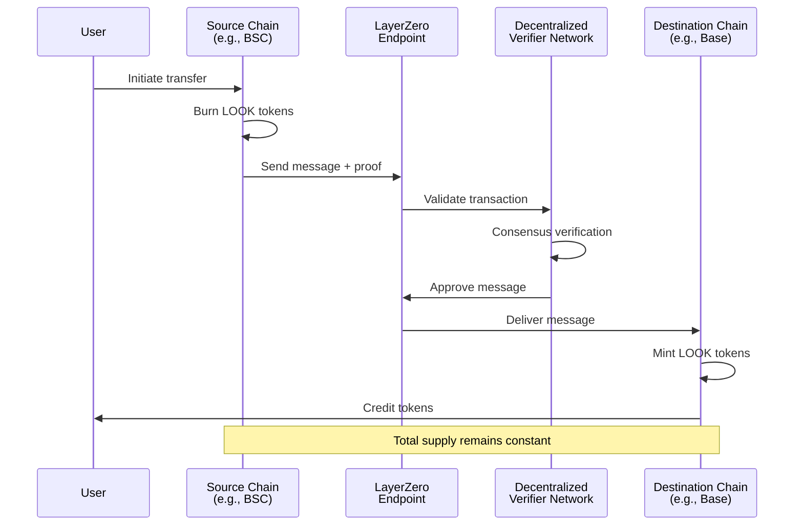
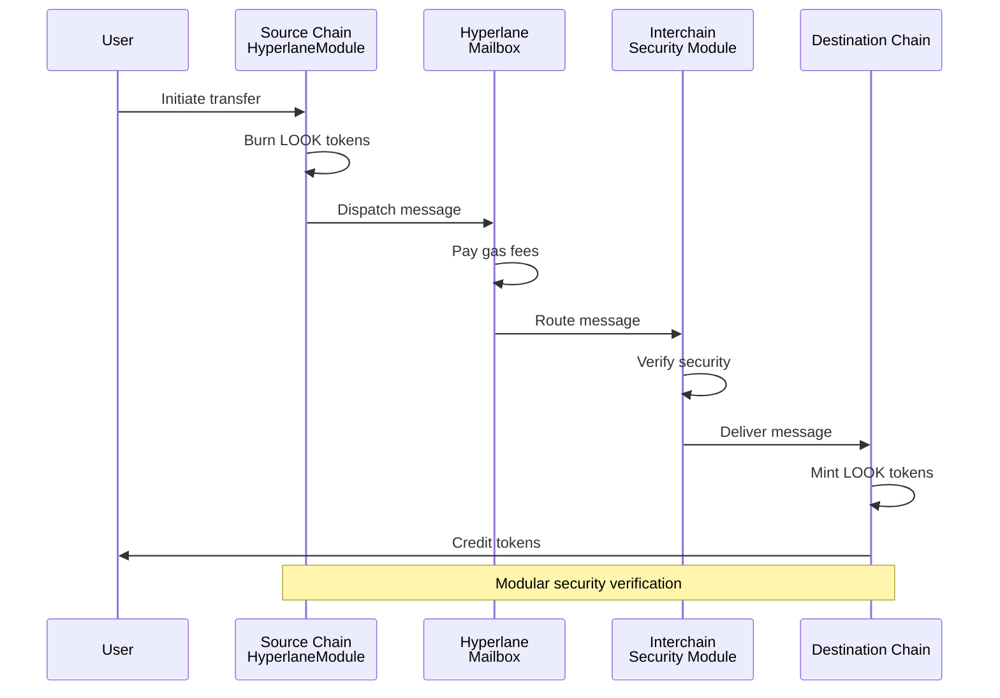
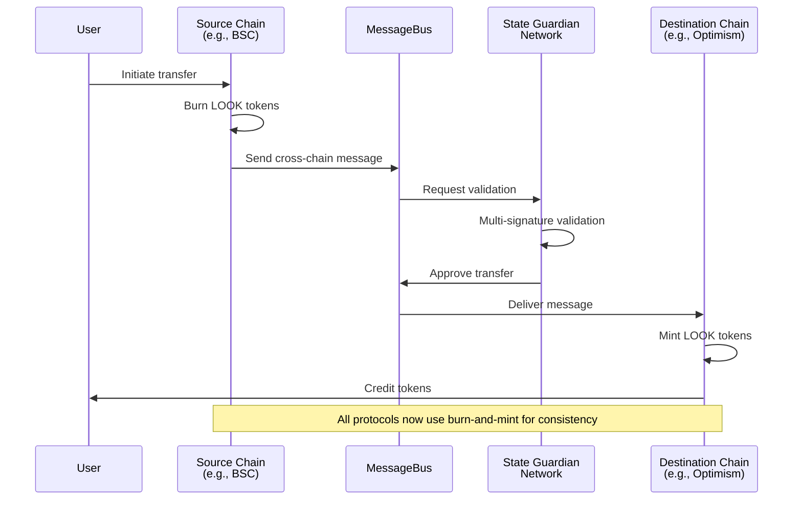
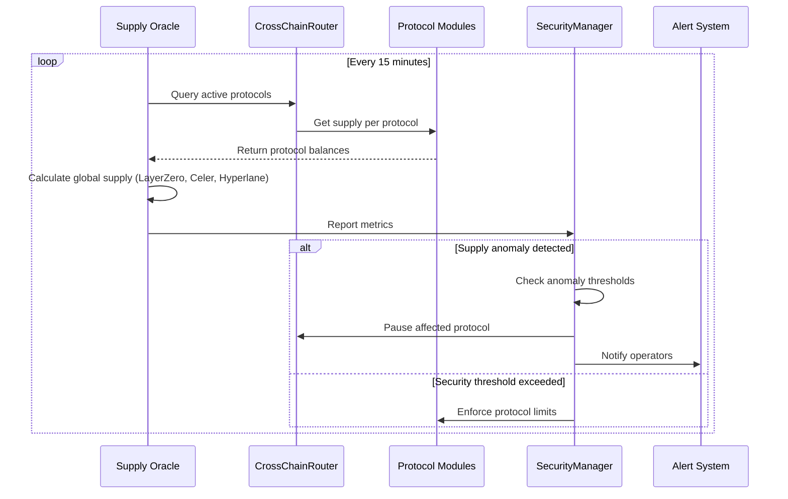
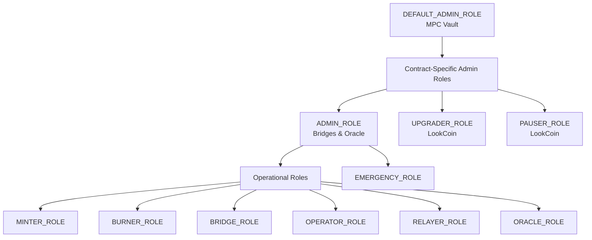

# LookCoin Technical Architecture

## Executive Summary

LookCoin (LOOK) is the native platform token of the LookCard ecosystem, designed as a native multi-protocol omnichain fungible token. The token implements a unified cross-chain architecture through the CrossChainRouter (when deployed in multi-protocol mode), supporting multiple bridge protocols: LayerZero's OFT V2 standard (BSC, Base, Optimism), Celer IM's cross-chain messaging (BSC, Optimism, Oasis Sapphire), with Hyperlane planned for future deployment. The architecture employs protocol abstraction through a modular design where each bridge protocol implements the ILookBridgeModule interface, enabling seamless protocol selection based on destination chain, cost optimization, speed requirements, or security preferences. The system maintains a unified global supply model with burn-and-mint mechanics for all protocols, ensuring consistent token supply across all deployments while providing redundancy, optimal routing, and enhanced cross-chain capabilities.

## Token Specification

### Basic Properties
- **Name**: LookCoin
- **Symbol**: LOOK
- **Decimals**: 18
- **Total Supply Cap**: 5,000,000,000 LOOK
- **Current Minted**: 20,000 LOOK (BSC Mainnet only)
- **Circulating Supply**: totalMinted - totalBurned
- **Token Standard**: ERC20 with native cross-chain support
- **Deployment Status**: ✅ Live on BSC Mainnet, BSC Testnet, Base Sepolia, Optimism Sepolia, Oasis Sapphire Mainnet

### Technical Standards
- **Base**: OpenZeppelin ERC20Upgradeable v5.1.0
- **Extensions**: ERC20PermitUpgradeable (EIP-2612 gasless approvals)
- **Proxy Pattern**: UUPS (Universal Upgradeable Proxy Standard)
- **Cross-chain**: Native LayerZero OFT V2 integration + modular bridge architecture
- **Security**: Pausable, ReentrancyGuard, AccessControl with granular roles
- **Solidity Version**: 0.8.28 with optimizer (9999 runs)

## Cross-Chain Architecture

### Native OFT V2 Integration
LookCoin implements LayerZero OFT V2 natively within the token contract:
- **sendFrom()**: Full OFT V2 send functionality with adapter params
- **bridgeToken()**: Simplified bridge interface for user convenience
- **lzReceive()**: Direct endpoint integration for receiving transfers
- **Trusted Remotes**: Per-chain peer contract configuration
- **Gas Management**: Configurable gas limits per destination chain

### Bridge Protocols

### Multi-Protocol Router Architecture



#### 1. LayerZero OFT V2 (Native)
- **Mechanism**: Burn-and-mint
- **Networks**: All supported chains
- **Security**: DVN (Decentralized Verifier Network) support
- **Features**: 
  - Native integration in LookCoin contract
  - Enforced options for minimum gas
  - Nonce-based replay protection
  - Trusted remote verification

#### 2. Celer IM (Inter-chain Messaging)
- **Mechanism**: Burn-and-mint
- **Networks**: BSC ⟷ Optimism, Sapphire
- **Security**: SGN (State Guardian Network) validators
- **Features**: 
  - Message-based transfers with executor pattern
  - Configurable chain support (no hardcoded chain IDs)
  - Remote module registration
  - Fee refund mechanism

#### 3. Hyperlane (Planned - Not Yet Deployed)
- **Mechanism**: Burn-and-mint (planned)
- **Networks**: To be configured via domain mappings
- **Security**: Will use Modular ISM (Interchain Security Modules)
- **Features**: 
  - Domain-based routing (no hardcoded chain IDs)
  - Configurable domain-to-chain mappings
  - Gas oracle integration
  - Message-based architecture
- **Status**: Infrastructure deployment pending

- **Custom Mailboxes**: LookCard-deployed mailbox contracts on each chain
- **Self-Operated Relayers**: Dedicated relayer infrastructure for all routes
- **Custom Warp Routes**: Tailored warp route configuration for LOOK token
- **Controlled Validators**: LookCard-managed validator set for enhanced security
- **Custom ISM**: Optimized Interchain Security Module configuration
- **Self-Hosted Gas Paymasters**: Independent gas payment system

#### Current Status

- **Phase 1 (Current)**: Using public Hyperlane infrastructure as temporary solution
- **Phase 2 (Planned)**: Migration to fully self-hosted infrastructure
- **Benefits of Self-Hosting**:
  - Enhanced performance and reliability
  - Full control over security parameters
  - Optimized gas costs and fee structure
  - No dependency on third-party relayers
  - Custom features specific to LookCard ecosystem



### Deployment Architecture

```
Multi-Chain Deployment
├── Core Contracts (All Chains)
│   ├── LookCoin.sol (UUPS upgradeable with native OFT V2)
│   └── SupplyOracle.sol (Cross-chain supply monitoring)
│
├── Protocol Modules (Chain-specific)
│   ├── CelerIMModule.sol (Chains with Celer support)
│   └── HyperlaneModule.sol (Chains with Hyperlane support)
│
├── Infrastructure (Multi-protocol chains only)
│   ├── CrossChainRouter.sol (Protocol selection & routing)
│   ├── FeeManager.sol (Unified fee management)
│   ├── SecurityManager.sol (Security controls)
│   └── ProtocolRegistry.sol (Module registration)
│
└── External Integrations
    ├── LayerZero Endpoint (Native in LookCoin)
    ├── Celer MessageBus (Via CelerIMModule)
    └── Hyperlane Mailbox (Via HyperlaneModule)
```

## Multi-Protocol Bridge Flow

1. **User Initiates Transfer**
   - Direct: Call `sendFrom()` for LayerZero OFT transfers
   - Simplified: Call `bridgeToken()` for automatic routing
   - Router: CrossChainRouter selects optimal protocol (if deployed)

2. **Protocol Selection (CrossChainRouter)**
   - Check protocol availability and configuration
   - Validate destination chain support
   - Route to appropriate bridge module

3. **Token Burning**
   - All protocols use burn-and-mint mechanism
   - Tokens burned on source chain
   - `totalBurned` counter updated
   - Events emitted for tracking

4. **Cross-Chain Message**
   - **LayerZero**: Direct endpoint.send() with OFT payload
   - **Celer**: MessageBus.sendMessage() with executor
   - **Hyperlane**: Mailbox.dispatch() with recipient

5. **Token Minting**
   - Destination validates message origin
   - Trusted source verification (remotes/modules)
   - Mints tokens to recipient
   - `totalMinted` counter updated
   - Supply oracle synchronization

## Chain Deployment Matrix

| Chain Name     | Supported Protocols                        | Network ID | Protocol IDs | Status        |
| -------------- | ------------------------------------------ | ---------- | ------------ | ------------- |
| BSC            | LayerZero, Celer IM, Hyperlane           | 56         | 0, 1, 2      | ✅ Deployed   |
| Base           | LayerZero, Hyperlane                      | 8453       | 0, 2         | Planned       |
| Optimism       | LayerZero, Celer IM, Hyperlane           | 10         | 0, 1, 2      | Planned       |
| Oasis Sapphire | Celer IM                                  | 23295      | 1            | Planned       |
| Akashic        | Hyperlane (self-hosted)                   | 9070       | 2            | Planned       |

## Supported Networks

The following table provides a comprehensive overview of all supported networks and their protocol compatibility. RPC endpoints are configured in `hardhat.config.ts`.

| Network                    | Chain ID | Network Key         | LayerZero | Celer IM | Hyperlane | Deployment Status | RPC Configuration     |
| -------------------------- | -------- | ------------------- | --------- | -------- | --------- | ----------------- | --------------------- |
| **BSC Mainnet**            | 56       | bsc                 | ✓         | ✓        | ✓         | ✅ Deployed       | See `hardhat.config.ts` line 12 |
| **BSC Testnet**            | 97       | bscTestnet          | ✓         | ✓        | ✓         | ✅ Deployed       | See `hardhat.config.ts` line 13 |
| **Base Mainnet**           | 8453     | base                | ✓         | ✗        | ✓         | ⏳ Pending        | See `hardhat.config.ts` line 14 |
| **Base Sepolia**           | 84532    | baseSepolia         | ✓         | ✗        | ✓         | ⏳ Pending        | See `hardhat.config.ts` line 15 |
| **Optimism Mainnet**       | 10       | optimism            | ✓         | ✓        | ✓         | ⏳ Pending        | See `hardhat.config.ts` line 16 |
| **Optimism Sepolia**       | 11155420 | opSepolia           | ✓         | ✓        | ✓         | ⏳ Pending        | See `hardhat.config.ts` line 17 |
| **Oasis Sapphire Mainnet** | 23294    | sapphire            | ✗         | ✓        | ✗         | ⏳ Pending        | See `hardhat.config.ts` line 18 |
| **Oasis Sapphire Testnet** | 23295    | sapphireTestnet     | ✗         | ✓        | ✗         | ⏳ Pending        | See `hardhat.config.ts` line 19 |
| **Akashic Mainnet**        | 9070     | akashic             | ✗         | ✗        | ✓*        | ⏳ Pending        | See `hardhat.config.ts` line 20 |
| **Akashic Testnet**        | 9071     | akashicTestnet      | ✗         | ✗        | ✓*        | ⏳ Pending        | See `hardhat.config.ts` line 21 |

**Notes:**
- ✓ = Supported
- ✗ = Not Supported
- ✓* = Supported via self-hosted Hyperlane infrastructure
- Network keys are used in deployment scripts and configuration
- All RPC endpoints can be overridden via environment variables (e.g., `BSC_RPC_URL`, `BASE_RPC_URL`)

### Protocol Selection Matrix

| Source → Destination | Optimal Protocol | Alternative Protocols | Selection Criteria |
| -------------------- | ---------------- | --------------------- | ------------------ |
| BSC → Base          | LayerZero        | Hyperlane             | Direct support     |
| BSC → Optimism      | LayerZero        | Celer IM, Hyperlane   | Speed vs. cost     |
| Base → Optimism     | LayerZero        | Hyperlane             | Fast finality      |
| * → Sapphire        | Celer IM         | -                     | Only option        |
| * → Akashic         | Hyperlane        | -                     | Self-hosted only   |

## Cross-Chain Flow Diagrams

### Multi-Protocol Router Flow


### LayerZero Burn-and-Mint Flow




### Hyperlane Burn-and-Mint Flow



### Celer IM Burn-and-Mint Flow



### Supply Reconciliation with Multi-Protocol Support



## Smart Contract Design

## Deployment Process

### Prerequisites
- Node.js 20+ with npm
- Hardhat development environment
- Environment variables:
  - `GOVERNANCE_VAULT`: MPC vault wallet address
  - Private keys for deployment accounts
  - RPC endpoints for target networks (see hardhat.config.ts)
  - Block explorer API keys for verification

### Three-Stage Deployment Process

#### Stage 1: Deploy
Creates contracts and deployment artifacts on a single network:

```bash
# Deploy to specific networks
npm run deploy:bsc-testnet
npm run deploy:bsc-mainnet
npm run deploy:base-sepolia
npm run deploy:base-mainnet
npm run deploy:op-sepolia
npm run deploy:op-mainnet
```

#### Stage 2: Setup
Configures local roles and settings post-deployment:

```bash
# Setup contracts on deployed network
npm run setup:bsc-testnet
npm run setup:base-sepolia
npm run setup:op-sepolia
npm run setup:sapphire-mainnet
```

Setup includes:
- Granting operational roles (MINTER, BURNER, BRIDGE)
- Registering bridge modules with CrossChainRouter
- Setting initial protocol fees

#### Stage 3: Configure
Establishes cross-chain connections between networks:

```bash
# Configure cross-chain connections
npm run configure:bsc-testnet
npm run configure:base-sepolia
npm run configure:optimism-sepolia
npm run configure:sapphire-mainnet
```

Configuration includes:
- Setting LayerZero trusted remotes
- Configuring Celer IM remote modules
- Setting Hyperlane domain mappings
- Registering cross-chain bridges

**Important**: Configure scripts require deployment artifacts from other networks

### Role-Based Access Control

- **DEFAULT_ADMIN_ROLE**: Full administrative control (Administrators only)
- **MINTER_ROLE**: Can mint new tokens (Administrators and Bridge Contracts)
- **BURNER_ROLE**: Can burn tokens (Administrators and Bridge Contracts)
- **PAUSER_ROLE**: Can pause/unpause all operations (Administrators only)
- **UPGRADER_ROLE**: Can authorize contract upgrades (Administrators and Dev Team)
- **BRIDGE_ROLE**: Reserved for bridge contracts only
- **PROTOCOL_ADMIN_ROLE**: Can configure protocol settings (Dev Team only)
- **ROUTER_ADMIN_ROLE**: Can set CrossChainRouter contract (Dev Team only)
- **OPERATOR_ROLE**: Operational tasks and configuration (Dev Team only)

## Security Considerations

### Supply Monitoring
- Real-time tracking via totalMinted and totalBurned
- Cross-chain supply reconciliation every 15 minutes
- Automatic pause on 1% deviation detection
- Manual reconciliation tools for administrators
- Oracle-based reporting across all chains
- Circulating supply: totalMinted - totalBurned
- Bridge registration with idempotency (prevents duplicate registrations)

### Supply Reconciliation Process
The system includes a dedicated reconciliation script for cross-chain supply monitoring:

```bash
# Run reconciliation from any deployed network
npm run reconcile:bsc-testnet
npm run reconcile:base-sepolia
npm run reconcile:optimism-sepolia
```

**Reconciliation Features:**
- Queries supply data from all deployed chains via RPC
- Aggregates total minted, burned, and circulating supply
- Compares against the 5 billion LOOK global cap
- Updates SupplyOracle with multi-signature validation
- Detects discrepancies beyond tolerance threshold (1000 LOOK)
- Triggers automatic bridge pausing if unhealthy

**Prerequisites:**
- ORACLE_ROLE on SupplyOracle contract
- RPC access to all deployed chains
- Deployment artifacts in /deployments directory

**Reconciliation Workflow:**
1. Collect supply data from all chains
2. Calculate aggregate supply metrics
3. Check health against tolerance threshold
4. Update SupplyOracle if needed (15-minute intervals)
5. Generate comprehensive report

**Supply Distribution:**
- Home Chain (BSC): Mints the full 5 billion LOOK initially
- Secondary Chains: Receive tokens only through bridges
- SupplyOracle: Initialized with 5 billion expected supply, automatically updated by setup script if needed

**Supply Oracle Management:**
- The SupplyOracle is deployed with a 5 billion LOOK expected supply
- The setup script automatically checks and updates the expected supply if it doesn't match
- Admins can manually update using: `supplyOracle.updateExpectedSupply(newSupply)`

### Multi-Signature Oracle Operations

The SupplyOracle implements an on-chain multi-signature mechanism for supply updates to ensure data integrity and prevent single points of failure.

**How It Works:**
1. **Signature Collection**: Multiple oracle nodes with `ORACLE_ROLE` must independently report the same supply data
2. **Threshold Requirement**: By default, 3 signatures are required before a supply update is executed
3. **Automatic Execution**: When the threshold is reached, the supply update executes immediately
4. **No Time Limits**: Signatures accumulate until the threshold is met, with no expiration

**Supply Update Process:**
```javascript
// Oracle Node 1 reports supply
await supplyOracle.updateSupply(
  56,           // Chain ID (BSC)
  1000000000,   // Total supply on chain
  50000000,     // Locked supply in bridges
  12345         // Nonce for this update
);
// Status: 1/3 signatures collected

// Oracle Node 2 reports same data
await supplyOracle.updateSupply(56, 1000000000, 50000000, 12345);
// Status: 2/3 signatures collected

// Oracle Node 3 reports same data
await supplyOracle.updateSupply(56, 1000000000, 50000000, 12345);
// Status: 3/3 signatures - Update executes automatically!
```

**Key Requirements:**
- All oracles must use identical parameters (chainId, totalSupply, lockedSupply, nonce)
- Each oracle can only sign once per unique update
- The nonce ensures coordination between oracle nodes

**Operational Setup:**

For production deployments, the typical setup involves:

1. **MPC Vault (Admin Team)**:
   - Holds `DEFAULT_ADMIN_ROLE` for governance
   - Can update signature thresholds via `updateRequiredSignatures()`
   - Manages emergency procedures

2. **Oracle Operators (Dev Team)**:
   - 3+ independent addresses with `ORACLE_ROLE`
   - Each runs an oracle service monitoring different RPC endpoints
   - Coordinate on nonce values (typically using timestamps or block numbers)

**Example Oracle Service:**
```javascript
// Each oracle node runs this independently
async function reportSupplyData() {
  // Gather supply data from chain
  const totalSupply = await lookCoin.totalSupply();
  const lockedInBridges = await calculateLockedSupply();
  
  // Use timestamp as nonce for coordination
  const nonce = Math.floor(Date.now() / 1000);
  
  // Submit supply update (requires 3 signatures)
  await supplyOracle.updateSupply(
    chainId,
    totalSupply,
    lockedInBridges,
    nonce
  );
  
  console.log(`Oracle ${oracleId} submitted supply update with nonce ${nonce}`);
}

// Run every 15 minutes
setInterval(reportSupplyData, 15 * 60 * 1000);
```

**Security Considerations:**
- Multiple oracle nodes prevent single points of failure
- Geographic distribution of nodes increases resilience
- Different RPC providers reduce dependency risks
- Threshold can be adjusted based on security requirements

**Adjusting Signature Requirements:**
```javascript
// Only DEFAULT_ADMIN_ROLE (MPC Vault) can change this
await supplyOracle.updateRequiredSignatures(5); // Increase to 5 signatures
```

### Emergency Procedures
1. **Pause All Operations**
   - PAUSER_ROLE holders can pause immediately
   - Affects all token transfers and bridge operations
   - Emits EmergencyPause event
   - Requires PAUSER_ROLE to unpause

2. **Bridge-Specific Pause**
   - Disable specific bridge module
   - Other protocols continue operating
   - Isolated incident response

3. **Supply Reconciliation**
   - Force manual reconciliation
   - Identify and isolate anomalies
   - Restore normal operations

### Governance Model
- **Type**: MPC Vault Wallet (Off-chain Multi-Party Computation)
- **MPC Vault Address**: Configured via `GOVERNANCE_VAULT` environment variable
  - Holds financial control (MINTER_ROLE, BURNER_ROLE)
  - Can perform all administrative functions
  - Has DEFAULT_ADMIN_ROLE on all contracts
- **Dev Team Address**: Configured via `DEV_TEAM_ADDRESS` environment variable (optional)
  - Holds technical roles without financial control
  - Manages protocol configurations and operational tasks
  - Has OPERATOR_ROLE on infrastructure contracts
- **Execution**: Direct on-chain execution without timelock
- **Scope**: All administrative functions via role-based permissions
- **Security**: No single point of failure, distributed key management

### Smart Contract Architecture


## Access Control & Role Management

#### Role Overview

The LookCoin ecosystem implements granular role-based access control using OpenZeppelin's AccessControl pattern. All contracts share a unified role hierarchy with the MPC vault serving as the governance authority.

| Contract                   | Role Constant        | Gated Functions                               | Capabilities                    | Default Assignee | Revocability |
| -------------------------- | -------------------- | --------------------------------------------- | ------------------------------- | ---------------- | ------------ |
| **LookCoin.sol**           |                      |                                               |                                 |                  |              |
|                            | `DEFAULT_ADMIN_ROLE` | `grantRole()`, `revokeRole()`                 | Grant/revoke all roles          | MPC Vault        | No           |
|                            | `MINTER_ROLE`        | `mint()`                                      | Mint new tokens                 | MPC Vault + Bridge Modules | Yes          |
|                            | `BURNER_ROLE`        | `burn()`, `burnFrom()`                        | Burn tokens                     | MPC Vault + Bridge Modules + LookCoin | Yes          |
|                            | `PAUSER_ROLE`        | `pause()`, `unpause()`                        | Pause/unpause transfers         | MPC Vault        | Yes          |
|                            | `UPGRADER_ROLE`      | `upgradeToAndCall()`                          | Upgrade contract implementation | MPC Vault + Dev Team | Yes          |
|                            | `BRIDGE_ROLE`        | Bridge-specific operations                     | Bridge functions only           | Bridge Modules + CrossChainRouter | Yes          |
|                            | `PROTOCOL_ADMIN_ROLE`| `setTrustedRemote()`, protocol configs        | Configure protocols             | Dev Team         | Yes          |
|                            | `ROUTER_ADMIN_ROLE`  | `setCrossChainRouter()`                       | Set router contract             | Dev Team         | Yes          |
| **CrossChainRouter.sol**   |                      |                                               |                                 |                  |              |
|                            | `DEFAULT_ADMIN_ROLE` | `grantRole()`, `revokeRole()`                 | Grant/revoke all roles          | MPC Vault        | No           |
|                            | `OPERATOR_ROLE`      | `registerProtocol()`, `setChainProtocolSupport()` | Manage protocols          | Dev Team         | Yes          |
|                            | `EMERGENCY_ROLE`     | `pauseProtocol()`, `unpauseProtocol()`        | Emergency protocol control      | MPC Vault        | Yes          |
| **LayerZeroModule.sol**    |                      |                                               |                                 |                  |              |
|                            | `DEFAULT_ADMIN_ROLE` | `grantRole()`, `revokeRole()`                 | Grant/revoke all roles          | MPC Vault        | No           |
|                            | `OPERATOR_ROLE`      | `setTrustedRemote()`, `setMinDstGas()`        | Configure LayerZero            | Dev Team         | Yes          |
| **CelerIMModule.sol**      |                      |                                               |                                 |                  |              |
|                            | `DEFAULT_ADMIN_ROLE` | `grantRole()`, `revokeRole()`                 | Grant/revoke all roles          | MPC Vault        | No           |
|                            | `OPERATOR_ROLE`      | `setRemoteModule()`, `setFeeParameters()`     | Configure Celer IM             | Dev Team         | Yes          |
| **HyperlaneModule.sol**    |                      |                                               |                                 |                  |              |
|                            | `DEFAULT_ADMIN_ROLE` | `grantRole()`, `revokeRole()`                 | Grant/revoke all roles          | MPC Vault        | No           |
|                            | `OPERATOR_ROLE`      | `setTrustedSender()`, `setGasConfig()`        | Configure Hyperlane            | Dev Team         | Yes          |
| **SecurityManager.sol**    |                      |                                               |                                 |                  |              |
|                            | `DEFAULT_ADMIN_ROLE` | `grantRole()`, `revokeRole()`                 | Grant/revoke all roles          | MPC Vault        | No           |
|                            | `OPERATOR_ROLE`      | `setProtocolLimits()`, `setAnomalyThresholds()` | Configure security           | Dev Team         | Yes          |
|                            | `EMERGENCY_ROLE`     | `emergencyPause()`, `forceReconcile()`        | Emergency response              | MPC Vault        | Yes          |

#### Role Hierarchy

The role system follows a hierarchical structure where `DEFAULT_ADMIN_ROLE` serves as the root administrator:



#### Cross-Contract Role Dependencies

The multi-protocol system implements carefully orchestrated role dependencies:

1. **Protocol Module Permissions**: All protocol modules (LayerZero, Celer, Hyperlane) require appropriate roles on the LookCoin contract:
   - LayerZero & Hyperlane modules: `MINTER_ROLE` and `BURNER_ROLE` for burn-and-mint
   - CelerIMModule: `MINTER_ROLE` for lock-and-mint

2. **Router Integration**: The CrossChainRouter requires registration in LookCoin via `setCrossChainRouter()` to enable protocol routing.

3. **Security Integration**: Protocol modules must be registered with SecurityManager for anomaly detection.

4. **Fee Management**: FeeManager requires protocol module addresses for accurate fee estimation across protocols.

#### Role Assignment Lifecycle

The role assignment follows a three-stage pattern designed for security and operational efficiency, matching the deployment process:

**Stage 1: Contract Deployment**

- During deployment, only administrative roles are assigned to the `_admin` parameter (MPC vault)
- This includes `DEFAULT_ADMIN_ROLE`, `PAUSER_ROLE`, and `UPGRADER_ROLE`
- Technical roles (`PROTOCOL_ADMIN_ROLE`, `ROUTER_ADMIN_ROLE`) are also assigned to MPC vault initially
- No bridge permissions are granted during initialization
- Creates deployment artifacts with contract addresses for use in subsequent stages

**Stage 2: Setup (Local Configuration)**

- **Script**: `scripts/setup.ts`
- **Purpose**: Configures roles and settings for the current network only
- **Prerequisites**: 
  - Stage 1 deployment completed with artifacts in `/deployments`
  - Environment variables configured (`GOVERNANCE_VAULT`, `DEV_TEAM_ADDRESS`)
- **Operations**:

  **1. Role Configuration:**
  - **MPC Vault** (`GOVERNANCE_VAULT`) receives:
    - `MINTER_ROLE` - For minting tokens in business operations
    - `BURNER_ROLE` - For burning tokens in supply management
  
  - **Dev Team** (`DEV_TEAM_ADDRESS` - optional) receives:
    - `PROTOCOL_ADMIN_ROLE` - For configuring protocol settings (trusted remotes, fees)
    - `ROUTER_ADMIN_ROLE` - For setting/updating CrossChainRouter contract
    - `UPGRADER_ROLE` - For contract upgrades (provides redundancy with MPC vault)
    - `OPERATOR_ROLE` - On CrossChainRouter, FeeManager, SecurityManager, and all protocol modules
  
  - **Bridge Modules** receive:
    - LayerZeroModule: `MINTER_ROLE`, `BURNER_ROLE`, `BRIDGE_ROLE`
    - HyperlaneModule: `MINTER_ROLE`, `BURNER_ROLE`, `BRIDGE_ROLE` (if Hyperlane ready)
    - CelerIMModule: `MINTER_ROLE`, `BRIDGE_ROLE`
  
  - **LookCoin Contract** receives:
    - `BURNER_ROLE` - Enables direct LayerZero OFT functionality

  **2. Infrastructure Configuration:**
  - Sets LayerZero endpoint on LookCoin for direct OFT transfers
  - Registers bridges with SupplyOracle for cross-chain supply tracking:
    - LookCoin itself for LayerZero (uses LZ chain ID)
    - HyperlaneModule (uses Hyperlane domain ID)
    - CelerIMModule (uses Celer chain ID)
  
  **3. CrossChainRouter Setup (Multi-Protocol Mode):**
  - Registers CrossChainRouter with LookCoin via `setCrossChainRouter()`
  - Grants `OPERATOR_ROLE` to dev team on CrossChainRouter
  - Registers protocol modules with router:
    - LayerZero module (Protocol ID: 0)
    - Celer module (Protocol ID: 1)
    - Hyperlane module (Protocol ID: 2)
  - Grants `BRIDGE_ROLE` to CrossChainRouter for module interaction

**Stage 3: Configure (Cross-Chain Configuration)**

- **Script**: `scripts/configure.ts`
- **Purpose**: Establishes cross-chain connections across all protocols
- **Operations**:
  - Registers all protocol modules with CrossChainRouter
  - Sets chain-protocol support mappings
  - Configures cross-chain trusted endpoints:
    - LayerZero trusted remotes
    - Celer remote modules
    - Hyperlane trusted senders
  - Updates ProtocolRegistry with supported chains per protocol
  - Configures FeeManager with protocol modules

**Technical Dependencies**:

- **Setup Stage**: Uses only local deployment artifacts and centralized configuration
- **Configure Stage**: Requires deployment artifacts from other networks via `loadOtherChainDeployments()`
- **Security**: Implements cross-tier validation to prevent mainnet/testnet mixing

#### Security Rationale

The role separation follows the principle of least privilege:

- **Financial Control**: MPC vault holds minting/burning rights for business operations
- **Technical Separation**: Dev team manages technical aspects without financial control
- **Bridge Autonomy**: Each bridge module operates independently with its own role grants
- **Emergency Response**: `PAUSER_ROLE` provides rapid response capability
- **Upgrade Redundancy**: Both MPC vault and dev team can execute upgrades

#### Operational Examples

**Emergency Pause Scenario**:

```solidity
// MPC vault initiates emergency pause
1. Call LookCoin.pause() with PAUSER_ROLE
2. Call CelerIMModule.pause() with ADMIN_ROLE
3. Call SecurityManager.pauseProtocol() for specific protocols
4. Oracle detects pause and halts monitoring
```

**Multi-Protocol Transfer Flow**:

```solidity
// User bridges from BSC to Optimism (protocol selection)
1. User calls CrossChainRouter.bridgeToken()
2. Router selects optimal protocol (LayerZero vs Celer)
3. Router calls selected module.bridgeToken()
4. Module executes protocol-specific operations
5. Destination receives and processes message
6. SecurityManager validates and tracks transfer
```

**Contract Upgrade Process**:

```solidity
// Upgrading LookCoin implementation
1. Deploy new implementation contract
2. Dev team OR MPC vault calls upgradeToAndCall() with UPGRADER_ROLE
3. Roles persist through upgrade (stored in proxy)
4. No role reassignment needed
```

#### Role Management Procedures

**Granting a New Role**:

```typescript
// Only DEFAULT_ADMIN_ROLE can execute
await lookCoin.grantRole(MINTER_ROLE, newBridgeAddress);
```

**Revoking a Role**:

```typescript
// Revoke compromised oracle
await supplyOracle.revokeRole(ORACLE_ROLE, compromisedAddress);
```

**Role Verification**:

```typescript
// Check if address has role
const hasMinterRole = await lookCoin.hasRole(MINTER_ROLE, bridgeAddress);
```

**Emergency Role Rotation**:

1. Revoke role from compromised address
2. Grant role to new secure address
3. Update off-chain services to use new address
4. Monitor for any unauthorized attempts

#### Upgrade Impact on Roles

- Roles are stored in the proxy contract, not the implementation
- Upgrading contract logic does not affect role assignments
- New roles can be added in upgraded implementations
- Existing roles remain functional across upgrades
- Role constants must maintain same bytes32 values for compatibility

## Contract Upgrade Process

### UUPS Upgrade Pattern

1. **Deploy New Implementation**: Create new version of contract logic
2. **Authorize Upgrade**: Dev team or MPC vault with UPGRADER_ROLE can execute
3. **Execute Upgrade**: Call `upgradeToAndCall()` to switch implementation
4. **Verify**: Test all functionality post-upgrade

### Cross-Chain Coordination

- Coordinated upgrade windows across all chains
- Version compatibility maintained via deployment artifacts
- Rollback procedures documented per chain
- Storage layout compatibility enforced

## Monitoring & Incident Response

### Supply Monitoring System

- **Real-Time Tracking**: totalMinted and totalBurned counters
- **Cross-Chain Oracle**: 15-minute reconciliation cycles
- **Anomaly Detection**: 1% deviation triggers automatic pause
- **Manual Controls**: Force reconciliation available to admins

### Incident Response Levels

1. **Automated Response**: SecurityManager pauses affected protocol
2. **Operator Intervention**: Manual investigation and resolution
3. **MPC Vault Action**: Critical decisions requiring governance
4. **Public Communication**: Transparency for major incidents

### Protocol Failure Handling

- **Isolated Failures**: Pause single protocol, others continue
- **Supply Anomalies**: Automatic detection and response
- **Bridge Compromise**: Emergency pause with fund recovery
- **Network Issues**: Fallback to alternative protocols

## Technical Documentation References

### Protocol Documentation
- [LayerZero V2 OFT Standard](https://docs.layerzero.network/v2/developers/evm/oft/quickstart)
- [Celer IM Integration Guide](https://docs.celer.network/developer/celer-im)
- [Hyperlane Message Format](https://docs.hyperlane.xyz/docs/reference/messaging/message-format)
- [OpenZeppelin UUPS Pattern](https://docs.openzeppelin.com/contracts/4.x/api/proxy#UUPSUpgradeable)

### Security Resources
- [MPC Wallet Best Practices](https://www.fireblocks.com/blog/mpc-wallet-technology/)
- [Bridge Security Considerations](https://ethereum.org/en/developers/docs/bridges/)
- [Smart Contract Security Verification](https://consensys.github.io/smart-contract-best-practices/)


