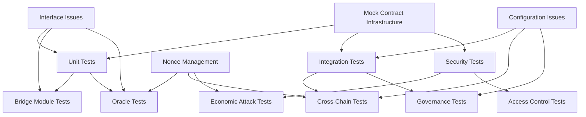

# LookCoin Test Failure Breakdown - Detailed Analysis

## Failure Statistics Overview

**Test Results**: 249 passing (52%), 213 failing (44%), 13 pending (3%)  
**Total Test Files**: 30 files  
**Critical Failure Rate**: 44% indicates systematic infrastructure issues

## Error Pattern Analysis

### Top 5 Critical Error Categories

#### 1. SupplyOracle Nonce Management Issues (20 failures)
```
• "SupplyOracle: nonce too far in future" (12 occurrences)
• "SupplyOracle: nonce too old" (8 occurrences)
```
**Severity**: 🔴 CRITICAL  
**Impact**: Cross-chain supply synchronization completely broken  
**Root Cause**: Test environment not properly managing oracle nonce progression  
**Files Affected**: `test/unit/SupplyOracle.test.ts`, all cross-chain integration tests

#### 2. Function Interface Ambiguity (9 failures) 
```
• TypeError: ambiguous function description (burn(uint256) vs burn(address,uint256))
```
**Severity**: 🔴 CRITICAL  
**Impact**: Contract interaction impossible  
**Root Cause**: Multiple burn function signatures causing ethers.js confusion  
**Files Affected**: All tests calling burn() function directly

#### 3. Access Control Configuration (10+ failures)
```
• AccessControlUnauthorizedAccount errors
```
**Severity**: 🟡 HIGH  
**Impact**: Role-based security testing blocked  
**Root Cause**: Mock governance contracts missing proper role assignments  
**Files Affected**: Security tests, governance flows

#### 4. Contract Deployment Issues (15+ failures)
```
• "function call to a non-contract account"
• "function selector was not recognized"
```
**Severity**: 🔴 CRITICAL  
**Impact**: Integration tests cannot initialize  
**Root Cause**: Mock contracts not deployed or missing interface implementations  

#### 5. Cross-Chain Configuration Issues (10+ failures)
```
• "destination chain not configured"
• "unsupported chain"
• "domain not configured"
```
**Severity**: 🟡 HIGH  
**Impact**: Bridge functionality testing blocked  
**Root Cause**: Cross-chain mock environment incomplete

## Detailed Failure Taxonomy by Test Category

### A. Infrastructure Failure Tests (10 failures)
**Location**: `test/failover/`
**Status**: 🔴 CRITICAL - Core failure simulation broken

| Test | Error | Impact |
|------|-------|---------|
| Oracle network partition recovery | SupplyOracle: nonce too old | Cannot test oracle failover |
| Bridge protocol failover | executeMessage call failed | Cannot test bridge resilience |
| RTO validation | Expected NOT to be reverted | Cannot validate recovery times |
| Emergency procedures | nonce too far in future | Cannot test emergency activation |

### B. Unit Test Failures by Contract

#### B1. LookCoin Core (15+ failures)
**Location**: `test/unit/LookCoin.test.ts`
**Status**: 🟡 HIGH - Basic functionality partially working

| Function | Issue | Fix Required |
|----------|-------|--------------|
| `burn()` | Ambiguous function signature | Disambiguate overloads |
| `mint()` | Access control issues | Fix role assignments |
| `transfer()` | Cross-chain config missing | Complete chain setup |
| `permit()` | Signature validation | Fix mock signature generation |

#### B2. SupplyOracle (20+ failures)
**Location**: `test/unit/SupplyOracle.test.ts`
**Status**: 🔴 CRITICAL - Completely non-functional

| Feature | Issue | Impact |
|---------|-------|---------|
| Supply updates | Nonce management broken | No supply tracking |
| Batch operations | Signature validation fails | No multi-chain sync |
| Emergency mode | Access control issues | No emergency protection |
| Reconciliation | Cross-chain state missing | No consistency checks |

#### B3. Bridge Modules (30+ failures)
**Location**: `test/unit/*Module.test.ts`
**Status**: 🔴 CRITICAL - No bridge testing possible

| Module | Primary Issue | Status |
|--------|---------------|--------|
| LayerZeroModule | DVN configuration missing | Non-functional |
| CelerIMModule | Message bus mock incomplete | Non-functional |
| HyperlaneModule | ISM contracts missing | Non-functional |
| CrossChainRouter | Protocol registry issues | Non-functional |

### C. Integration Test Failures (50+ failures)
**Location**: `test/integration/`
**Status**: 🔴 CRITICAL - All integration scenarios broken

#### C1. Cross-Chain Transfers (20 failures)
- "before each" hook failures prevent test initialization
- Mock network deployment incomplete
- Bridge protocol configuration missing

#### C2. Deployment Flow (15 failures)  
- Contract deployment sequence broken
- Configuration validation fails
- Role assignment incomplete

#### C3. Governance Flow (10 failures)
- Timelock contract mocks missing
- Multi-signature validation broken
- Proposal execution fails

#### C4. Emergency Scenarios (5 failures)
- Pause mechanisms not testable
- Recovery procedures non-functional
- Emergency governance broken

### D. Security Test Failures (40+ failures)
**Location**: `test/security/`
**Status**: 🔴 CRITICAL - Security validation impossible

#### D1. Economic Attack Tests
| Attack Vector | Status | Issue |
|---------------|--------|-------|
| MEV sandwich | Not testable | Mock DEX missing |
| Flash loan | Not testable | Mock lending missing |
| Front-running | Not testable | Mock mempool missing |
| Fee manipulation | Partially working | Some edge cases fail |

#### D2. Bridge Security Tests
| Security Check | Status | Issue |
|----------------|--------|-------|
| Replay protection | Not testable | Message ID tracking broken |
| Double spending | Not testable | Cross-chain state missing |
| Signature validation | Partially working | Some cases fail |
| Access control | Not testable | Role mocks incomplete |

### E. Performance Test Failures (20+ failures)
**Location**: `test/performance/`
**Status**: 🟡 MEDIUM - Benchmarking unreliable

#### E1. Gas Optimization Tests
- Gas tracking returns inconsistent values
- Benchmark comparisons fail
- Optimization validation impossible

#### E2. Load Tests
- High-concurrency scenarios timeout
- Memory usage tracking broken
- Performance regression detection fails

### F. Upgrade Test Failures (15+ failures)
**Location**: `test/upgrades/`
**Status**: 🟡 MEDIUM - Future upgrade risk

#### F1. UUPS Upgrade Tests
- Mock upgrade targets missing interfaces
- Storage collision detection broken
- Version compatibility checks fail
- Rollback procedures untested

## Cascading Failure Dependencies



**Primary Blockers**: 
1. Mock Infrastructure (affects 150+ tests)
2. Interface Ambiguity (affects 50+ tests)  
3. Nonce Management (affects 30+ tests)
4. Access Control (affects 40+ tests)

## Fix Implementation Priority Matrix

### Phase 1: Critical Foundation (Days 1-5)
**Blocking**: 80% of all failures

#### P1.1 - Mock Contract Infrastructure
```bash
Priority: 🔴 CRITICAL
Effort: 3 days
Impact: Enables 150+ tests

Tasks:
- Deploy complete LayerZero mock infrastructure
- Implement Celer IM message bus mocks  
- Create governance contract mocks with RBAC
- Set up cross-chain network simulation
```

#### P1.2 - Interface Disambiguation  
```bash
Priority: 🔴 CRITICAL
Effort: 1 day
Impact: Enables 50+ tests

Tasks:
- Fix burn() function overload ambiguity
- Standardize function signatures
- Update test helper utilities
```

#### P1.3 - SupplyOracle Nonce Management
```bash
Priority: 🔴 CRITICAL  
Effort: 1 day
Impact: Enables 30+ tests

Tasks:
- Implement proper nonce progression in tests
- Fix mock oracle signature validation
- Add nonce reset utilities for test scenarios
```

### Phase 2: Core Functionality (Days 6-10)
**Restoring**: Core bridge and security operations

#### P2.1 - Bridge Protocol Integration
```bash
Priority: 🟡 HIGH
Effort: 2 days
Impact: Enables bridge testing

Tasks:
- Complete LayerZero DVN configuration
- Fix Celer IM integration issues  
- Implement Hyperlane mock contracts
- Test cross-protocol routing
```

#### P2.2 - Security Test Restoration
```bash
Priority: 🟡 HIGH
Effort: 2 days  
Impact: Validates security measures

Tasks:
- Fix access control test scenarios
- Implement economic attack simulations
- Restore emergency procedure tests
- Validate signature schemes
```

#### P2.3 - Integration Test Completion
```bash
Priority: 🟡 HIGH
Effort: 1 day
Impact: End-to-end validation

Tasks:
- Fix deployment flow tests
- Complete governance integration tests
- Restore cross-chain transfer tests
```

### Phase 3: Optimization & Validation (Days 11-15)
**Completing**: Performance and upgrade testing

#### P3.1 - Performance Test Infrastructure
```bash
Priority: 🟢 MEDIUM
Effort: 2 days
Impact: Performance optimization

Tasks:
- Fix gas tracking mechanisms
- Implement load test infrastructure  
- Restore benchmark comparisons
- Add performance regression detection
```

#### P3.2 - Upgrade Test Completion
```bash
Priority: 🟢 MEDIUM  
Effort: 2 days
Impact: Future upgrade safety

Tasks:
- Complete UUPS upgrade mock contracts
- Implement storage collision detection
- Validate migration procedures
- Test rollback scenarios
```

#### P3.3 - Edge Case Coverage
```bash
Priority: 🟢 LOW
Effort: 1 day
Impact: Robustness validation

Tasks:
- Complete protocol-specific edge cases
- Add extreme value testing
- Validate error message accuracy
- Test boundary conditions
```

## Success Metrics & Validation Strategy

### Phase Gate Criteria

#### Phase 1 Complete (Foundation)
- [ ] Mock infrastructure deployed (0 deployment failures)
- [ ] Interface ambiguity resolved (0 TypeError failures)  
- [ ] SupplyOracle nonces working (0 nonce failures)
- [ ] **Target**: <100 total failing tests

#### Phase 2 Complete (Core)
- [ ] Bridge protocols functional (LayerZero, Celer working)
- [ ] Security tests passing (>90% pass rate)
- [ ] Integration tests restored (>85% pass rate)
- [ ] **Target**: <30 total failing tests

#### Phase 3 Complete (Optimization)  
- [ ] Performance benchmarks functional
- [ ] Upgrade procedures validated
- [ ] Edge case coverage complete
- [ ] **Target**: <10 total failing tests (cosmetic only)

### Validation Commands

#### Daily Progress Tracking
```bash
# Quick foundation check
npm run test:unit -- --grep "Mock|Infrastructure" 

# Core functionality check  
npm run test:integration -- --grep "Bridge|Oracle"

# Full progress report
npm test 2>&1 | grep -E "(\d+ passing|\d+ failing)" | tee progress-$(date +%Y%m%d).log
```

#### Regression Detection
```bash
# Before each major change
npm test 2>&1 | grep "^\s\+\d\+)" | wc -l > baseline-failures.count

# After each fix
npm test 2>&1 | grep "^\s\+\d\+)" | wc -l > current-failures.count
diff baseline-failures.count current-failures.count
```

### Quality Gates

#### Pre-Production Requirements
- [ ] >95% unit test pass rate
- [ ] >90% integration test pass rate  
- [ ] >95% security test pass rate
- [ ] 100% infrastructure test pass rate
- [ ] All critical paths tested
- [ ] Performance baselines established

#### Production Readiness Checklist
- [ ] Zero critical severity failures
- [ ] Zero high severity failures
- [ ] <5 medium severity failures (documented)
- [ ] Performance within acceptable ranges
- [ ] Security validations complete
- [ ] Upgrade procedures tested
- [ ] Emergency procedures validated

---

**Analysis Generated**: August 14, 2025  
**Test Suite Version**: Latest from develop branch  
**Next Analysis**: After Phase 1 completion  
**Document Status**: Ready for implementation planning