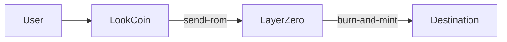
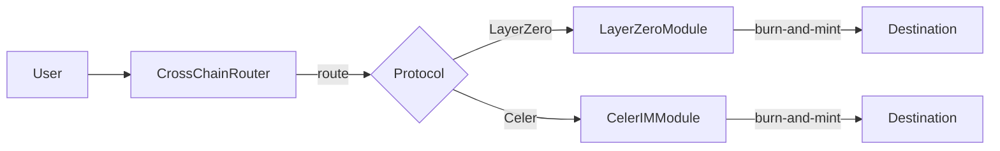
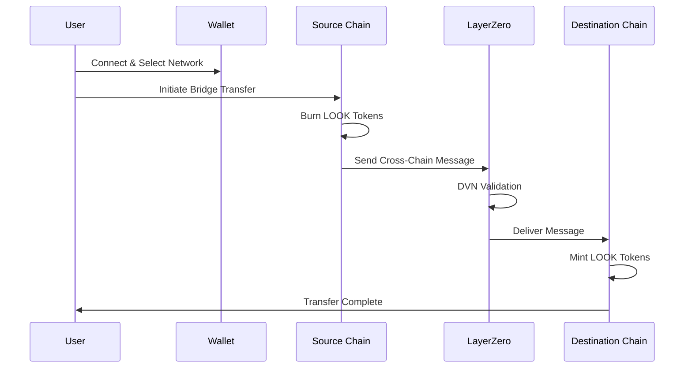
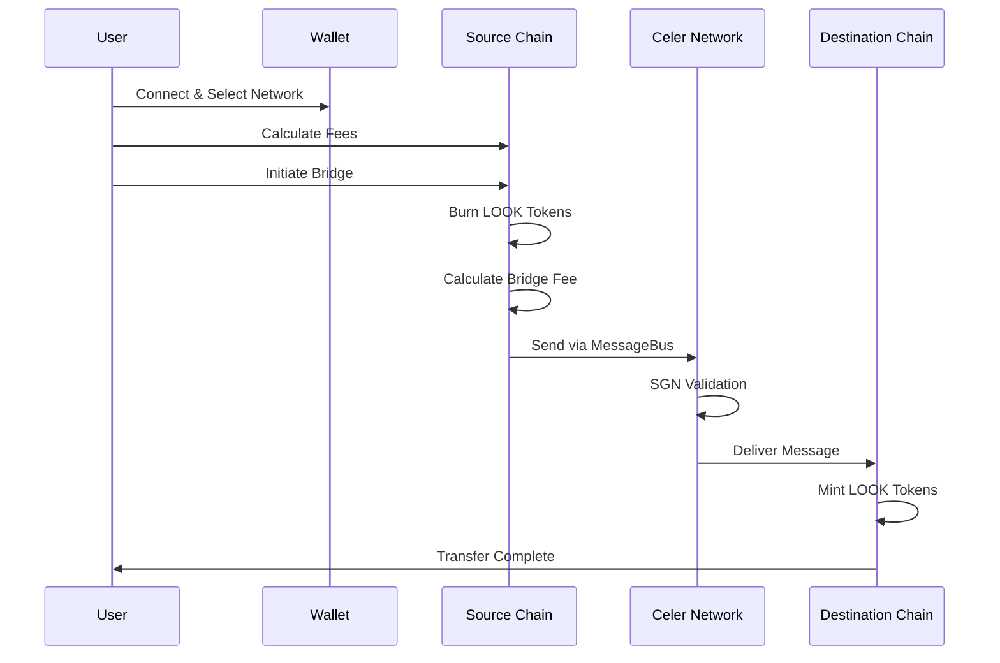
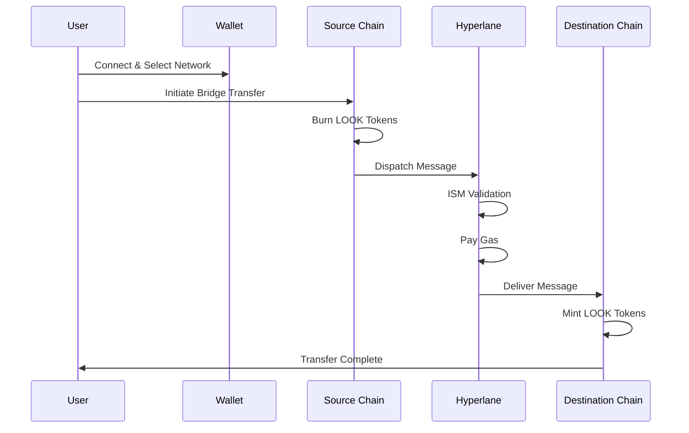
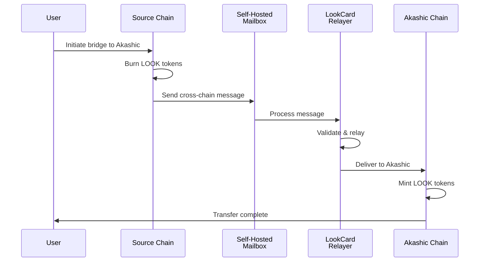

# LookCoin User Flow Guide

**Cross-Chain Bridging with LayerZero and Celer IM**

This guide walks you through bridging LookCoin (LOOK) tokens across different blockchain networks using our active bridge protocols: LayerZero and Celer IM. Whether you're moving tokens between BSC, Base, Optimism, or Sapphire, this guide provides step-by-step instructions for a smooth bridging experience. Hyperlane support is planned for future deployment.

## Bridging Methods Overview

LookCoin offers two main approaches for cross-chain transfers:

### 1. Direct OFT Path (LayerZero Only)

- Call `LookCoin.sendFrom()` directly
- Available only for LayerZero protocol
- Most gas-efficient for LayerZero transfers
- Ideal for programmatic integrations

### 2. Router Path (Multi-Protocol)

- Call `CrossChainRouter.bridgeToken()`
- Supports LayerZero and Celer protocols
- Automatic protocol selection available
- Unified interface for all bridges
- Note: CrossChainRouter is only deployed on BSC networks in multi-protocol mode

## Prerequisites

Before bridging LOOK tokens, ensure you have:

1. **Compatible Wallet**: MetaMask, Trust Wallet, or any Web3-compatible wallet
2. **LOOK Tokens**: Sufficient balance on the source chain
3. **Native Tokens for Gas**:
   - BSC: BNB
   - Base: ETH
   - Optimism: ETH
   - Sapphire: ROSE
4. **Network Configuration**: Add all required networks to your wallet

## Supported Networks

| Network  | Chain ID | LayerZero | Celer IM | Hyperlane | Native Token |
| -------- | -------- | --------- | -------- | --------- | ------------ |
| BSC      | 56       | ✓         | ✓        | Planned   | BNB          |
| Base     | 8453     | ✓         | ✗        | Planned   | ETH          |
| Optimism | 10       | ✓         | ✓        | Planned   | ETH          |
| Sapphire | 23295    | ✗         | ✓        | ✗         | ROSE         |
| Akashic  | 9070     | ✗         | ✗        | Planned   | AKASH        |

**Note**: Hyperlane infrastructure is planned but not yet deployed. LookCard will deploy and operate a complete self-hosted Hyperlane stack across all supported chains.

## Bridging Architecture

LookCoin implements a **dual-path architecture** for maximum flexibility:

1. **Direct OFT Path** (LayerZero only): Use `LookCoin.sendFrom()` for direct LayerZero transfers
2. **Router Path** (All protocols): Use `CrossChainRouter.bridgeToken()` for automatic protocol selection

### All Protocols Use Burn-and-Mint

As of the latest update, **all bridge protocols now use burn-and-mint mechanism**:
- Tokens are burned on the source chain
- Equivalent tokens are minted on the destination chain
- Total supply remains constant across all chains
- No token custody risks

## LayerZero Bridge (Burn-and-Mint)

LayerZero uses a burn-and-mint mechanism where tokens are burned on the source chain and minted on the destination chain. This ensures the total supply remains constant across all chains.

### How It Works



### Step-by-Step Instructions

1. **Connect Your Wallet**
   - Open your Web3 wallet
   - Connect to the source chain (BSC, Base, or Optimism)
   - Ensure you have sufficient LOOK balance

2. **Check Requirements**
   - LOOK balance: Your desired transfer amount
   - Native token balance: ~0.01 ETH/BNB for gas fees
   - Rate limits: Maximum 500,000 LOOK per hour, 3 transactions per hour

3. **Initiate Bridge Transfer**

   ```javascript
   // Example: Bridge 1000 LOOK from BSC to Base
   const amount = ethers.parseEther("1000");
   const destinationChainId = 8453; // Base
   const recipientAddress = "0xYourAddressOnBase";

   // Option 1: Direct OFT (LayerZero only)
   await lookCoin.sendFrom(
     msg.sender,
     destinationChainId,
     recipientAddress,
     amount,
     payable(msg.sender), // Refund address
     address(0),          // ZRO payment address
     "0x",                // Adapter params
     { value: ethers.parseEther("0.01") } // Native token fee
   );
   
   // Option 2: Via CrossChainRouter (any protocol)
   await crossChainRouter.bridgeToken(
     destinationChainId,
     recipientAddress,
     amount,
     Protocol.LayerZero, // Or let router choose optimal
     "0x",
     { value: ethers.parseEther("0.01") }
   );
   ```

4. **Pay Bridge Fees**
   - Native token fee: Approximately 0.01 ETH/BNB
   - No LOOK token fees for LayerZero bridge

5. **Wait for Confirmation**
   - Source chain burn: 1-2 minutes
   - Cross-chain validation: 5-10 minutes
   - Destination chain mint: 1-2 minutes

6. **Verify Receipt**
   - Check your balance on the destination chain
   - View transaction on block explorer

### Events to Track

- **On Source Chain**: `CrossChainTransferInitiated(sender, destinationChainId, recipient, amount)`
- **On Destination Chain**: `CrossChainTransferReceived(sender, sourceChainId, recipient, amount)`

### Troubleshooting

| Error                     | Solution                                                      |
| ------------------------- | ------------------------------------------------------------- |
| "Endpoint not configured" | The destination chain is not yet configured. Contact support. |
| "Destination not trusted" | The path between chains is not established. Contact support.  |
| "Insufficient balance"    | Ensure you have enough LOOK and native tokens.                |
| "Rate limit exceeded"     | Wait for the cooldown period (1 hour) before next transfer.   |

## Celer IM Bridge (Burn-and-Mint)

Celer IM now uses a burn-and-mint mechanism (same as LayerZero and Hyperlane) where tokens are burned on the source chain and minted on the destination chain. This ensures consistent token mechanics across all protocols.

### How It Works



### Fee Structure

Celer IM bridge charges two types of fees:

1. **Bridge Fee (LOOK tokens)**: 0.5% of transfer amount
   - Minimum: 10 LOOK
   - Maximum: 1000 LOOK
   - Note: Fee is deducted from the burn amount

2. **Message Fee (Native tokens)**: Base fee + per-byte fee for cross-chain messaging

### Fee Examples

| Transfer Amount | Bridge Fee | Net Received   | Notes               |
| --------------- | ---------- | -------------- | ------------------- |
| 100 LOOK        | 10 LOOK    | 90 LOOK        | Minimum fee applied |
| 1,000 LOOK      | 10 LOOK    | 990 LOOK       | Minimum fee applied |
| 10,000 LOOK     | 50 LOOK    | 9,950 LOOK     | 0.5% fee            |
| 500,000 LOOK    | 1000 LOOK  | 499,000 LOOK   | Maximum fee applied |

### Step-by-Step Instructions

1. **Connect Your Wallet**
   - Open your Web3 wallet
   - Connect to the source chain (BSC, Optimism, or Sapphire)
   - Ensure you have sufficient LOOK balance plus bridge fee

2. **Estimate Message Fee**

   ```javascript
   // Estimate the native token fee
   const amount = ethers.parseEther("1000");
   const destinationChainId = 10; // Optimism
   const recipientAddress = "0xYourAddressOnOptimism";

   const messageFee = await celerIMModule.estimateMessageFee(destinationChainId, recipientAddress, amount);
   ```

3. **Calculate Total Cost**
   - LOOK tokens needed: Transfer amount + bridge fee (0.1%, min 1, max 100)
   - Native tokens needed: Message fee + gas costs

4. **Initiate Bridge Transfer**

   ```javascript
   // Example: Bridge 1000 LOOK from BSC to Optimism via Celer
   // Option 1: Direct module call
   await celerIMModule.bridgeToken(
     destinationChainId,
     recipientAddress,
     amount,
     "0x", // No additional params needed
     { value: messageFee } // Native token for message fee
   );
   
   // Option 2: Via CrossChainRouter (recommended)
   await crossChainRouter.bridgeToken(
     destinationChainId,
     recipientAddress,
     amount,
     Protocol.Celer, // Specify Celer protocol
     "0x",
     { value: messageFee }
   );
   ```

5. **Wait for Confirmation**
   - Source chain lock: 1-2 minutes
   - SGN validation: 10-15 minutes
   - Destination chain mint: 1-2 minutes

6. **Verify Receipt**
   - Check your balance on the destination chain
   - Note: You'll receive the amount minus bridge fee

### Events to Track

- **On Source Chain**: `TransferInitiated(transferId, sender, destinationChain, amount, "Celer")`
- **On Destination Chain**: `TransferCompleted(transferId, recipient, amount)`

### Supported Chains

- BSC (Chain ID: 56)
- Optimism (Chain ID: 10)
- Sapphire (Chain ID: 23295)

## Hyperlane Bridge (Planned - Not Yet Deployed)

Hyperlane infrastructure is planned but not yet deployed. When implemented, it will use a burn-and-mint mechanism with LookCard's self-hosted message passing system and custom security model through Interchain Security Modules (ISM).

### How It Works



### Planned Implementation

**Status**: Hyperlane bridge is currently in planning phase and not yet available for use.

**When Available**, the bridge will support:

1. **Self-Hosted Infrastructure**
   - LookCard-deployed mailbox contracts on all supported chains
   - Custom relayer network for optimal performance
   - Controlled security through custom ISM configuration

2. **Planned Features**
   - Burn-and-mint mechanism consistent with other protocols
   - Domain-based addressing for all supported chains
   - Gas prepayment system for cross-chain messages
   - Custom warp routes optimized for LOOK token transfers

3. **Expected Integration**
   ```javascript
   // Future implementation (not yet available)
   await crossChainRouter.bridgeToken(
     destinationChain,
     recipientAddress,
     amount,
     Protocol.Hyperlane,
     "0x",
     { value: gasEstimate }
   );
   ```

**Timeline**: Infrastructure deployment pending. Updates will be provided when deployment begins.

### Events to Track

- **On Source Chain**: `CrossChainTransferInitiated(sender, destinationDomain, recipient, amount)`
- **On Destination Chain**: `CrossChainTransferReceived(sender, sourceDomain, recipient, amount)`

### Planned Supported Chains

- BSC (Domain: 56) - Planned
- Base (Domain: 8453) - Planned  
- Optimism (Domain: 10) - Planned
- Akashic (Domain: 9070) - Planned

## Akashic Bridge (Planned - Self-Hosted Hyperlane)

Akashic integration is planned as part of LookCard's self-hosted Hyperlane infrastructure. When deployed, it will provide a dedicated, high-performance bridge specifically optimized for the LookCard ecosystem.

### How It Works



### Key Features

- **Dedicated Infrastructure**: LookCard operates the complete Hyperlane stack for Akashic
- **Optimized Performance**: Custom configuration for faster settlement times
- **Enhanced Security**: Controlled validator set and ISM configuration
- **No Third-Party Dependencies**: Full control over the bridging infrastructure
- **Consistent Mechanism**: Uses burn-and-mint like other protocols

### Planned Implementation

**Status**: Akashic bridge is currently in planning phase as part of the broader Hyperlane infrastructure deployment.

**When Available**, Akashic integration will feature:

1. **Dedicated Self-Hosted Infrastructure**
   - LookCard-operated complete Hyperlane stack
   - Custom configuration optimized for Akashic network
   - No dependency on public Hyperlane infrastructure

2. **Expected Features**
   - Fastest settlement times among all bridges
   - Predictable fee structure
   - Direct integration with Akashic ecosystem
   - Enhanced security through controlled validator set

3. **Planned Integration**
   ```javascript
   // Future implementation (not yet available)
   await crossChainRouter.bridgeToken(
     akashicDomain, // 9070
     recipientAddress,
     amount,
     Protocol.Hyperlane,
     "0x",
     { value: gasEstimate }
   );
   ```

**Timeline**: Deployment pending completion of overall Hyperlane infrastructure setup.

### Benefits of Self-Hosted Setup

- **Faster Processing**: No dependency on public relayer networks
- **Predictable Costs**: Controlled gas payment and fee structure
- **Higher Reliability**: Dedicated infrastructure reduces downtime
- **Custom Features**: Optimized for LookCard's specific requirements

## Bridge Comparison

| Feature              | LayerZero                    | Celer IM                             | Hyperlane (Planned)         |
| -------------------- | ---------------------------- | ------------------------------------ | --------------------------- |
| **Status**           | ✅ Active                    | ✅ Active                            | 🚧 Planning Phase           |
| **Mechanism**        | Burn-and-mint                | Burn-and-mint                        | Burn-and-mint (planned)     |
| **Speed**            | 8-15 minutes                 | 12-20 minutes                        | 5-15 minutes (expected)     |
| **LOOK Fee**         | None                         | 0.5% (10-1000 LOOK)                  | None (planned)              |
| **Native Fee**       | ~0.01 ETH/BNB                | Variable (base + per-byte)           | Variable (planned)          |
| **Supported Chains** | BSC, Base, Optimism          | BSC, Optimism, Sapphire              | All chains (when deployed)  |
| **Direct OFT**       | Yes (dual-path)              | No (module only)                     | No (module only)            |
| **Best For**         | Base transfers, No LOOK fees | Sapphire transfers, Predictable fees | Self-hosted control (planned) |

## Frequently Asked Questions

### How much gas do I need?

- **BSC**: 0.01-0.02 BNB
- **Base/Optimism**: 0.01-0.02 ETH
- **Sapphire**: 0.5-1 ROSE
- **Akashic**: 0.1-0.5 AKASH

Always keep extra for safety.

### What are the transfer limits?

- **Per Transaction**: 500,000 LOOK
- **Per Hour**: 3 transactions per account
- **Daily Global Limit**: 20% of total supply

### What if my transfer fails?

1. Check the transaction hash on the block explorer
2. Verify the error message
3. For LayerZero/Hyperlane: Tokens are automatically refunded if burn fails
4. For all protocols: Burned tokens cannot be recovered if transfer fails (ensure correct recipient address)
5. Contact support with transaction details if issues persist

### How do I track my transfer?

1. Save your transaction hash
2. Use chain-specific block explorers:
   - BSC: [BscScan](https://bscscan.com)
   - Base: [BaseScan](https://basescan.org)
   - Optimism: [Optimistic Etherscan](https://optimistic.etherscan.io)
   - Sapphire: [Sapphire Explorer](https://explorer.sapphire.oasis.io)
   - Akashic: [Akashic Explorer](https://explorer.akashicrecords.io)
3. Monitor events in the transaction logs

### Is bridging safe?

Yes, with these security measures:

- Rate limiting prevents large-scale attacks
- MPC vault wallet governance for secure operations
- Automatic supply reconciliation every 15 minutes
- Emergency pause capability
- Multiple security audits

### Which bridge should I use?

Choose based on your needs:

- **LayerZero**: Best for Base transfers, no LOOK fees
- **Celer IM**: Required for Sapphire, predictable fees  
- **Hyperlane**: Not yet available (planned for future deployment)

### Best Practices

1. **Test First**: Try a small amount before large transfers
2. **Double-Check Addresses**: Ensure recipient address is correct
3. **Monitor Gas Prices**: Bridge during low-congestion periods
4. **Keep Records**: Save all transaction hashes
5. **Stay Informed**: Follow official announcements for updates

## References

- [Technical Documentation](./TECHNICAL.md) - Detailed technical specifications
- [LayerZero V2 Documentation](https://docs.layerzero.network/v2) - Official LayerZero docs
- [Celer Network Documentation](https://celer.network/docs/) - Official Celer docs
- [Hyperlane Documentation](https://docs.hyperlane.xyz) - Official Hyperlane docs
- [LookCoin Contract Repository](https://github.com/lookcard/lookcoin-contract) - Source code and deployment scripts
