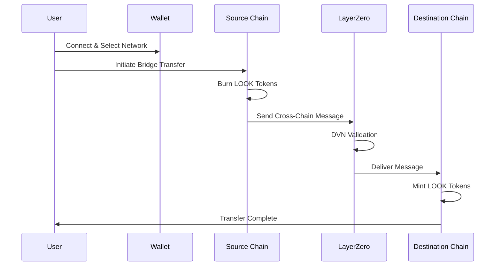
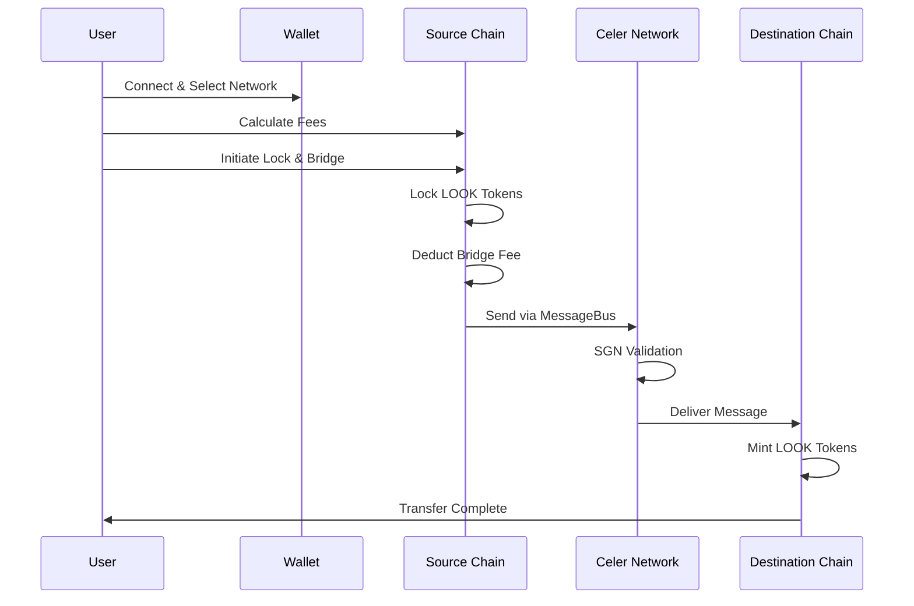

# LookCoin User Flow Guide

**Cross-Chain Bridging with LayerZero and Celer IM**

This guide walks you through bridging LookCoin (LOOK) tokens across different blockchain networks using our two bridge protocols: LayerZero and Celer IM. Whether you're moving tokens between BSC, Base, Optimism, or Sapphire, this guide provides step-by-step instructions for a smooth bridging experience.

## Prerequisites

Before bridging LOOK tokens, ensure you have:

1. **Compatible Wallet**: MetaMask, Trust Wallet, or any Web3-compatible wallet
2. **LOOK Tokens**: Sufficient balance on the source chain
3. **Native Tokens for Gas**:
   - BSC: BNB
   - Base: ETH
   - Optimism: ETH
   - Sapphire: ROSE
4. **Network Configuration**: Add all required networks to your wallet

## Supported Networks

| Network  | Chain ID | LayerZero Support | Celer IM Support | Endpoint Address                           |
| -------- | -------- | ----------------- | ---------------- | ------------------------------------------ |
| BSC      | 56       |                   |                  | 0x1a44076050125825900e736c501f859c50fE728c |
| Base     | 8453     |                   | L                | 0x1a44076050125825900e736c501f859c50fE728c |
| Optimism | 10       |                   |                  | 0x1a44076050125825900e736c501f859c50fE728c |
| Sapphire | 23295    | L                 |                  | TBD                                        |

**Note**:

- Base uses LayerZero exclusively (no Celer IM support)
- Sapphire uses Celer IM exclusively (no LayerZero support)
- Akashic uses IBC exclusively (not shown in this table)
- BSC and Optimism support both LayerZero and Celer IM

## LayerZero Bridge (Burn-and-Mint)

LayerZero uses a burn-and-mint mechanism where tokens are burned on the source chain and minted on the destination chain. This ensures the total supply remains constant across all chains.

### How It Works



### Step-by-Step Instructions

1. **Connect Your Wallet**
   - Open your Web3 wallet
   - Connect to the source chain (BSC, Base, or Optimism)
   - Ensure you have sufficient LOOK balance

2. **Check Requirements**
   - LOOK balance: Your desired transfer amount
   - Native token balance: ~0.01 ETH/BNB for gas fees
   - Rate limits: Maximum 500,000 LOOK per hour, 3 transactions per hour

3. **Initiate Bridge Transfer**

   ```javascript
   // Example: Bridge 1000 LOOK from BSC to Base
   const amount = ethers.parseEther("1000");
   const destinationChainId = 8453; // Base
   const recipientAddress = "0xYourAddressOnBase";

   await lookCoin.bridgeToken(
     destinationChainId,
     recipientAddress,
     amount,
     { value: ethers.parseEther("0.01") }, // Native token fee
   );
   ```

4. **Pay Bridge Fees**
   - Native token fee: Approximately 0.01 ETH/BNB
   - No LOOK token fees for LayerZero bridge

5. **Wait for Confirmation**
   - Source chain burn: 1-2 minutes
   - Cross-chain validation: 5-10 minutes
   - Destination chain mint: 1-2 minutes

6. **Verify Receipt**
   - Check your balance on the destination chain
   - View transaction on block explorer

### Events to Track

- **On Source Chain**: `CrossChainTransferInitiated(sender, destinationChainId, recipient, amount)`
- **On Destination Chain**: `CrossChainTransferReceived(sender, sourceChainId, recipient, amount)`

### Troubleshooting

| Error                     | Solution                                                      |
| ------------------------- | ------------------------------------------------------------- |
| "Endpoint not configured" | The destination chain is not yet configured. Contact support. |
| "Destination not trusted" | The path between chains is not established. Contact support.  |
| "Insufficient balance"    | Ensure you have enough LOOK and native tokens.                |
| "Rate limit exceeded"     | Wait for the cooldown period (1 hour) before next transfer.   |

## Celer IM Bridge (Lock-and-Mint)

Celer IM uses a lock-and-mint mechanism where tokens are locked on the source chain and corresponding tokens are minted on the destination chain. This bridge includes a bridge fee in LOOK tokens.

### How It Works



### Fee Structure

Celer IM bridge charges two types of fees:

1. **Bridge Fee (LOOK tokens)**: 0.1% of transfer amount
   - Minimum: 1 LOOK
   - Maximum: 100 LOOK

2. **Message Fee (Native tokens)**: Base fee + per-byte fee

### Fee Examples

| Transfer Amount | Bridge Fee | Net Received   | Notes               |
| --------------- | ---------- | -------------- | ------------------- |
| 100 LOOK        | 1 LOOK     | 99 LOOK        | Minimum fee applied |
| 1,000 LOOK      | 1 LOOK     | 999 LOOK       | Minimum fee applied |
| 10,000 LOOK     | 10 LOOK    | 9,990 LOOK     | 0.1% fee            |
| 5,000,000 LOOK  | 100 LOOK   | 4,999,900 LOOK | Maximum fee applied |

### Step-by-Step Instructions

1. **Connect Your Wallet**
   - Open your Web3 wallet
   - Connect to the source chain (BSC, Optimism, or Sapphire)
   - Ensure you have sufficient LOOK balance plus bridge fee

2. **Estimate Message Fee**

   ```javascript
   // Estimate the native token fee
   const amount = ethers.parseEther("1000");
   const destinationChainId = 10; // Optimism
   const recipientAddress = "0xYourAddressOnOptimism";

   const messageFee = await celerIMModule.estimateMessageFee(destinationChainId, recipientAddress, amount);
   ```

3. **Calculate Total Cost**
   - LOOK tokens needed: Transfer amount + bridge fee (0.1%, min 1, max 100)
   - Native tokens needed: Message fee + gas costs

4. **Initiate Lock & Bridge**

   ```javascript
   // Example: Bridge 1000 LOOK from BSC to Optimism
   await celerIMModule.lockAndBridge(
     destinationChainId,
     recipientAddress,
     amount,
     { value: messageFee }, // Native token for message fee
   );
   ```

5. **Wait for Confirmation**
   - Source chain lock: 1-2 minutes
   - SGN validation: 10-15 minutes
   - Destination chain mint: 1-2 minutes

6. **Verify Receipt**
   - Check your balance on the destination chain
   - Note: You'll receive the amount minus bridge fee

### Events to Track

- **On Source Chain**: `CrossChainTransferLocked(sender, destinationChainId, recipient, amount, bridgeFee)`
- **On Destination Chain**: `CrossChainTransferMinted(sender, sourceChainId, recipient, amount)`

### Supported Chains

- BSC (Chain ID: 56)
- Optimism (Chain ID: 10)
- Sapphire (Chain ID: 23295)

## Bridge Comparison

| Feature              | LayerZero                    | Celer IM                             |
| -------------------- | ---------------------------- | ------------------------------------ |
| **Mechanism**        | Burn-and-mint                | Lock-and-mint                        |
| **Speed**            | 8-15 minutes                 | 12-20 minutes                        |
| **LOOK Fee**         | None                         | 0.1% (1-100 LOOK)                    |
| **Native Fee**       | ~0.01 ETH                    | Variable (base + per-byte)           |
| **Supported Chains** | BSC, Base, Optimism          | BSC, Optimism, Sapphire              |
| **Best For**         | Base transfers, No LOOK fees | Sapphire transfers, Predictable fees |

## Frequently Asked Questions

### How much gas do I need?

- **BSC**: 0.01-0.02 BNB
- **Base/Optimism**: 0.01-0.02 ETH
- **Sapphire**: 0.5-1 ROSE

Always keep extra for safety.

### What are the transfer limits?

- **Per Transaction**: 500,000 LOOK
- **Per Hour**: 3 transactions per account
- **Daily Global Limit**: 20% of total supply

### What if my transfer fails?

1. Check the transaction hash on the block explorer
2. Verify the error message
3. For LayerZero: Tokens are automatically refunded if burn fails
4. For Celer IM: Locked tokens can be reclaimed after timeout period
5. Contact support with transaction details if issues persist

### How do I track my transfer?

1. Save your transaction hash
2. Use chain-specific block explorers:
   - BSC: [BscScan](https://bscscan.com)
   - Base: [BaseScan](https://basescan.org)
   - Optimism: [Optimistic Etherscan](https://optimistic.etherscan.io)
   - Sapphire: [Sapphire Explorer](https://explorer.sapphire.oasis.io)
3. Monitor events in the transaction logs

### Is bridging safe?

Yes, with these security measures:

- Rate limiting prevents large-scale attacks
- MPC vault wallet governance for secure operations
- Automatic supply reconciliation every 15 minutes
- Emergency pause capability
- Multiple security audits

### Best Practices

1. **Test First**: Try a small amount before large transfers
2. **Double-Check Addresses**: Ensure recipient address is correct
3. **Monitor Gas Prices**: Bridge during low-congestion periods
4. **Keep Records**: Save all transaction hashes
5. **Stay Informed**: Follow official announcements for updates

## References

- [Technical Documentation](./TECHNICAL.md) - Detailed technical specifications
- [LayerZero V2 Documentation](https://docs.layerzero.network/v2) - Official LayerZero docs
- [Celer Network Documentation](https://celer.network/docs/) - Official Celer docs
- [LookCoin Contract Repository](https://github.com/lookcard/lookcoin-contract) - Source code and deployment scripts
