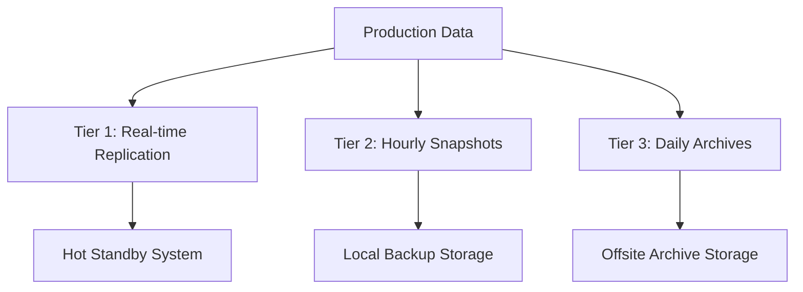

# LookCoin Migration Operational Procedures
**Pre-Migration Validation, Post-Migration Verification, and Operational Guidelines**

## Document Overview

This document provides comprehensive operational procedures for the LookCoin state management migration. It covers pre-migration validation checklists, post-migration verification procedures, monitoring and alerting setup, backup and recovery procedures, and team training materials.

**Audience**: Operations team, DevOps engineers, System administrators, Technical team  
**Scope**: Operational aspects of migration execution and maintenance  
**Last Updated**: 2025-08-12  
**Version**: 1.0.0

---

## Table of Contents
- [Pre-Migration Validation Checklist](#pre-migration-validation-checklist)
- [Post-Migration Verification Procedures](#post-migration-verification-procedures)
- [Monitoring and Alerting Setup](#monitoring-and-alerting-setup)
- [Backup and Recovery Procedures](#backup-and-recovery-procedures)
- [Team Training Materials](#team-training-materials)
- [Standard Operating Procedures](#standard-operating-procedures)
- [Maintenance and Support](#maintenance-and-support)

---

## Pre-Migration Validation Checklist

### System Readiness Assessment

#### Infrastructure Readiness
- [ ] **Server Resources**
  - [ ] Minimum 16GB RAM available
  - [ ] Minimum 50GB disk space available
  - [ ] CPU utilization below 70%
  - [ ] Network connectivity stable (>100Mbps)

- [ ] **Software Dependencies**
  - [ ] Node.js 20.x installed and verified
  - [ ] npm dependencies installed (`npm install` completed)
  - [ ] Git repository up to date
  - [ ] Required environment variables configured

- [ ] **Access and Permissions**
  - [ ] Deployment keys and credentials verified
  - [ ] File system permissions correct (read/write access to deployments/)
  - [ ] Network access to all blockchain RPC endpoints confirmed
  - [ ] Block explorer API keys functional

#### Data Integrity Pre-Check
```bash
# Execute pre-migration data validation
npm run validate:pre-migration

# Expected results checklist:
```
- [ ] **LevelDB Database Health**
  - [ ] LevelDB database accessible and responsive
  - [ ] No corruption detected in database files
  - [ ] All 28 expected contracts present and readable
  - [ ] Implementation hashes consistent with expected values

- [ ] **Current Deployment State**
  - [ ] All networks (BSC Mainnet, BSC Testnet, Base Sepolia, Optimism Sepolia, Sapphire Testnet) accessible
  - [ ] Contract addresses valid and contracts deployed
  - [ ] Cross-network consistency verified
  - [ ] No pending transactions or incomplete deployments

- [ ] **JSON Schema Validation**
  - [ ] Enhanced JSON schema v2.0.0 loaded and validated
  - [ ] Schema compatibility with existing data confirmed
  - [ ] BigInt serialization support tested

#### Team Readiness Checklist
- [ ] **Primary Migration Engineer** available and trained
- [ ] **Backup Engineer** available and prepared
- [ ] **Systems Administrator** on standby
- [ ] **Emergency contacts** verified and reachable
- [ ] **Communication channels** tested (Slack, phone, email)
- [ ] **Escalation procedures** reviewed and understood

#### Business Readiness
- [ ] **Stakeholder Notification**
  - [ ] Engineering management informed of migration schedule
  - [ ] Dependent teams notified of potential downtime
  - [ ] External partners informed (if applicable)
  - [ ] Change management process followed

- [ ] **Risk Assessment**
  - [ ] Migration risks documented and mitigation plans ready
  - [ ] Rollback procedures tested and validated
  - [ ] Success criteria clearly defined
  - [ ] Go/No-Go decision criteria established

### Pre-Migration Test Execution

#### Test Environment Validation
```bash
# Run comprehensive pre-migration tests
npm run test:pre-migration:comprehensive

# Execute performance baseline tests  
npm run test:pre-migration:performance

# Validate rollback procedures
npm run test:rollback-procedures
```

**Test Results Requirements**:
- [ ] All pre-migration tests pass (100% success rate required)
- [ ] Performance baseline established and documented
- [ ] Rollback procedures tested successfully
- [ ] No critical or high-severity issues identified

#### Environment Configuration
- [ ] **Development Environment**
  - [ ] Local development setup tested
  - [ ] Migration scripts executed successfully in dev
  - [ ] Test data migration completed without errors

- [ ] **Staging Environment** (if applicable)
  - [ ] Staging environment mirrors production configuration
  - [ ] End-to-end migration test completed successfully
  - [ ] Performance benchmarks meet requirements

### Final Go/No-Go Decision

#### Go/No-Go Criteria
**GO Decision Requires**:
- [ ] All infrastructure readiness items checked
- [ ] All data integrity checks passed
- [ ] Team fully prepared and available
- [ ] All tests passed successfully
- [ ] Rollback procedures validated
- [ ] Business approval obtained

**NO-GO Decision Triggers**:
- [ ] Critical infrastructure issues
- [ ] Data integrity problems detected
- [ ] Key team members unavailable
- [ ] Test failures or performance issues
- [ ] Rollback procedures not functioning
- [ ] Business concerns or blockers

#### Final Sign-Off
- [ ] **Technical Team Lead** approval: _________________ Date: _______
- [ ] **Engineering Manager** approval: ________________ Date: _______
- [ ] **Systems Administrator** approval: _______________ Date: _______
- [ ] **Migration Lead** approval: ____________________ Date: _______

---

## Post-Migration Verification Procedures

### Immediate Post-Migration Verification (0-2 hours)

#### System Health Check
```bash
# Execute immediate post-migration validation
npm run verify:post-migration:immediate

# Check system health
npm run health:post-migration
```

**Verification Steps**:
- [ ] **JSON Backend Operational**
  - [ ] All JSON deployment files created and accessible
  - [ ] File permissions correct (644 for files, 755 for directories)
  - [ ] JSON files validate against enhanced schema v2.0.0
  - [ ] All 28 contracts present in JSON format

- [ ] **Data Consistency Validation**
  - [ ] All contract addresses match between old and new systems
  - [ ] Implementation hashes identical across backends
  - [ ] Constructor arguments preserved accurately
  - [ ] Deployment timestamps maintained
  - [ ] BigInt values serialized/deserialized correctly

- [ ] **Functional Verification**
  - [ ] Basic contract queries working (getContract operations)
  - [ ] Deployment operations functional (deploy, setup, configure)
  - [ ] Cross-network operations working
  - [ ] Error handling functioning correctly

#### Performance Verification
```bash
# Execute performance verification tests
npm run verify:performance:post-migration

# Compare with baseline metrics
npm run compare:performance-baselines
```

**Performance Requirements**:
- [ ] JSON read operations ≤ 2x LevelDB baseline latency
- [ ] JSON write operations ≤ 3x LevelDB baseline latency
- [ ] Memory usage ≤ 150% of LevelDB baseline
- [ ] No memory leaks detected over 30-minute period

### Extended Verification (2-24 hours)

#### Operational Testing
```bash
# Execute extended operational tests
npm run test:operational:extended

# Monitor system under normal load
npm run monitor:system-load
```

**Extended Test Scenarios**:
- [ ] **Deployment Scenarios**
  - [ ] New contract deployment on testnet
  - [ ] Contract upgrade simulation
  - [ ] Multi-network configuration
  - [ ] Error recovery testing

- [ ] **Load Testing**
  - [ ] Concurrent access patterns
  - [ ] High-frequency operations
  - [ ] Large dataset queries
  - [ ] Resource utilization under load

- [ ] **Integration Testing**
  - [ ] CI/CD pipeline integration
  - [ ] Automated deployment scripts
  - [ ] Third-party tool compatibility
  - [ ] API endpoint functionality

#### Data Integrity Continuous Verification
```bash
# Set up continuous data integrity monitoring
npm run monitor:data-integrity:continuous

# Schedule periodic validation
npm run schedule:periodic-validation
```

**Continuous Monitoring Requirements**:
- [ ] Real-time consistency checking enabled
- [ ] Automated validation every 4 hours
- [ ] Alerting configured for inconsistencies
- [ ] Logging and audit trail active

### 7-Day Extended Monitoring

#### Week-Long Stability Testing
- [ ] **Days 1-2**: Intensive monitoring and immediate issue resolution
- [ ] **Days 3-4**: Performance optimization and fine-tuning
- [ ] **Days 5-7**: Standard monitoring with periodic validation

#### Weekly Validation Report
```bash
# Generate weekly validation report
npm run generate:weekly-validation-report
```

**Report Requirements**:
- [ ] System availability metrics (target: >99.9%)
- [ ] Performance trends analysis
- [ ] Error rates and patterns
- [ ] Resource utilization trends
- [ ] User impact assessment

---

## Monitoring and Alerting Setup

### Monitoring Infrastructure

#### Core Metrics Monitoring
```bash
# Initialize monitoring infrastructure
npm run monitoring:initialize

# Configure core metrics collection
npm run monitoring:configure-metrics
```

**Key Metrics to Monitor**:
- [ ] **System Health Metrics**
  - Response time for contract queries
  - System resource usage (CPU, memory, disk)
  - Network connectivity and latency
  - Error rates and types

- [ ] **Data Integrity Metrics**
  - Cross-backend consistency rates
  - Data validation success rates
  - Checksum verification results
  - Missing or corrupted data detection

- [ ] **Performance Metrics**
  - Operation latencies (read, write, query)
  - Throughput measurements
  - Cache hit/miss rates
  - Concurrent operation handling

#### Monitoring Tools Configuration

##### Application Performance Monitoring (APM)
```javascript
// Example APM configuration
const apmConfig = {
  serviceName: 'lookcoin-state-management',
  environment: process.env.NODE_ENV || 'production',
  metrics: {
    interval: '30s'
  },
  logging: {
    level: 'info',
    destination: '/var/log/lookcoin/apm.log'
  }
};
```

##### System Monitoring
```bash
# Configure system monitoring
npm run monitoring:configure-system

# Setup includes:
# - CPU and memory usage tracking
# - Disk space monitoring
# - Network connectivity checks
# - Process health monitoring
```

### Alerting Configuration

#### Critical Alerts (Immediate Response Required)
- [ ] **Data Corruption Alert**
  - Trigger: Checksum validation failure
  - Response Time: < 5 minutes
  - Escalation: Immediate to technical team lead

- [ ] **System Unavailability Alert**
  - Trigger: Service unreachable for >2 minutes
  - Response Time: < 5 minutes
  - Escalation: Immediate to operations team

- [ ] **Performance Degradation Alert**
  - Trigger: Response time >500% baseline
  - Response Time: < 10 minutes
  - Escalation: Technical team after 15 minutes

#### Warning Alerts (Monitor and Plan Response)
- [ ] **Performance Warning**
  - Trigger: Response time >200% baseline
  - Response Time: < 30 minutes
  - Escalation: Technical team if persistent >1 hour

- [ ] **Resource Usage Warning**
  - Trigger: Memory usage >80% or disk space <10GB
  - Response Time: < 1 hour
  - Escalation: Operations team if not resolved

#### Alerting Channels Configuration
```yaml
# Alert routing configuration
alerts:
  critical:
    channels: [pagerduty, slack-emergency, sms]
    escalation:
      - level: 1
        delay: 0m
        recipients: [technical-team]
      - level: 2  
        delay: 15m
        recipients: [engineering-management]
      - level: 3
        delay: 30m
        recipients: [executive-team]
  
  warning:
    channels: [slack-monitoring, email]
    escalation:
      - level: 1
        delay: 0m
        recipients: [technical-team]
      - level: 2
        delay: 1h
        recipients: [operations-team]
```

### Dashboard Configuration

#### Technical Dashboard
- [ ] **Real-time Metrics**
  - System performance graphs
  - Error rate trends
  - Data integrity status
  - Resource utilization

- [ ] **Operational Status**
  - Service availability
  - Recent deployments
  - Alert history
  - Performance comparisons

#### Management Dashboard
- [ ] **High-Level KPIs**
  - Overall system health score
  - Migration success metrics
  - Performance vs. SLA targets
  - Cost and resource efficiency

---

## Backup and Recovery Procedures

### Backup Strategy

#### Multi-Tier Backup Approach


#### Backup Schedule and Retention
- [ ] **Real-time Backup (Tier 1)**
  - Continuous replication to hot standby
  - Retention: 48 hours
  - Purpose: Immediate failover capability

- [ ] **Hourly Snapshots (Tier 2)**
  - Full system snapshots every hour
  - Retention: 7 days
  - Purpose: Quick recovery from recent issues

- [ ] **Daily Archives (Tier 3)**
  - Complete daily backups
  - Retention: 90 days
  - Purpose: Long-term recovery and compliance

### Backup Procedures

#### Automated Backup Setup
```bash
# Initialize automated backup system
npm run backup:initialize

# Configure backup schedules
npm run backup:configure-schedules

# Test backup and restore procedures
npm run backup:test-procedures
```

#### Manual Backup Procedures
```bash
# Create emergency backup
npm run backup:create-emergency

# Backup specific components
npm run backup:leveldb
npm run backup:json-deployments
npm run backup:configuration

# Verify backup integrity
npm run backup:verify-integrity
```

#### Backup Components Checklist
- [ ] **LevelDB Database**
  - Complete database directory
  - Database lock files
  - Metadata files

- [ ] **JSON Deployment Files**
  - All network deployment JSONs
  - Schema definition files
  - Migration state files

- [ ] **Configuration Files**
  - Environment configurations
  - Hardhat network settings
  - Migration parameters

- [ ] **System State**
  - Process configurations
  - Log files
  - Monitoring configurations

### Recovery Procedures

#### Recovery Scenarios and Procedures

##### Scenario 1: JSON File Corruption
**Detection**: JSON parse errors, schema validation failures

**Recovery Steps**:
```bash
# 1. Stop affected services
npm run services:stop

# 2. Identify corrupted files
npm run backup:identify-corrupted-json

# 3. Restore from most recent backup
npm run backup:restore-json --timestamp=<backup-timestamp>

# 4. Verify restoration
npm run backup:verify-json-restoration

# 5. Restart services
npm run services:start

# 6. Validate system functionality
npm run verify:system-functionality
```

##### Scenario 2: Complete System Failure
**Detection**: System unresponsive, multiple component failures

**Recovery Steps**:
```bash
# 1. Assess damage extent
npm run disaster:assess-damage

# 2. Initialize disaster recovery
npm run disaster:initialize-recovery

# 3. Restore from most recent full backup
npm run backup:restore-full --backup-tier=1

# 4. Validate data integrity
npm run verify:data-integrity-full

# 5. Perform system health check
npm run health:post-recovery

# 6. Notify stakeholders of recovery status
npm run notify:recovery-complete
```

##### Scenario 3: Partial Data Loss
**Detection**: Missing contracts, incomplete datasets

**Recovery Steps**:
```bash
# 1. Identify missing data scope
npm run backup:identify-missing-data

# 2. Restore missing components
npm run backup:restore-selective --components=<missing-components>

# 3. Reconcile data consistency
npm run backup:reconcile-data

# 4. Validate restoration
npm run backup:verify-selective-restoration
```

#### Recovery Validation Procedures
- [ ] **Data Integrity Validation**
  - All expected contracts present
  - Address consistency maintained
  - Implementation hashes correct
  - Timestamp data preserved

- [ ] **Functional Validation**
  - All operations working correctly
  - Cross-network functionality restored
  - Performance within acceptable ranges
  - No regression in features

- [ ] **System Health Validation**
  - All services operational
  - Monitoring and alerting functional
  - Logging systems active
  - Security controls in place

---

## Team Training Materials

### Training Program Overview

#### Training Objectives
- [ ] **Technical Proficiency**
  - Understand state management architecture
  - Master migration procedures
  - Learn troubleshooting techniques
  - Practice emergency response

- [ ] **Operational Excellence**
  - Follow standard operating procedures
  - Execute monitoring and maintenance tasks
  - Implement backup and recovery procedures
  - Maintain documentation standards

### Training Modules

#### Module 1: Architecture and Design (4 hours)
**Learning Objectives**:
- Understand state management architecture
- Learn backend implementation differences
- Master the StateManager interface
- Comprehend data flow patterns

**Training Materials**:
- [ ] Architecture overview presentation
- [ ] Code walkthrough sessions
- [ ] Interactive diagrams and examples
- [ ] Hands-on coding exercises

**Assessment**:
- [ ] Architecture quiz (minimum 80% score)
- [ ] Code review exercise
- [ ] Design discussion session

#### Module 2: Migration Procedures (6 hours)
**Learning Objectives**:
- Master step-by-step migration process
- Practice each migration phase
- Learn rollback procedures
- Understand emergency responses

**Training Materials**:
- [ ] Migration runbook deep dive
- [ ] Hands-on migration simulation
- [ ] Rollback procedure practice
- [ ] Emergency response drills

**Assessment**:
- [ ] Migration simulation (must complete successfully)
- [ ] Rollback procedure execution
- [ ] Emergency response scenario

#### Module 3: Troubleshooting and Diagnostics (4 hours)
**Learning Objectives**:
- Master troubleshooting methodologies
- Learn diagnostic tools and techniques
- Practice issue resolution
- Understand escalation procedures

**Training Materials**:
- [ ] Troubleshooting guide walkthrough
- [ ] Diagnostic tools training
- [ ] Issue simulation exercises
- [ ] Escalation procedure practice

**Assessment**:
- [ ] Troubleshooting scenario exercises
- [ ] Diagnostic tool proficiency test
- [ ] Issue resolution case studies

#### Module 4: Operations and Maintenance (4 hours)
**Learning Objectives**:
- Master monitoring and alerting systems
- Learn backup and recovery procedures
- Practice maintenance tasks
- Understand performance optimization

**Training Materials**:
- [ ] Operations procedures manual
- [ ] Monitoring dashboard training
- [ ] Backup/recovery simulations
- [ ] Performance optimization techniques

**Assessment**:
- [ ] Operations procedures quiz
- [ ] Monitoring configuration exercise
- [ ] Backup/recovery simulation

### Training Documentation

#### Quick Reference Cards
- [ ] **Migration Commands Reference**
```
Essential Migration Commands:
├── npm run migrate:bulk-data-migration    # Perform bulk migration
├── npm run verify:migration-consistency   # Validate consistency  
├── npm run rollback:emergency             # Emergency rollback
├── npm run monitor:migration-progress     # Monitor progress
└── npm run validate:post-migration        # Post-migration validation
```

- [ ] **Troubleshooting Reference**
```
Common Issues Quick Reference:
├── MIGRATION-001: Migration Failed        → Check disk space, restart
├── JSON-002: Parse Error                  → Repair JSON files
├── LEVELDB-001: Database Corruption       → Restore from backup
├── Performance degradation                → Check resources, optimize
└── Data inconsistency                     → Run reconciliation
```

#### Training Validation Checklist
- [ ] **Technical Team Member Certification**
  - [ ] All training modules completed
  - [ ] All assessments passed (minimum 80% score)
  - [ ] Practical exercises completed successfully
  - [ ] Emergency response drill participated
  - [ ] Knowledge transfer session conducted

- [ ] **Ongoing Training Requirements**
  - [ ] Quarterly refresher sessions
  - [ ] New feature training as needed
  - [ ] Emergency response drill participation
  - [ ] Documentation updates training

### Knowledge Transfer Process

#### Documentation Requirements
- [ ] **Process Documentation**
  - Standard operating procedures updated
  - Troubleshooting guides maintained
  - Emergency response procedures current
  - Architecture documentation accurate

- [ ] **Training Records**
  - Training completion certificates
  - Assessment scores recorded
  - Skill proficiency evaluations
  - Continuing education plans

#### Mentorship Program
- [ ] **New Team Member Onboarding**
  - Assign experienced mentor
  - Structured 30-day onboarding plan
  - Regular progress checkpoints
  - Final competency evaluation

- [ ] **Knowledge Sharing Sessions**
  - Weekly technical discussions
  - Monthly case study reviews
  - Quarterly best practices updates
  - Annual architecture reviews

---

## Standard Operating Procedures

### Daily Operations

#### Daily Health Checks
**Schedule**: Every morning at 9:00 AM

```bash
# Execute daily health check routine
npm run operations:daily-health-check
```

**Daily Checklist**:
- [ ] System availability verification
- [ ] Performance metrics review
- [ ] Error log analysis
- [ ] Backup completion verification
- [ ] Resource utilization check
- [ ] Alert status review

#### Daily Monitoring Tasks
- [ ] **Dashboard Review**
  - Check all critical metrics in green status
  - Review performance trends
  - Identify any anomalies or patterns
  - Verify monitoring system functionality

- [ ] **Log Analysis**
  - Review error logs for new patterns
  - Check warning messages
  - Verify audit trail completeness
  - Archive old log files

### Weekly Operations

#### Weekly Maintenance Tasks
**Schedule**: Every Sunday at 2:00 AM

```bash
# Execute weekly maintenance routine
npm run operations:weekly-maintenance
```

**Weekly Checklist**:
- [ ] Comprehensive system performance review
- [ ] Backup integrity verification
- [ ] Security updates and patches
- [ ] Documentation updates
- [ ] Performance optimization review
- [ ] Capacity planning assessment

#### Weekly Reports
- [ ] **System Performance Report**
  - Performance trends analysis
  - Resource utilization trends
  - Error patterns and resolutions
  - Capacity planning recommendations

- [ ] **Operations Summary Report**
  - Incidents and resolutions
  - Maintenance activities completed
  - System improvements implemented
  - Upcoming maintenance schedule

### Monthly Operations

#### Monthly Assessment Tasks
**Schedule**: First Monday of each month

```bash
# Execute monthly assessment
npm run operations:monthly-assessment
```

**Monthly Checklist**:
- [ ] Comprehensive security review
- [ ] Performance baseline updates
- [ ] Backup and recovery testing
- [ ] Documentation accuracy review
- [ ] Training and certification updates
- [ ] Cost and resource optimization

### Emergency Response Procedures

#### Incident Response Team
- [ ] **Incident Commander**: Technical Team Lead
- [ ] **Technical Responder**: Primary Migration Engineer
- [ ] **Operations Support**: Systems Administrator
- [ ] **Communications**: Engineering Manager

#### Incident Response Process
1. **Detection and Assessment** (0-5 minutes)
2. **Initial Response** (5-15 minutes)
3. **Diagnosis and Resolution** (15-60 minutes)
4. **Validation and Recovery** (60-120 minutes)
5. **Post-Incident Review** (Within 24 hours)

---

## Maintenance and Support

### Preventive Maintenance

#### System Health Maintenance
- [ ] **Monthly Performance Optimization**
  - Cache optimization
  - Query performance tuning
  - Resource allocation review
  - System cleanup tasks

- [ ] **Quarterly Security Reviews**
  - Security patch assessments
  - Access control reviews
  - Audit log analysis
  - Vulnerability assessments

#### Data Maintenance
- [ ] **Data Integrity Verification**
  - Automated consistency checks
  - Manual validation procedures
  - Corruption detection and repair
  - Archival and cleanup processes

### Support Procedures

#### Internal Support
- [ ] **Level 1 Support**: Operations team
  - Basic troubleshooting
  - Standard procedure execution
  - Monitoring and alerting
  - Documentation maintenance

- [ ] **Level 2 Support**: Technical team
  - Advanced troubleshooting
  - Performance optimization
  - Code-level debugging
  - Architecture modifications

- [ ] **Level 3 Support**: Architecture team
  - Complex system issues
  - Architecture decisions
  - Major system modifications
  - Strategic planning

#### External Support Channels
- [ ] **Vendor Support**
  - Third-party tool support
  - Infrastructure provider support
  - Security service providers
  - Monitoring service providers

### Continuous Improvement

#### Performance Optimization Cycle
1. **Baseline Establishment**
2. **Continuous Monitoring**
3. **Bottleneck Identification**
4. **Optimization Implementation**
5. **Results Validation**
6. **Documentation Updates**

#### Process Improvement
- [ ] **Regular Process Reviews**
  - Quarterly procedure assessments
  - Annual comprehensive reviews
  - Team feedback integration
  - Best practices updates

- [ ] **Technology Assessments**
  - Emerging technology evaluation
  - Tool and platform assessments
  - Upgrade planning and execution
  - Migration strategy updates

---

## Compliance and Governance

### Documentation Standards
- [ ] All procedures documented and version-controlled
- [ ] Regular documentation reviews and updates
- [ ] Change management process followed
- [ ] Approval workflows implemented

### Audit Requirements
- [ ] Complete audit trail maintenance
- [ ] Regular compliance assessments
- [ ] External audit preparation
- [ ] Remediation tracking and resolution

### Quality Assurance
- [ ] Procedure validation and testing
- [ ] Performance standard compliance
- [ ] Security requirement adherence
- [ ] Best practices implementation

---

**Document Version**: 1.0.0  
**Last Updated**: 2025-08-12  
**Next Review**: Post-migration completion  
**Document Owner**: Operations Team  
**Approved By**: [Engineering Manager] - Date: ________