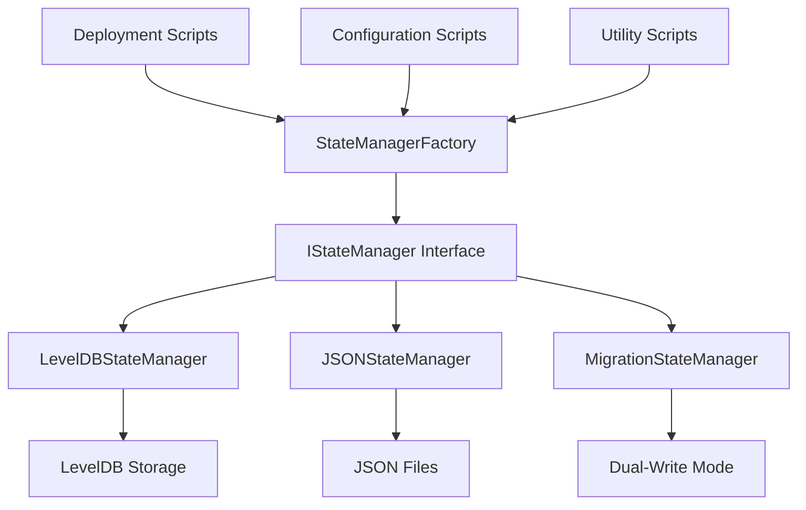

# LookCoin Migration Technical Architecture
**State Management Architecture and Enhanced JSON Schema Documentation**

## Document Overview

This document provides comprehensive technical architecture documentation for the LookCoin state management migration. It covers the state management architecture overview, enhanced JSON schema documentation, API reference for new interfaces, migration tool documentation, and performance optimization guidelines.

**Audience**: Technical architects, senior developers, system designers  
**Scope**: Technical implementation details and architectural decisions  
**Last Updated**: 2025-08-12  
**Version**: 1.0.0

---

## Table of Contents
- [State Management Architecture](#state-management-architecture)
- [Enhanced JSON Schema Documentation](#enhanced-json-schema-documentation)
- [API Reference](#api-reference)
- [Migration Tool Documentation](#migration-tool-documentation)
- [Performance Optimization Guidelines](#performance-optimization-guidelines)
- [Security Considerations](#security-considerations)
- [Future Architecture Considerations](#future-architecture-considerations)

---

## State Management Architecture

### Overview

The LookCoin deployment system uses a pluggable state management architecture that supports multiple backend implementations while maintaining a consistent interface. The migration introduces a dual-backend capability with seamless fallback mechanisms.

### Architecture Principles

1. **Backend Abstraction**: Common interface (`IStateManager`) for all storage backends
2. **Pluggable Architecture**: Factory pattern for backend selection
3. **Data Consistency**: Atomic operations and validation layers
4. **Fallback Safety**: Automatic fallback from JSON to LevelDB on errors
5. **Performance Optimization**: Caching and parallel processing support

### Core Components



### State Manager Interface

```typescript
interface IStateManager {
  // Core operations
  getContract(address: string): Promise<ContractInfo | null>;
  putContract(address: string, info: ContractInfo): Promise<void>;
  deleteContract(address: string): Promise<void>;
  
  // Query operations
  getAllContracts(): Promise<ContractInfo[]>;
  queryContracts(filter: ContractFilter): Promise<ContractInfo[]>;
  
  // Batch operations
  putContracts(contracts: Map<string, ContractInfo>): Promise<void>;
  
  // Utility operations
  exists(address: string): Promise<boolean>;
  close(): Promise<void>;
  
  // Deployment-specific operations
  fetchDeployOrUpgradeProxy(args: DeploymentArgs): Promise<ContractDeployment>;
  migrateDeploymentFormat(deployment: LegacyDeployment): EnhancedDeployment;
}
```

### Backend Implementations

#### LevelDBStateManager
```typescript
class LevelDBStateManager implements IStateManager {
  private db: Level.Level<string, any>;
  private readonly dbPath: string;
  
  constructor(network: string) {
    this.dbPath = path.join(process.cwd(), 'leveldb');
    this.db = new Level(this.dbPath);
  }
  
  async getContract(address: string): Promise<ContractInfo | null> {
    try {
      const key = this.buildKey(address);
      const data = await this.db.get(key);
      return this.deserializeContract(data);
    } catch (error) {
      if (error.notFound) return null;
      throw new StateManagerError('LEVELDB_READ_ERROR', error.message);
    }
  }
  
  private buildKey(address: string): string {
    return `${this.network}:${address}`;
  }
  
  private deserializeContract(data: string): ContractInfo {
    const parsed = JSON.parse(data);
    return {
      ...parsed,
      deployedAt: BigInt(parsed.deployedAt),
      implementationHash: parsed.implementationHash,
      constructorArgs: this.deserializeArgs(parsed.constructorArgs)
    };
  }
}
```

#### JSONStateManager
```typescript
class JSONStateManager implements IStateManager {
  private readonly filePath: string;
  private cache: Map<string, ContractInfo> = new Map();
  private cacheValid: boolean = false;
  private readonly cacheTTL: number = 5 * 60 * 1000; // 5 minutes
  
  constructor(network: string) {
    this.filePath = path.join(process.cwd(), 'deployments', `${network}.json`);
  }
  
  async getContract(address: string): Promise<ContractInfo | null> {
    await this.ensureCacheValid();
    return this.cache.get(address.toLowerCase()) || null;
  }
  
  async putContract(address: string, info: ContractInfo): Promise<void> {
    await this.ensureCacheValid();
    this.cache.set(address.toLowerCase(), info);
    await this.persistCache();
  }
  
  private async ensureCacheValid(): Promise<void> {
    if (this.cacheValid && Date.now() - this.cacheTimestamp < this.cacheTTL) {
      return;
    }
    
    await this.loadFromFile();
    this.cacheValid = true;
    this.cacheTimestamp = Date.now();
  }
  
  private async loadFromFile(): Promise<void> {
    try {
      if (!fs.existsSync(this.filePath)) {
        this.cache.clear();
        return;
      }
      
      const data = await fs.promises.readFile(this.filePath, 'utf-8');
      const deployment = JSON.parse(data) as EnhancedDeployment;
      
      this.cache.clear();
      for (const [address, contractInfo] of Object.entries(deployment.contracts)) {
        this.cache.set(address.toLowerCase(), this.deserializeContract(contractInfo));
      }
    } catch (error) {
      throw new StateManagerError('JSON_LOAD_ERROR', `Failed to load ${this.filePath}: ${error.message}`);
    }
  }
  
  private async persistCache(): Promise<void> {
    const deployment: EnhancedDeployment = {
      version: "2.0.0",
      network: this.network,
      chainId: this.chainId,
      timestamp: new Date().toISOString(),
      deploymentMode: this.deploymentMode,
      protocols: this.protocols,
      contracts: Object.fromEntries(
        Array.from(this.cache.entries()).map(([address, info]) => [
          address,
          this.serializeContract(info)
        ])
      )
    };
    
    // Atomic write operation
    const tempPath = `${this.filePath}.tmp`;
    await fs.promises.writeFile(tempPath, JSON.stringify(deployment, null, 2));
    await fs.promises.rename(tempPath, this.filePath);
  }
}
```

#### MigrationStateManager (Dual-Write Mode)
```typescript
class MigrationStateManager implements IStateManager {
  private leveldbManager: LevelDBStateManager;
  private jsonManager: JSONStateManager;
  private readonly primaryBackend: 'leveldb' | 'json';
  
  constructor(network: string, primaryBackend: 'leveldb' | 'json' = 'leveldb') {
    this.leveldbManager = new LevelDBStateManager(network);
    this.jsonManager = new JSONStateManager(network);
    this.primaryBackend = primaryBackend;
  }
  
  async getContract(address: string): Promise<ContractInfo | null> {
    if (this.primaryBackend === 'json') {
      try {
        return await this.jsonManager.getContract(address);
      } catch (error) {
        console.warn('JSON backend failed, falling back to LevelDB:', error);
        return await this.leveldbManager.getContract(address);
      }
    } else {
      return await this.leveldbManager.getContract(address);
    }
  }
  
  async putContract(address: string, info: ContractInfo): Promise<void> {
    const errors: Error[] = [];
    
    // Write to both backends
    try {
      await this.leveldbManager.putContract(address, info);
    } catch (error) {
      errors.push(new Error(`LevelDB write failed: ${error.message}`));
    }
    
    try {
      await this.jsonManager.putContract(address, info);
    } catch (error) {
      errors.push(new Error(`JSON write failed: ${error.message}`));
    }
    
    // At least one backend must succeed
    if (errors.length === 2) {
      throw new StateManagerError('DUAL_WRITE_FAILED', `Both backends failed: ${errors.map(e => e.message).join(', ')}`);
    }
    
    // Log warnings for partial failures
    if (errors.length === 1) {
      console.warn('Dual-write partial failure:', errors[0].message);
    }
  }
}
```

### StateManagerFactory

```typescript
class StateManagerFactory {
  static async createManager(
    network: string,
    options: StateManagerOptions = {}
  ): Promise<IStateManager> {
    const config = this.resolveConfiguration(network, options);
    
    switch (config.backend) {
      case 'leveldb':
        return new LevelDBStateManager(network);
        
      case 'json':
        return new JSONStateManager(network);
        
      case 'dual-write':
        return new MigrationStateManager(network, config.primaryBackend);
        
      case 'auto':
      default:
        return this.createAutoManager(network, config);
    }
  }
  
  private static async createAutoManager(
    network: string,
    config: StateManagerConfig
  ): Promise<IStateManager> {
    // Try JSON backend first if available
    if (config.preferJSON) {
      try {
        const jsonManager = new JSONStateManager(network);
        await jsonManager.validate();
        return jsonManager;
      } catch (error) {
        console.warn('JSON backend validation failed, falling back to LevelDB');
      }
    }
    
    // Fallback to LevelDB
    return new LevelDBStateManager(network);
  }
  
  private static resolveConfiguration(
    network: string,
    options: StateManagerOptions
  ): StateManagerConfig {
    return {
      backend: process.env.STATE_BACKEND || options.backend || 'auto',
      primaryBackend: process.env.PRIMARY_BACKEND || options.primaryBackend || 'leveldb',
      preferJSON: process.env.PREFER_JSON === 'true' || options.preferJSON || false,
      enableFallback: process.env.ENABLE_FALLBACK !== 'false',
      enableCaching: process.env.ENABLE_CACHING !== 'false',
      ...options
    };
  }
}
```

---

## Enhanced JSON Schema Documentation

### Schema Version 2.0.0

The enhanced JSON schema supports all 28 LookCoin contracts across 5 networks with comprehensive metadata and protocol configurations.

#### Root Schema Structure

```json
{
  "$schema": "http://json-schema.org/draft-07/schema#",
  "title": "LookCoin Enhanced Deployment Schema",
  "type": "object",
  "version": "2.0.0",
  "required": ["version", "network", "chainId", "timestamp", "contracts"],
  "properties": {
    "version": {
      "type": "string",
      "enum": ["2.0.0"],
      "description": "Schema version identifier"
    },
    "network": {
      "type": "string",
      "description": "Human-readable network name"
    },
    "chainId": {
      "type": "integer",
      "description": "Blockchain chain ID"
    },
    "timestamp": {
      "type": "string",
      "format": "date-time",
      "description": "Deployment timestamp in ISO 8601 format"
    },
    "deploymentMode": {
      "type": "string",
      "enum": ["standard", "multi-protocol", "simple"],
      "description": "Deployment mode used"
    },
    "protocols": {
      "type": "object",
      "description": "Protocol configurations"
    },
    "contracts": {
      "type": "object",
      "description": "Contract deployment information",
      "patternProperties": {
        "^0x[a-fA-F0-9]{40}$": {
          "$ref": "#/definitions/contractInfo"
        }
      }
    }
  }
}
```

#### Contract Information Schema

```json
{
  "definitions": {
    "contractInfo": {
      "type": "object",
      "required": ["name", "address", "deployedAt", "implementationHash"],
      "properties": {
        "name": {
          "type": "string",
          "description": "Contract name"
        },
        "address": {
          "type": "string",
          "pattern": "^0x[a-fA-F0-9]{40}$",
          "description": "Contract address"
        },
        "deployedAt": {
          "type": "string",
          "description": "Deployment timestamp as BigInt string"
        },
        "implementationHash": {
          "type": "string",
          "pattern": "^0x[a-fA-F0-9]{64}$",
          "description": "Implementation bytecode hash"
        },
        "constructorArgs": {
          "type": "array",
          "description": "Constructor arguments with BigInt serialization support"
        },
        "proxy": {
          "type": "object",
          "description": "Proxy configuration if applicable",
          "properties": {
            "proxyAddress": {
              "type": "string",
              "pattern": "^0x[a-fA-F0-9]{40}$"
            },
            "implementationAddress": {
              "type": "string",
              "pattern": "^0x[a-fA-F0-9]{40}$"
            },
            "admin": {
              "type": "string",
              "pattern": "^0x[a-fA-F0-9]{40}$"
            }
          }
        },
        "metadata": {
          "type": "object",
          "description": "Additional contract metadata"
        }
      }
    }
  }
}
```

#### Protocol Configuration Schema

```json
{
  "definitions": {
    "protocolConfigurations": {
      "type": "object",
      "properties": {
        "layerZero": {
          "type": "object",
          "properties": {
            "endpoint": {
              "type": "string",
              "pattern": "^0x[a-fA-F0-9]{40}$"
            },
            "chainId": {
              "type": "integer"
            },
            "dvnConfigs": {
              "type": "array",
              "items": {
                "type": "object",
                "properties": {
                  "dvn": {"type": "string", "pattern": "^0x[a-fA-F0-9]{40}$"},
                  "optionType": {"type": "integer"},
                  "gas": {"type": "string"}
                }
              }
            }
          }
        },
        "celer": {
          "type": "object",
          "properties": {
            "messageBus": {
              "type": "string",
              "pattern": "^0x[a-fA-F0-9]{40}$"
            },
            "chainId": {
              "type": "integer"
            },
            "feeStructure": {
              "type": "object",
              "properties": {
                "bridgeFeeBasisPoints": {"type": "integer"},
                "minBridgeFee": {"type": "string"},
                "maxBridgeFee": {"type": "string"}
              }
            }
          }
        },
        "hyperlane": {
          "type": "object",
          "properties": {
            "mailbox": {
              "type": "string",
              "pattern": "^0x[a-fA-F0-9]{40}$"
            },
            "domain": {
              "type": "integer"
            },
            "ismConfig": {
              "type": "object"
            }
          }
        }
      }
    }
  }
}
```

### BigInt Serialization Support

The enhanced schema includes special handling for BigInt values that cannot be natively represented in JSON:

```typescript
interface BigIntSerializationSupport {
  serializeBigInt(value: bigint): string;
  deserializeBigInt(value: string): bigint;
  serializeConstructorArgs(args: any[]): any[];
  deserializeConstructorArgs(args: any[]): any[];
}

class BigIntSerializer implements BigIntSerializationSupport {
  serializeBigInt(value: bigint): string {
    return value.toString();
  }
  
  deserializeBigInt(value: string): bigint {
    return BigInt(value);
  }
  
  serializeConstructorArgs(args: any[]): any[] {
    return args.map(arg => {
      if (typeof arg === 'bigint') {
        return { _type: 'bigint', _value: arg.toString() };
      } else if (Array.isArray(arg)) {
        return this.serializeConstructorArgs(arg);
      } else if (typeof arg === 'object' && arg !== null) {
        const serialized: any = {};
        for (const [key, value] of Object.entries(arg)) {
          serialized[key] = this.serializeConstructorArgs([value])[0];
        }
        return serialized;
      }
      return arg;
    });
  }
  
  deserializeConstructorArgs(args: any[]): any[] {
    return args.map(arg => {
      if (typeof arg === 'object' && arg !== null && arg._type === 'bigint') {
        return BigInt(arg._value);
      } else if (Array.isArray(arg)) {
        return this.deserializeConstructorArgs(arg);
      } else if (typeof arg === 'object' && arg !== null) {
        const deserialized: any = {};
        for (const [key, value] of Object.entries(arg)) {
          deserialized[key] = this.deserializeConstructorArgs([value])[0];
        }
        return deserialized;
      }
      return arg;
    });
  }
}
```

### Example Enhanced Deployment JSON

```json
{
  "version": "2.0.0",
  "network": "BSC Mainnet",
  "chainId": 56,
  "timestamp": "2025-08-12T10:30:00.000Z",
  "deploymentMode": "multi-protocol",
  "protocols": {
    "layerZero": {
      "endpoint": "0x1a44076050125825900e736c501f859c50fE728c",
      "chainId": 102,
      "dvnConfigs": [
        {
          "dvn": "0xfD6865c841c2d64565562fCc7e05e619A30615f0",
          "optionType": 3,
          "gas": "200000"
        }
      ]
    },
    "celer": {
      "messageBus": "0x95714818fdd7a5454f73da9c777b3ee6ebaeea6b",
      "chainId": 56,
      "feeStructure": {
        "bridgeFeeBasisPoints": 50,
        "minBridgeFee": "10000000000000000000",
        "maxBridgeFee": "1000000000000000000000"
      }
    }
  },
  "contracts": {
    "0x1234567890abcdef1234567890abcdef12345678": {
      "name": "LookCoin",
      "address": "0x1234567890abcdef1234567890abcdef12345678",
      "deployedAt": "1723456789123456789",
      "implementationHash": "0x035df318e7b4d02767fc5d749d77c0cd1f8a24e45950df940b71de21b6b81d49",
      "constructorArgs": [
        "LookCoin",
        "LOOK",
        "0x1a44076050125825900e736c501f859c50fE728c",
        "0xGovernanceVaultAddress"
      ],
      "proxy": {
        "proxyAddress": "0x1234567890abcdef1234567890abcdef12345678",
        "implementationAddress": "0xabcdef1234567890abcdef1234567890abcdef12",
        "admin": "0xGovernanceVaultAddress"
      },
      "metadata": {
        "contractType": "core",
        "upgradeable": true,
        "hasLayerZeroSupport": true
      }
    }
  }
}
```

---

## API Reference

### Core State Management API

#### IStateManager Interface

**Purpose**: Unified interface for all state management backends

**Methods**:

##### `getContract(address: string): Promise<ContractInfo | null>`
Retrieves contract information by address.

**Parameters**:
- `address`: Contract address (0x prefixed, 40 hex characters)

**Returns**: 
- `ContractInfo` object if found, `null` if not found

**Throws**:
- `StateManagerError` on backend errors

**Example**:
```typescript
const manager = await StateManagerFactory.createManager('bscmainnet');
const contract = await manager.getContract('0x1234...');
if (contract) {
  console.log(`Contract: ${contract.name}, Hash: ${contract.implementationHash}`);
}
```

##### `putContract(address: string, info: ContractInfo): Promise<void>`
Stores contract information.

**Parameters**:
- `address`: Contract address
- `info`: Contract information object

**Returns**: `void`

**Throws**:
- `StateManagerError` on write failures

##### `getAllContracts(): Promise<ContractInfo[]>`
Retrieves all contracts for the network.

**Returns**: Array of `ContractInfo` objects

##### `queryContracts(filter: ContractFilter): Promise<ContractInfo[]>`
Queries contracts with filtering.

**Parameters**:
- `filter`: Filter criteria object

**Example**:
```typescript
const upgradeable = await manager.queryContracts({
  metadata: { upgradeable: true }
});
```

#### StateManagerFactory API

##### `createManager(network: string, options?: StateManagerOptions): Promise<IStateManager>`
Creates appropriate state manager for network.

**Parameters**:
- `network`: Network name (e.g., 'bscmainnet')
- `options`: Configuration options

**Returns**: `IStateManager` instance

**Example**:
```typescript
// Auto-detection
const manager = await StateManagerFactory.createManager('bscmainnet');

// Force specific backend
const jsonManager = await StateManagerFactory.createManager('bscmainnet', {
  backend: 'json'
});

// Dual-write mode
const migrationManager = await StateManagerFactory.createManager('bscmainnet', {
  backend: 'dual-write',
  primaryBackend: 'json'
});
```

### Migration-Specific API

#### MigrationStateManager

##### `performBulkMigration(): Promise<MigrationResult>`
Performs bulk migration from LevelDB to JSON.

**Returns**: Migration result with statistics

**Example**:
```typescript
const migrationManager = new MigrationStateManager('bscmainnet');
const result = await migrationManager.performBulkMigration();
console.log(`Migrated ${result.contractCount} contracts in ${result.duration}ms`);
```

##### `validateConsistency(): Promise<ConsistencyReport>`
Validates data consistency between backends.

**Returns**: Detailed consistency report

#### Deployment Integration API

##### `fetchDeployOrUpgradeProxy(args: DeploymentArgs): Promise<ContractDeployment>`
Determines whether to deploy new or upgrade existing proxy.

**Parameters**:
- `args`: Deployment arguments including contract info

**Returns**: Deployment decision and contract info

**Example**:
```typescript
const deployment = await manager.fetchDeployOrUpgradeProxy({
  contractName: 'LookCoin',
  implementationHash: '0x123...',
  constructorArgs: [...args]
});

if (deployment.action === 'upgrade') {
  console.log('Upgrading existing proxy at:', deployment.proxyAddress);
} else {
  console.log('Deploying new proxy');
}
```

### Error Handling API

#### StateManagerError

```typescript
class StateManagerError extends Error {
  constructor(
    public readonly code: string,
    message: string,
    public readonly cause?: Error
  ) {
    super(message);
    this.name = 'StateManagerError';
  }
}
```

**Error Codes**:
- `LEVELDB_READ_ERROR`: LevelDB read operation failed
- `LEVELDB_WRITE_ERROR`: LevelDB write operation failed
- `JSON_LOAD_ERROR`: JSON file loading failed
- `JSON_PARSE_ERROR`: JSON parsing failed
- `JSON_WRITE_ERROR`: JSON file writing failed
- `DUAL_WRITE_FAILED`: Both backends failed in dual-write mode
- `VALIDATION_FAILED`: Data validation failed
- `NOT_FOUND`: Requested data not found

---

## Migration Tool Documentation

### Migration Orchestrator

The migration process is managed by a comprehensive orchestrator that handles the complexity of multi-backend state management.

#### MigrationOrchestrator

```typescript
class MigrationOrchestrator {
  private sourceManager: LevelDBStateManager;
  private targetManager: JSONStateManager;
  private progressTracker: MigrationProgressTracker;
  
  constructor(network: string) {
    this.sourceManager = new LevelDBStateManager(network);
    this.targetManager = new JSONStateManager(network);
    this.progressTracker = new MigrationProgressTracker();
  }
  
  async executeMigration(): Promise<MigrationResult> {
    const phases = [
      this.validatePreConditions,
      this.enableDualWriteMode,
      this.performBulkMigration,
      this.validateDataConsistency,
      this.switchToJSONPrimary
    ];
    
    for (const [index, phase] of phases.entries()) {
      await this.progressTracker.startPhase(index + 1, phase.name);
      await phase.call(this);
      await this.progressTracker.completePhase(index + 1);
    }
    
    return this.progressTracker.getResult();
  }
  
  private async validatePreConditions(): Promise<void> {
    // Check system health
    await this.validateSystemHealth();
    
    // Verify data integrity
    await this.validateSourceDataIntegrity();
    
    // Check available resources
    await this.checkSystemResources();
  }
  
  private async performBulkMigration(): Promise<void> {
    const contracts = await this.sourceManager.getAllContracts();
    const batchSize = 10; // Process in batches to manage memory
    
    for (let i = 0; i < contracts.length; i += batchSize) {
      const batch = contracts.slice(i, i + batchSize);
      await this.migrateBatch(batch);
      await this.progressTracker.updateProgress(i + batch.length, contracts.length);
    }
  }
  
  private async migrateBatch(contracts: ContractInfo[]): Promise<void> {
    const migrations = contracts.map(contract => 
      this.targetManager.putContract(contract.address, contract)
    );
    
    await Promise.all(migrations);
  }
}
```

### Migration Progress Tracking

```typescript
class MigrationProgressTracker {
  private phases: MigrationPhase[] = [];
  private currentPhase?: MigrationPhase;
  private startTime: Date;
  
  constructor() {
    this.startTime = new Date();
  }
  
  async startPhase(phaseNumber: number, phaseName: string): Promise<void> {
    const phase: MigrationPhase = {
      number: phaseNumber,
      name: phaseName,
      startTime: new Date(),
      status: 'in_progress'
    };
    
    this.currentPhase = phase;
    this.phases.push(phase);
    
    console.log(`Phase ${phaseNumber}: ${phaseName} - Started`);
  }
  
  async completePhase(phaseNumber: number): Promise<void> {
    const phase = this.phases.find(p => p.number === phaseNumber);
    if (phase) {
      phase.endTime = new Date();
      phase.status = 'completed';
      phase.duration = phase.endTime.getTime() - phase.startTime.getTime();
      
      console.log(`Phase ${phaseNumber}: Completed in ${phase.duration}ms`);
    }
  }
  
  async updateProgress(current: number, total: number): Promise<void> {
    const percentage = Math.round((current / total) * 100);
    console.log(`Migration progress: ${current}/${total} (${percentage}%)`);
  }
}
```

### Data Validation Tools

#### Migration Validator

```typescript
class MigrationValidator {
  async validateMigration(
    source: IStateManager, 
    target: IStateManager
  ): Promise<ValidationReport> {
    const sourceContracts = await source.getAllContracts();
    const targetContracts = await target.getAllContracts();
    
    const report: ValidationReport = {
      sourceCount: sourceContracts.length,
      targetCount: targetContracts.length,
      matches: 0,
      mismatches: [],
      missing: [],
      extra: []
    };
    
    // Compare contracts
    for (const sourceContract of sourceContracts) {
      const targetContract = targetContracts.find(
        tc => tc.address.toLowerCase() === sourceContract.address.toLowerCase()
      );
      
      if (!targetContract) {
        report.missing.push(sourceContract.address);
        continue;
      }
      
      const isMatch = this.compareContracts(sourceContract, targetContract);
      if (isMatch) {
        report.matches++;
      } else {
        report.mismatches.push({
          address: sourceContract.address,
          differences: this.identifyDifferences(sourceContract, targetContract)
        });
      }
    }
    
    // Check for extra contracts in target
    for (const targetContract of targetContracts) {
      const exists = sourceContracts.some(
        sc => sc.address.toLowerCase() === targetContract.address.toLowerCase()
      );
      if (!exists) {
        report.extra.push(targetContract.address);
      }
    }
    
    return report;
  }
  
  private compareContracts(source: ContractInfo, target: ContractInfo): boolean {
    return (
      source.name === target.name &&
      source.address.toLowerCase() === target.address.toLowerCase() &&
      source.implementationHash === target.implementationHash &&
      source.deployedAt === target.deployedAt &&
      JSON.stringify(source.constructorArgs) === JSON.stringify(target.constructorArgs)
    );
  }
}
```

---

## Performance Optimization Guidelines

### Caching Strategies

#### Multi-Level Caching Architecture

```typescript
class OptimizedStateManager implements IStateManager {
  private l1Cache: Map<string, ContractInfo> = new Map(); // In-memory
  private l2Cache: LRUCache<string, ContractInfo>;        // LRU cache
  private backend: IStateManager;
  
  constructor(backend: IStateManager) {
    this.backend = backend;
    this.l2Cache = new LRUCache({ max: 1000, ttl: 5 * 60 * 1000 });
  }
  
  async getContract(address: string): Promise<ContractInfo | null> {
    const key = address.toLowerCase();
    
    // L1 Cache (in-memory)
    if (this.l1Cache.has(key)) {
      return this.l1Cache.get(key)!;
    }
    
    // L2 Cache (LRU)
    if (this.l2Cache.has(key)) {
      const contract = this.l2Cache.get(key)!;
      this.l1Cache.set(key, contract);
      return contract;
    }
    
    // Backend
    const contract = await this.backend.getContract(address);
    if (contract) {
      this.l1Cache.set(key, contract);
      this.l2Cache.set(key, contract);
    }
    
    return contract;
  }
  
  invalidateCache(address?: string): void {
    if (address) {
      const key = address.toLowerCase();
      this.l1Cache.delete(key);
      this.l2Cache.delete(key);
    } else {
      this.l1Cache.clear();
      this.l2Cache.clear();
    }
  }
}
```

### Parallel Processing

#### Concurrent Operations

```typescript
class ParallelizedMigrationManager {
  private readonly concurrencyLimit: number;
  private readonly semaphore: Semaphore;
  
  constructor(concurrencyLimit = 10) {
    this.concurrencyLimit = concurrencyLimit;
    this.semaphore = new Semaphore(concurrencyLimit);
  }
  
  async migrateContractsParallel(
    contracts: ContractInfo[]
  ): Promise<MigrationResult[]> {
    const tasks = contracts.map(contract => 
      this.migrateContractWithLimit(contract)
    );
    
    return Promise.all(tasks);
  }
  
  private async migrateContractWithLimit(
    contract: ContractInfo
  ): Promise<MigrationResult> {
    await this.semaphore.acquire();
    
    try {
      return await this.migrateContract(contract);
    } finally {
      this.semaphore.release();
    }
  }
  
  private async migrateContract(contract: ContractInfo): Promise<MigrationResult> {
    const startTime = performance.now();
    
    // Perform migration
    await this.targetManager.putContract(contract.address, contract);
    
    const endTime = performance.now();
    
    return {
      address: contract.address,
      duration: endTime - startTime,
      status: 'success'
    };
  }
}

class Semaphore {
  private permits: number;
  private waitQueue: (() => void)[] = [];
  
  constructor(permits: number) {
    this.permits = permits;
  }
  
  async acquire(): Promise<void> {
    if (this.permits > 0) {
      this.permits--;
      return;
    }
    
    return new Promise<void>(resolve => {
      this.waitQueue.push(resolve);
    });
  }
  
  release(): void {
    this.permits++;
    if (this.waitQueue.length > 0) {
      const next = this.waitQueue.shift()!;
      this.permits--;
      next();
    }
  }
}
```

### Memory Optimization

#### Streaming and Batch Processing

```typescript
class MemoryOptimizedMigrator {
  private readonly batchSize: number;
  private readonly memoryThreshold: number;
  
  constructor(batchSize = 50, memoryThresholdMB = 100) {
    this.batchSize = batchSize;
    this.memoryThreshold = memoryThresholdMB * 1024 * 1024;
  }
  
  async migrateWithMemoryManagement(): Promise<void> {
    const contractIterator = this.createContractIterator();
    let batch: ContractInfo[] = [];
    
    for await (const contract of contractIterator) {
      batch.push(contract);
      
      if (batch.length >= this.batchSize || this.isMemoryPressure()) {
        await this.processBatch(batch);
        batch = [];
        
        // Force garbage collection if available
        if (global.gc) {
          global.gc();
        }
      }
    }
    
    // Process remaining contracts
    if (batch.length > 0) {
      await this.processBatch(batch);
    }
  }
  
  private async *createContractIterator(): AsyncGenerator<ContractInfo, void, unknown> {
    const addresses = await this.sourceManager.getAllAddresses();
    
    for (const address of addresses) {
      const contract = await this.sourceManager.getContract(address);
      if (contract) {
        yield contract;
      }
    }
  }
  
  private isMemoryPressure(): boolean {
    const usage = process.memoryUsage();
    return usage.heapUsed > this.memoryThreshold;
  }
  
  private async processBatch(batch: ContractInfo[]): Promise<void> {
    const promises = batch.map(contract =>
      this.targetManager.putContract(contract.address, contract)
    );
    
    await Promise.all(promises);
  }
}
```

### I/O Optimization

#### Asynchronous File Operations

```typescript
class OptimizedJSONManager extends JSONStateManager {
  private writeQueue: Map<string, ContractInfo> = new Map();
  private isWriting: boolean = false;
  private writeTimeout?: NodeJS.Timeout;
  
  async putContract(address: string, info: ContractInfo): Promise<void> {
    // Add to write queue instead of immediate write
    this.writeQueue.set(address.toLowerCase(), info);
    
    // Debounced write
    if (this.writeTimeout) {
      clearTimeout(this.writeTimeout);
    }
    
    this.writeTimeout = setTimeout(() => this.flushWrites(), 100);
  }
  
  private async flushWrites(): Promise<void> {
    if (this.isWriting || this.writeQueue.size === 0) {
      return;
    }
    
    this.isWriting = true;
    
    try {
      const deployment = await this.loadCurrentDeployment();
      
      // Apply all queued changes
      for (const [address, contractInfo] of this.writeQueue) {
        deployment.contracts[address] = this.serializeContract(contractInfo);
      }
      
      // Atomic write
      await this.atomicWrite(deployment);
      
      // Clear queue after successful write
      this.writeQueue.clear();
    } finally {
      this.isWriting = false;
    }
  }
  
  private async atomicWrite(deployment: EnhancedDeployment): Promise<void> {
    const tempPath = `${this.filePath}.tmp.${Date.now()}`;
    
    try {
      await fs.promises.writeFile(tempPath, JSON.stringify(deployment, null, 2));
      await fs.promises.rename(tempPath, this.filePath);
    } catch (error) {
      // Clean up temp file on error
      try {
        await fs.promises.unlink(tempPath);
      } catch {}
      throw error;
    }
  }
}
```

### Performance Monitoring

#### Metrics Collection

```typescript
class PerformanceMonitor {
  private metrics: Map<string, PerformanceMetric> = new Map();
  
  startTiming(operation: string): string {
    const id = `${operation}_${Date.now()}_${Math.random()}`;
    const metric: PerformanceMetric = {
      operation,
      startTime: performance.now(),
      id
    };
    
    this.metrics.set(id, metric);
    return id;
  }
  
  endTiming(id: string): number {
    const metric = this.metrics.get(id);
    if (!metric) {
      throw new Error(`Metric not found: ${id}`);
    }
    
    metric.endTime = performance.now();
    metric.duration = metric.endTime - metric.startTime;
    
    // Log slow operations
    if (metric.duration > 1000) { // >1 second
      console.warn(`Slow operation detected: ${metric.operation} took ${metric.duration}ms`);
    }
    
    this.metrics.delete(id);
    return metric.duration;
  }
  
  getAverageTime(operation: string): number {
    const metrics = Array.from(this.metrics.values())
      .filter(m => m.operation === operation && m.duration !== undefined);
    
    if (metrics.length === 0) return 0;
    
    const total = metrics.reduce((sum, m) => sum + m.duration!, 0);
    return total / metrics.length;
  }
}

// Usage
const monitor = new PerformanceMonitor();

const timingId = monitor.startTiming('contract_migration');
await migrateContract(contract);
const duration = monitor.endTiming(timingId);
```

---

## Security Considerations

### Data Integrity Protection

#### Checksums and Validation

```typescript
class SecureStateManager implements IStateManager {
  private checksumProvider: ChecksumProvider;
  
  constructor(backend: IStateManager) {
    this.backend = backend;
    this.checksumProvider = new ChecksumProvider();
  }
  
  async putContract(address: string, info: ContractInfo): Promise<void> {
    // Add checksum to contract info
    const secureInfo = {
      ...info,
      checksum: this.checksumProvider.calculate(info)
    };
    
    await this.backend.putContract(address, secureInfo);
  }
  
  async getContract(address: string): Promise<ContractInfo | null> {
    const contract = await this.backend.getContract(address);
    if (!contract) return null;
    
    // Verify checksum
    const expectedChecksum = this.checksumProvider.calculate(contract);
    if (contract.checksum !== expectedChecksum) {
      throw new StateManagerError('CHECKSUM_MISMATCH', 
        `Contract data integrity check failed for ${address}`);
    }
    
    return contract;
  }
}

class ChecksumProvider {
  calculate(contract: ContractInfo): string {
    const data = {
      name: contract.name,
      address: contract.address,
      implementationHash: contract.implementationHash,
      deployedAt: contract.deployedAt.toString(),
      constructorArgs: contract.constructorArgs
    };
    
    return crypto
      .createHash('sha256')
      .update(JSON.stringify(data))
      .digest('hex');
  }
}
```

### Access Control

#### Permission-Based Operations

```typescript
class SecureAccessManager {
  private permissions: Map<string, Set<string>> = new Map();
  
  constructor() {
    this.initializePermissions();
  }
  
  private initializePermissions(): void {
    // Admin permissions
    this.permissions.set('admin', new Set([
      'read_contract', 'write_contract', 'delete_contract',
      'migrate_data', 'modify_permissions'
    ]));
    
    // Migration permissions
    this.permissions.set('migration', new Set([
      'read_contract', 'write_contract', 'migrate_data'
    ]));
    
    // Read-only permissions
    this.permissions.set('readonly', new Set(['read_contract']));
  }
  
  hasPermission(role: string, operation: string): boolean {
    const rolePermissions = this.permissions.get(role);
    return rolePermissions ? rolePermissions.has(operation) : false;
  }
  
  requirePermission(role: string, operation: string): void {
    if (!this.hasPermission(role, operation)) {
      throw new SecurityError(`Access denied: ${role} cannot perform ${operation}`);
    }
  }
}
```

### Audit Logging

#### Comprehensive Operation Logging

```typescript
class AuditLogger {
  private logStream: fs.WriteStream;
  
  constructor(logPath: string) {
    this.logStream = fs.createWriteStream(logPath, { flags: 'a' });
  }
  
  async logOperation(operation: AuditOperation): Promise<void> {
    const logEntry = {
      timestamp: new Date().toISOString(),
      operation: operation.type,
      resource: operation.resource,
      user: operation.user,
      success: operation.success,
      details: operation.details,
      checksum: this.calculateLogChecksum(operation)
    };
    
    const logLine = JSON.stringify(logEntry) + '\n';
    
    return new Promise((resolve, reject) => {
      this.logStream.write(logLine, (error) => {
        if (error) reject(error);
        else resolve();
      });
    });
  }
  
  private calculateLogChecksum(operation: AuditOperation): string {
    return crypto
      .createHash('sha256')
      .update(JSON.stringify({
        type: operation.type,
        resource: operation.resource,
        timestamp: operation.timestamp
      }))
      .digest('hex');
  }
}
```

---

## Future Architecture Considerations

### Scalability Enhancements

#### Database Backend Support

Future versions may include support for traditional databases:

```typescript
interface DatabaseStateManager extends IStateManager {
  // Additional database-specific operations
  beginTransaction(): Promise<Transaction>;
  commitTransaction(transaction: Transaction): Promise<void>;
  rollbackTransaction(transaction: Transaction): Promise<void>;
  
  // Advanced querying
  queryWithJoins(query: DatabaseQuery): Promise<ContractInfo[]>;
  createIndex(fields: string[]): Promise<void>;
}
```

#### Distributed Storage

Support for distributed storage systems:

```typescript
interface DistributedStateManager extends IStateManager {
  // Distributed operations
  replicateToNodes(nodes: string[]): Promise<void>;
  syncFromMasterNode(masterNode: string): Promise<void>;
  
  // Consistency management
  establishConsensus(): Promise<ConsensusResult>;
  resolveConflicts(conflicts: DataConflict[]): Promise<void>;
}
```

### Event Sourcing Integration

#### Event-Driven Architecture

```typescript
interface EventSourcingStateManager extends IStateManager {
  // Event operations
  appendEvent(event: ContractEvent): Promise<void>;
  replayEvents(fromTimestamp?: Date): Promise<void>;
  
  // Snapshot management
  createSnapshot(): Promise<Snapshot>;
  restoreFromSnapshot(snapshot: Snapshot): Promise<void>;
}

interface ContractEvent {
  id: string;
  timestamp: Date;
  type: 'deployed' | 'upgraded' | 'configured';
  contractAddress: string;
  data: any;
  checksum: string;
}
```

### Multi-Chain State Management

#### Cross-Chain Synchronization

```typescript
interface MultiChainStateManager {
  // Cross-chain operations
  syncAcrossChains(chains: string[]): Promise<SyncResult>;
  detectCrossChainInconsistencies(): Promise<Inconsistency[]>;
  
  // Global state management
  getGlobalContract(address: string): Promise<GlobalContractInfo>;
  updateGlobalState(update: GlobalStateUpdate): Promise<void>;
}
```

---

**Document Version**: 1.0.0  
**Last Updated**: 2025-08-12  
**Next Review**: Post-migration completion  
**Architecture Owner**: Technical Architecture Team